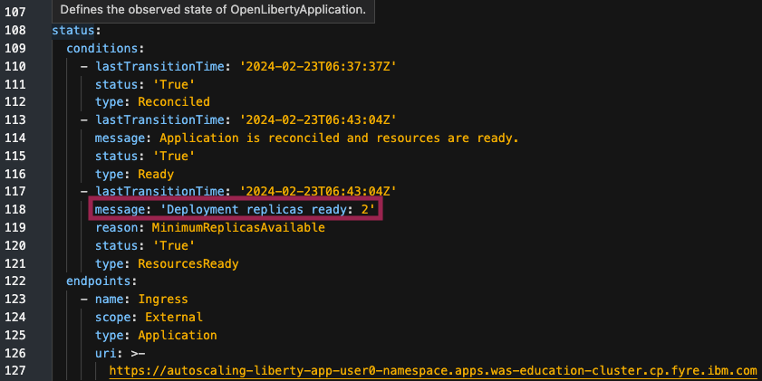

ifdef::env-github[]
:tip-caption: :bulb:
:note-caption: :information_source:
endif::[]

= Horizontal Pod Autoscaler Configuration

This lab focuses on the configuration of Horizontal Pod Autoscaler for OpenLibertyApplication instances.

== Horizontal Pod Autoscaler (HPA)
`Horizontal Pod Autoscaler (HPA)` is a feature that automates the scaling of workloads such as Deployments or StatefulSets, based on the configured demand for their resources, typically measured by CPU and memory consumption. It dynamically adjusts the number of Pods to efficiently handle the workload's resource requirements. When the workload is under-utilized and the number of running Pods is above the minimum configured value, HPA reduces the number of Pods. Conversely, when the workload is over-utilized and the number of running Pods is below the maximum configured value, HPA increases the number of Pods. By automatically scaling the number of Pods based on demand, HPA enables efficient resource utilization and eliminates the need for manual intervention in scaling decision.

== Getting Started
* Using educational cluster? If you need access to the cluster, please contact Lab Administrators to have credentials assigned to you.
* Using your own cluster? Please follow link:++../Prerequisites.adoc++[Prerequisites guide] before proceeding.

== Deployment Options
Choose one of two methods to deploy OpenLibertyApplication instance on your cluster.

.*Method A: Deployment through `oc` client*
[%collapsible]
====

._Environment setup: If already setup, you can close this section_
[%collapsible%open]
=====
1. Make sure you have `oc` client and `jq` installed in your system. `oc` client is used to communicate with RedHat OpenShift cluster and `jq` is a JSON processing tool, which helps formatting and extracting data.

2. Log into a RedHat OpenShift cluster.
+
[source,sh]
----
oc login --server=https://<cluster-api-ip-address>:6443 --username=<username> --password=<password>
----
+
For example:
+
[source,sh]
----
oc login --server=https://9.123.456.789:6443 --username=testuser --password=PasswordExample123
----
+
If you do not have access to a cluster, please contact Lab Administrators to have credentials assigned to you.

3. To set your current namespace to be the namespace you will be working in, run the following commands:
+
NOTE: _Replace `<your-namespace>` with the namespace provided to you for the lab._
+
[source,sh]
----
export NAMESPACE=<your-namespace>
oc project $NAMESPACE
----
=====

*_Start here after Environment Setup_*

1. Create a YAML file called `liberty-autoscaling.yaml` with the following content:
+
[source,yaml]
----
apiVersion: apps.openliberty.io/v1
kind: OpenLibertyApplication
metadata:
  name: autoscaling-liberty-app
spec:
  applicationImage: icr.io/appcafe/open-liberty/samples/getting-started
  replicas: 1
  expose: true
  resources:
    limits:
      cpu: 200m
      memory: 256Mi
    requests:
      cpu: 100m
      memory: 256Mi
----

2. Create the OpenLibertyApplication instance using the command:
+
[source,sh]
----
oc apply -f liberty-autoscaling.yaml
----
This will create a Deployment named `autoscaling-liberty-app` with 1 replica. The resources field defines a metric source for targeted container resources.

3. Check the status of the OpenLibertyApplication instance by running:
+
[source,sh]
----
oc get OpenLibertyApplication autoscaling-liberty-app -ojson | jq '.status.conditions'
----
+
It should print output that the application is `Reconciled`, `Ready` and `ResourcesReady` similar to the following:
+
[source,log]
----
[
  {
    "lastTransitionTime": "2023-11-03T13:33:55Z",
    "status": "True",
    "type": "Reconciled"
  },
  {
    "lastTransitionTime": "2023-11-03T13:33:57Z",
    "message": "Application is reconciled and resources are ready.",
    "status": "True",
    "type": "Ready"
  },
  {
    "lastTransitionTime": "2023-11-03T13:33:57Z",
    "message": "Deployment replicas ready: 1/1",
    "reason": "MinimumReplicasAvailable",
    "status": "True",
    "type": "ResourcesReady"
  }
]
----
+
As in the example output, `ResourcesReady` 's message field shows the static number of running replicas out of configured number of replicas. If any type under status conditions section reports that the Application is not ready even after a considerate amount of time, check the application's log, by running `oc logs deployment/autoscaling-liberty-app`.

4. Open `liberty-autoscaling.yaml` file and edit the OpenLibertyApplication instance to use `autoscaling` field as opposed to `replicas` field. Under `spec` field, remove `replicas: 1` and replace it with `autoscaling` field:
+
[source,yaml]
----
  autoscaling:
    maxReplicas: 3
    minReplicas: 2
    targetCPUUtilizationPercentage: 50
----
+
Apply the changes using the command:
+
[source,sh]
----
oc apply -f liberty-autoscaling.yaml
----
+
In this example, `autoscaling` field configures the range of number of Pods for a workload using `maxReplicas` and `minReplicas`. These fields ensure that the number of Pods falls within the specified range. Replica scaling will be determined using `targetCPUUtilizationPercentage` and the metric specified under `resources` field.

5. Check the status conditions of the OpenLibertyApplication instance again by running:
+
[source,sh]
----
oc get OpenLibertyApplication autoscaling-liberty-app -ojson | jq '.status.conditions'
----
It should print output that the application is `Reconciled`, `Ready` and `ResourcesReady` similar to the following:
+
[source,log]
----
[
  {
    "lastTransitionTime": "2023-11-03T13:37:24Z",
    "status": "True",
    "type": "Reconciled"
  },
  {
    "lastTransitionTime": "2023-11-03T13:37:27Z",
    "message": "Application is reconciled and resources are ready.",
    "status": "True",
    "type": "Ready"
  },
  {
    "lastTransitionTime": "2023-11-03T13:37:27Z",
    "message": "Deployment replicas ready: 2",
    "reason": "MinimumReplicasAvailable",
    "status": "True",
    "type": "ResourcesReady"
  }
]
----
+
Compared to the last status conditions output, `ResourcesReady` 's message field now outputs the number of running replicas only without the desired number of replicas. It will report `ResourcesReady` is true when the currently running number of pods is within the range of `maxReplicas` and `minReplicas`. If the status conditions section reports that the Application is not ready for long, check the log.

6. When you check the managed resources, you will see that HorizontalPodAutoscaler resource has been created.
+
[source,sh]
----
oc get all -l app.kubernetes.io/part-of=autoscaling-liberty-app
----
It will print output similar to the following:
+
[source,log]
----
NAME                                           READY   STATUS    RESTARTS   AGE
pod/autoscaling-liberty-app-5ddff7f9f6-rjhxb   1/1     Running   0          76s
pod/autoscaling-liberty-app-5ddff7f9f6-x5bf7   1/1     Running   0          17m

NAME                              TYPE        CLUSTER-IP       EXTERNAL-IP   PORT(S)    AGE
service/autoscaling-liberty-app   ClusterIP   172.30.174.225   <none>        9443/TCP   17m

NAME                                      READY   UP-TO-DATE   AVAILABLE   AGE
deployment.apps/autoscaling-liberty-app   2/2     2            2           17m

NAME                                                 DESIRED   CURRENT   READY   AGE
replicaset.apps/autoscaling-liberty-app-5ddff7f9f6   2         2         2       17m

NAME                                                          REFERENCE                            TARGETS   MINPODS   MAXPODS   REPLICAS   AGE
horizontalpodautoscaler.autoscaling/autoscaling-liberty-app   Deployment/autoscaling-liberty-app   15%/50%   2         3         2          92s

NAME                                               HOST/PORT                                                                            PATH   SERVICES                  PORT       TERMINATION   WILDCARD
route.route.openshift.io/autoscaling-liberty-app   autoscaling-liberty-app-user0-namespace.apps.was-education-cluster.cp.fyre.ibm.com          autoscaling-liberty-app   9443-tcp   reencrypt     None
----

7. Check the status of HorizontalPodAutoscaler resource to see if scaling is working as expected. You may have to wait up to several minutes for the HPA resource to receive metrics from the application pod.
+
[source,sh]
----
oc get hpa autoscaling-liberty-app -ojson | jq '.status.conditions'
----
+
It will print output similar to the following:
+
[source,log]
----
[
  {
    "lastTransitionTime": "2023-11-03T13:37:24Z",
    "message": "recommended size matches current size",
    "reason": "ReadyForNewScale",
    "status": "True",
    "type": "AbleToScale"
  },
  {
    "lastTransitionTime": "2023-11-03T13:39:09Z",
    "message": "the HPA was able to successfully calculate a replica count from cpu resource utilization (percentage of request)",
    "reason": "ValidMetricFound",
    "status": "True",
    "type": "ScalingActive"
  },
  {
    "lastTransitionTime": "2023-11-03T13:39:09Z",
    "message": "the desired count is within the acceptable range",
    "reason": "DesiredWithinRange",
    "status": "False",
    "type": "ScalingLimited"
  }
]
----
+
You should see `AbleToScale` and `ScalingActive` type reporting `True`. These report that the workload is being scaled with desired resource utilization. Depending on the resource consumption at the moment, `ScalingLimited` type may report `True` saying that the desired replica count is less than the minimum or more than the maximum replica count.

8. Open `liberty-autoscaling.yaml` file and edit the OpenLibertyApplication instance to disable autoscaling feature. Under `spec` field, remove all fields under `autoscaling`:
+
[source,yaml]
----
  autoscaling:
----
+
Apply the changes using the command:
+
[source,sh]
----
oc apply -f liberty-autoscaling.yaml
----

9. Check the status of the OpenLibertyApplication instance again by running:
+
[source,sh]
----
oc get OpenLibertyApplication autoscaling-liberty-app -ojson | jq '.status.conditions'
----
+
[source,log]
----
[
  {
    "lastTransitionTime": "2023-11-03T13:37:24Z",
    "status": "True",
    "type": "Reconciled"
  },
  {
    "lastTransitionTime": "2023-11-03T13:46:59Z",
    "message": "Application is reconciled and resources are ready.",
    "status": "True",
    "type": "Ready"
  },
  {
    "lastTransitionTime": "2023-11-03T13:46:59Z",
    "message": "Deployment replicas ready: 1/1",
    "reason": "MinimumReplicasAvailable",
    "status": "True",
    "type": "ResourcesReady"
  }
]
----
+
As in the example output, `ResourcesReady` 's message field shows the static number of running replicas out of configured number of replicas again with HPA disabled.

10. Please delete the OpenLibertyApplication instance to clean up the resources.
+
[source,sh]
----
oc delete OpenLibertyApplication/autoscaling-liberty-app
----

====

.*Method B: Deployment through OpenShift Web Console*
[%collapsible]
====
1. Access your OpenShift web console. Web console's URL starts with https://console-openshift-console.apps. If you do not have access to a cluster, please contact Lab Administrators to have credentials assigned to you.

2. Switch to the Developer perspective, if it is set to the Administrator perspective. Ensure you are on a project/namespace that you were assigned with for the lab.
+
image:images/perspective.png[,500]

3. Click `+Add`. Under `Developer Catalog`, click `Operator Backed`. This page shows the operator catalog on the cluster and enables you to deploy operator managed services.
+
image:images/operator-backed.png[,500]

4. Click *OpenLibertyApplication* and create an instance.
+
image:images/create-instance.png[,800]
+
Select YAML view and replace the default configurations with the following content:
+
[source,yaml]
----
apiVersion: apps.openliberty.io/v1
kind: OpenLibertyApplication
metadata:
  name: autoscaling-liberty-app
spec:
  applicationImage: icr.io/appcafe/open-liberty/samples/getting-started
  replicas: 1
  expose: true
  resources:
    limits:
      cpu: 200m
      memory: 256Mi
    requests:
      cpu: 100m
      memory: 256Mi
----
+
This will create a Deployment named `autoscaling-liberty-app` with 1 replica. The `resources` field defines a metric source for targeted container resources.

5. You will see that an instance is created in `Topology` page. Click `*OLA* autoscaling-liberty-app` to see its resources. You can select a resource that you would like to investigate.
+
image:images/topology.png[,900]

6. If you would like to see the instance's status at once, click 3 dots beside `*OLA* autoscaling-liberty-app`, then `Edit OpenLibertyApplication`.
+

7. Scroll to the botton of the YAML file. As in the example, `ResourcesReady` 's message field shows the static number of running replicas out of configured number of replicas.

+

+
If any type under status conditions section reports that the Application is not ready even after a considerate amount of time, check the application's log through Topology page.
+

8. Edit the OpenLibertyApplication instance to use autoscaling feature. Under `spec` field, remove `replicas: 1` and replace it with `autoscaling` field:
+
[source,yaml]
----
  autoscaling:
    maxReplicas: 3
    minReplicas: 2
    targetCPUUtilizationPercentage: 50
----
+
In this example, `autoscaling` field configures the range of number of Pods for a workload using `maxReplicas` and `minReplicas`. These fields ensure that the number of Pods falls within the specified range. Replica scaling will be determined using `targetCPUUtilizationPercentage` and the metric specified under `resources` field.

9. Check the instance's status again.
+

+
Compared to the last status conditions, `ResourcesReady` 's message now shows the number of running replicas only without the desired number of replicas. It will report `ResourcesReady` is true when the currently running number of pods is within the range of `maxReplicas` and `minReplicas`. If status conditions section reports that the Application is not ready for long, check the pod's log.

10. To see the changes in effect, check the managed resources on `Topology` page, you will now see a new resource under `HorizontalPodAutoscalers` section.
+

11. Click on the HPA resource and scroll down to the status condition to see if scaling is working as expected. You may have to wait up to several minutes for the HPA resource to receive metrics from the application pod.
+

+
You should see `AbleToScale` and `ScalingActive` type reporting `True`. These report that the workload is being scaled with desired resource utilization. Depending on the resource consumption at the moment, `ScalingLimited` type may report `True` saying that the desired replica count is less than the minimum or more than the maximum replica count.

12. Edit the OpenLibertyApplication instance to disable autoscaling feature. Under `spec` field, remove all fields under `autoscaling`:
+
[source,yaml]
----
  autoscaling:
----

13. Check the status of the OpenLibertyApplication instance again at the bottom.
+

+
As in the example, `ResourcesReady` 's message field shows the static number of running replicas out of configured number of replicas again with HPA disabled.

14. Please delete the OpenLibertyApplication instance to clean up the resources.
+

====
