ifdef::env-github[]
:tip-caption: :bulb:
:note-caption: :information_source:
endif::[]

= TLS Certificate Generation

This lab focuses on the TLS certification generate and configuration, as well as an integration of Certificate Manager for OpenLibertyApplication instances.

== TLS Certificates Configuration
In Kubernetes-based clusters, administartors have the ability to configure TLS certificates to secure applications. By default, the operator takes care of generating certificates. However, the administrators also have the option to specify certificates for the Route and Service manually. To automate the provisioning of TLS certificates for Pods and Routes, the cert-manager tool comes into play. This tool enables the operator to handle the certificate provisioning process automatically. Moreover, certificates are securely mounted into containers from a Kubernetes secret, ensuring that they are regularly refreshed whenever updates occur. For more in-depth information about the cert-manager tool, you can refer to https://cert-manager.io/.

There are three methods to generate and configure certificates with Open Liberty Operator. The lab will provide a step-by-step walk-through of each approach. However, before starting the lab, ensure that the certificate manager is already installed on the OpenShift cluster. In case it is not installed, please reach out to the Lab Administrators for assistance with the installation process.

== Getting Started
* Using educational cluster? If you need access to the cluster, please contact Lab Administrators to have credentials assigned to you.
* Using your own cluster? Please follow link:++../OCPClusterSetup.adoc++[Cluster Setup guide] before proceeding.

== Deployment Options
Choose one of two methods to deploy OpenLibertyApplication instance on your cluster.

.*Method A: Deployment through `oc` client*
[%collapsible]
====

._Environment setup: If already setup, you can close this section_
[%collapsible%open]
=====
1. Make sure you have `oc` client and `jq` installed in your system. `oc` client is used to communicate with RedHat OpenShift cluster and `jq` is a JSON processing tool, which helps formatting and extracting data.

2. Log into a RedHat OpenShift cluster.
+
[source,sh]
----
oc login --server=https://<cluster-api-ip-address>:6443 --username=<username> --password=<password>
----
+
For example:
+
[source,sh]
----
oc login --server=https://9.123.456.789:6443 --username=testuser --password=PasswordExample123
----
+
If you do not have access to a cluster, please contact Lab Administrators to have credentials assigned to you.

3. To set your current namespace to be the namespace you will be working in, run the following commands:
+
NOTE: _Replace `<your-namespace>` with the namespace provided to you for the lab._
+
[source,sh]
----
export NAMESPACE=<your-namespace>
oc project $NAMESPACE
----
=====

*_Start here after Environment Setup_*

1. Create a YAML file called `liberty-certificate.yaml` with the following content:
+
[source,yaml]
----
apiVersion: apps.openliberty.io/v1
kind: OpenLibertyApplication
metadata:
  name: certificate-liberty-app
spec:
  applicationImage: icr.io/appcafe/open-liberty:full-java8-openj9-ubi
  replicas: 1
  expose: true
  manageTLS: true
----

2. Create the OpenLibertyApplication instance using the command:
+
[source,sh]
----
oc apply -f liberty-certificate.yaml
----
+
This will create a Deployment named `certificate-liberty-app` with 1 replica. By setting `.spec.manageTLS` field to true, the operator attempts to generate certificates and mount them to the pod at `/etc/x509/certs`. Port `9443` is used as the default service port. Since `.spec.expose` field is set to true, the Route is also configured automatically to enable TLS by using `reencrypt` termination.

3. Check the status of the OpenLibertyApplication instance and its service certificate secret name by running:
+
[source,sh]
----
oc get OpenLibertyApplication certificate-liberty-app -ojson | jq '.status.conditions, .status.references'
----
+
It will print output similar to the following:
+
[source,log]
----
[
  {
    "lastTransitionTime": "2023-11-03T02:34:53Z",
    "status": "True",
    "type": "Reconciled"
  },
  {
    "lastTransitionTime": "2023-11-03T02:34:55Z",
    "message": "Application is reconciled and resources are ready.",
    "status": "True",
    "type": "Ready"
  },
  {
    "lastTransitionTime": "2023-11-03T02:34:55Z",
    "message": "Deployment replicas ready: 1/1",
    "reason": "MinimumReplicasAvailable",
    "status": "True",
    "type": "ResourcesReady"
  }
]
{
  "saResourceVersion": "27557235",
  "semeruGeneration": "1",
  "svcCertSecretName": "certificate-liberty-app-svc-tls-cm"
}
----
+
As in the example output, `ResourcesReady` 's message field shows the number of running replicas out of configured number of replicas. `svcCertSecretName` field shows the generated certificate secret name that the application uses. If any type under status conditions section reports that the Application is not ready even after a considerate amount of time, check the application's log, by running `oc logs deployment/certificate-liberty-app`.

4. Run the command to check Open Liberty logs and make sure the Liberty server started successfully:
+
[source,sh]
----
oc logs deployment/certificate-liberty-app -n $NAMESPACE
----
+
For Mac/Linux users, to grab the log directly:
+
[source,sh]
----
oc logs deployment/certificate-liberty-app -n $NAMESPACE | grep CWWKF0011I
----
+
Locate the following log:
+
[source,log]
----
{"type":"liberty_message","host":"certificate-liberty-app-74976fc598-rvzxq","ibm_userDir":"\/opt\/ol\/wlp\/usr\/","ibm_serverName":"defaultServer","message":"CWWKF0011I: The defaultServer server is ready to run a smarter planet. The defaultServer server started in 14.704 seconds.","ibm_threadId":"00000026","ibm_datetime":"2024-02-23T07:07:00.204+0000","ibm_messageId":"CWWKF0011I","module":"com.ibm.ws.kernel.feature.internal.FeatureManager","loglevel":"AUDIT","ibm_sequence":"1708672020204_0000000000021","ext_thread":"Default Executor-thread-1"}
----

5. Get the URL allocated by the application instance. For example, the route's URL will be similar to: `https://certificate-liberty-app-user0-namespace.apps.was-education-cluster.cp.fyre.ibm.com`.
+
[source,sh]
----
oc get OpenLibertyApplication certificate-liberty-app -ojson | jq '.status.endpoints'
----
+
[source,log]
----
[
  {
    "name": "Ingress",
    "scope": "External",
    "type": "Application",
    "uri": "https://certificate-liberty-app-user0-namespace.apps.was-education-cluster.cp.fyre.ibm.com"
  }
]
----
+
Copy and paste the uri value on your browser to access the application's external route.

6. Check the certificate of the page. It will say `Not Secure` because the certificate is self-signed. You should see that the certificate is issued to *.apps.<OCP-cluster-name>.cp.fyre.ibm.com and issued by ingress-operator. These are the default values when a certificate is not specified.
+

7. Verify that a Certificate Authority (CA) `Issuer` instance and a corresponding secret are successfully created in your namespace.
+
[source,sh]
----
oc get issuers -n $NAMESPACE -o wide
----
+
The output should be similar to the following:
+
[source,log]
----
NAME              READY   STATUS                AGE
olo-ca-issuer     True    Signing CA verified   115s
olo-self-signed   True                          115s
----
+
Verify that a TLS secret is also created with the issuer. Below command will grab all TLS secrets in the namespace.
+
[source,sh]
----
oc get secrets --field-selector type=kubernetes.io/tls -n $NAMESPACE
----
+
The output should include the following secret:
+
[source,log]
----
NAME                                  TYPE                DATA   AGE
certificate-liberty-app-svc-tls-cm    kubernetes.io/tls   3      6m36s
----
+
This shows the default secret generated by the Cert Manager, with `svc-tls-cm` suffix appended to the OpenLibertyApplication instance's name.

8. Edit OpenLibertyApplication in `liberty-certificate.yaml` to add the certificate secret reference to the route. Under `spec` field, add `route` field as the following:
+
[source,yaml]
----
  route:
    certificateSecretRef: certificate-liberty-app-svc-tls-cm
----
To apply the changes, run:
+
[source,sh]
----
oc apply -f liberty-certificate.yaml
----

9. Revisit the application page on your browser. Check the certificate again. Now the certificate is issued to `certificate-liberty-app.<namespace>.svc` and issued by `Open Liberty Operator`. This is the default self-signed certificate that the Open Liberty Operator provides with Cert Manager.
+
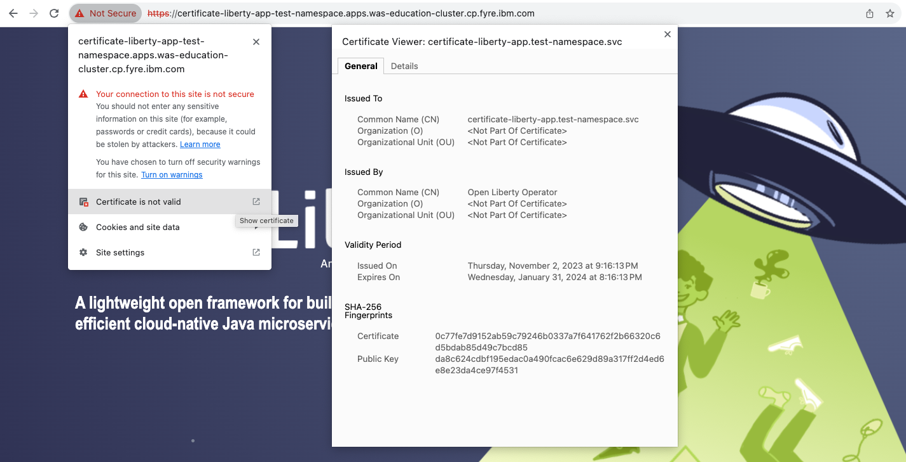

10. Since the operator is running on OpenShift Container Platform for the lab, we can also explore Red Hat OpenShift service CA as well. This method is the default for the operator and is the simplest way to generate certificates without the help of Certificate Manager. Edit OpenLibertyApplication in `liberty-certificate.yaml` to force use of the Red Hat OpenShift service CA. Under `spec` field, edit `route` field and add `service` field: 
+
[source,yaml]
----
  route:
    certificateSecretRef: certificate-liberty-app-svc-tls-ocp
  service:
    annotations:
      service.beta.openshift.io/serving-cert-secret-name: certificate-liberty-app-svc-tls-ocp
    port: 9443
    type: ClusterIP
----
+
To apply the changes, run:
+
[source,sh]
----
oc apply -f liberty-certificate.yaml
----
+
This configuration adds annotation to use Red Hat OpenShift CA. It will ensure `tls.crt` and `tls.key` files are mounted to the pod and Red Hat OpenShift CA certificate is in the /var/run/secrets/kubernetes.io/serviceaccount/service-ca.crt file. By updating the `certificateSecretRef` field, the application route will load the new certificate.

11. Run the following to see if the secret is successfully created:
+
[source,sh]
----
oc get secrets --field-selector type=kubernetes.io/tls -n $NAMESPACE
----
+
The output should include the following secrets:
+
[source,log]
----
NAME                                  TYPE                DATA   AGE
certificate-liberty-app-svc-tls-cm    kubernetes.io/tls   3      6m36s
certificate-liberty-app-svc-tls-ocp   kubernetes.io/tls   2      2m25s
----
+
Compared to the last TLS secrets output, there is another secret with `svc-tls-ocp` suffix appended to the OpenLibertyApplication instance's name.

12. Revisit the application page on your browser. Check the certificate again. The certificate is still issued to `certificate-liberty-app.<namespace>.svc` but is now issued by `openshift-service-serving-signer`.
+
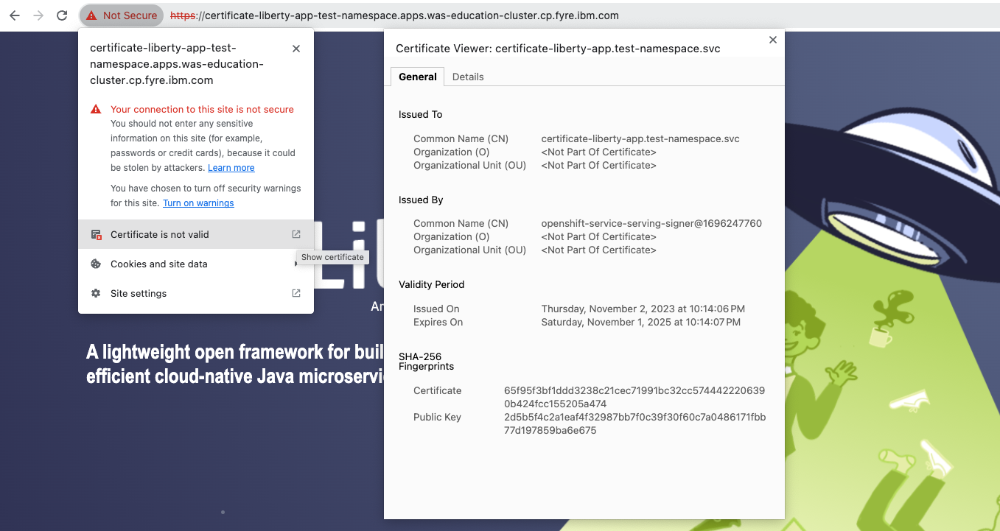

13. Let us consider a scenario where you already have a CA certificate ready. Instead of having the operator create its own CA for issuing service certificates, you can bring your own CA certificate. Create a YAML file called `cert-secret.yaml` with the following content:
+
[source,yaml]
----
apiVersion: v1
kind: Secret
metadata:
  name: olo-custom-ca-tls
type: kubernetes.io/tls
data:
  # This is a self signed certificate that was generated with:
  # openssl genrsa -out ca.key 2048
  # openssl req -x509 -new -nodes -days 10000 -key ca.key -out ca.crt -subj "/CN=ibm.com"
  tls.crt: LS0tLS1CRUdJTiBDRVJUSUZJQ0FURS0tLS0tCk1JSURCVENDQWUyZ0F3SUJBZ0lVYkNkaFZLcGoxTnZlaE15N1BLS0RZaU5nRTQ4d0RRWUpLb1pJaHZjTkFRRUwKQlFBd0VqRVFNQTRHQTFVRUF3d0hhV0p0TG1OdmJUQWVGdzB5TVRFeE1ERXhOakl5TkRKYUZ3MDBPVEF6TVRreApOakl5TkRKYU1CSXhFREFPQmdOVkJBTU1CMmxpYlM1amIyMHdnZ0VpTUEwR0NTcUdTSWIzRFFFQkFRVUFBNElCCkR3QXdnZ0VLQW9JQkFRRE1saFJiM2JRNXliNzRKT25yTCtnVzJOMGZTOGY4MlFCd0cxVXB4Nkx0b20rcDVWc3gKeVJvVE96aklETFA3ODBlOWxFUjBmUk5DVUphMUk2aE1OWmR3T0gyaHYzaSt4NDBneUQyYUEwbHorZXcxRHhGRwpFeHpSOVNNd2duc3p0c3YvcWN1OU9qeGhlTnVEZk1iSTB5S1RKYXpMNjhtNUJLc0oraDV5VWFyT3lwRENBS2o2CkxxWkNkUzZwb0haM3BtQjZCa29ZNFFoaE1ZVmFsbXQyMjM2MGJkV01MY1JGN1dhbkhyNWw5UWZaWEhibkVsbW0KSnBYTVlGWEFRRzBHZXpRYzVTZFNNa1hGOHBFejhLOVBheW5sTlVCUHJPNTFMdXVuSlJaT3M2OEFDY0RjNjlNcQorK2hRbDJhZVlLSjFhdnN5MkNCTEJWK3JRYlhlaEpOVVNsbFJBZ01CQUFHalV6QlJNQjBHQTFVZERnUVdCQlF5CkszcWJUYnRkOUoyd2RvQ3dZMmdhVDlibUNUQWZCZ05WSFNNRUdEQVdnQlF5SzNxYlRidGQ5SjJ3ZG9Dd1kyZ2EKVDlibUNUQVBCZ05WSFJNQkFmOEVCVEFEQVFIL01BMEdDU3FHU0liM0RRRUJDd1VBQTRJQkFRQklNSEExcWpTbgpDMHBUK3lHUS9pTFZqWjBMYVhTK1M5MVFqKzNTS3QxeWRkajdmOE0ySFZvSjZPMGNiNDFkSmdWaU52dHN6dUpoCkc2bENPUGtOcm1lOGhXSk91eGhSTXArenJlQm44UzFuZUhoaG4vZWJYb0JxdGt6WWJkcnFPZzlRdk81LytqYUsKQ1U3L0k0ZEIwMXdoR1lmSEUwS24xZlA1N0ZsWTNDR2M2UDJQYzRycnJBSzZZcGg3STNrUHY4cHdMdHBlOGFIdApvVUFPVmtwNmgzU3dJTW8yTXJVL3NwQVpLS0FRNWhGK2tWaDg2NExrdEN1Nk44dzZoWlpDcjYxdmdrNStZQzd2CmdpRnN4QzFWTDNMWHNDUFdSVWs0RjJFQW53dTd5cXFvN0FwQVhseVNYMExNSC90Y3BaMWQ3MzAwOW9jYkRYS3MKc0QxTERmMFNYNHZMCi0tLS0tRU5EIENFUlRJRklDQVRFLS0tLS0K
  tls.key: LS0tLS1CRUdJTiBSU0EgUFJJVkFURSBLRVktLS0tLQpNSUlFb3dJQkFBS0NBUUVBekpZVVc5MjBPY20rK0NUcDZ5L29GdGpkSDB2SC9Oa0FjQnRWS2NlaTdhSnZxZVZiCk1ja2FFenM0eUF5eisvTkh2WlJFZEgwVFFsQ1d0U09vVERXWGNEaDlvYjk0dnNlTklNZzltZ05KYy9uc05ROFIKUmhNYzBmVWpNSUo3TTdiTC82bkx2VG84WVhqYmczekd5Tk1pa3lXc3krdkp1UVNyQ2ZvZWNsR3F6c3FRd2dDbworaTZtUW5VdXFhQjJkNlpnZWdaS0dPRUlZVEdGV3BacmR0dCt0RzNWakMzRVJlMW1weDYrWmZVSDJWeDI1eEpaCnBpYVZ6R0JWd0VCdEJuczBIT1VuVWpKRnhmS1JNL0N2VDJzcDVUVkFUNnp1ZFM3cnB5VVdUck92QUFuQTNPdlQKS3Z2b1VKZG1ubUNpZFdyN010Z2dTd1ZmcTBHMTNvU1RWRXBaVVFJREFRQUJBb0lCQUYyRjBlSzQ4N1ZqRTJpTwpQMXlpOXI3Uy9pcGJVeDJ6K1c1R0lHVkwvS0FUSEdhWEVWd3Q2VHlYV3ZxZ1MvckdHS3FDUjlUVWhHUlJRTU9uCmZEenlWcnNYSjk4MER6ZHZNNFdqNC8wdXVYcEo2bi9LMW9PcEl3aWJ2aTFqeUh3NGVRTHpsTTU0KzdjM0wybnAKTlZvQ29wQ1ByWEUrNVdVdHpCNXdkMUNkSXE4S3UxTHJsbGczbXJEUEQ3RXg4Q0hoeG5KQTlLOGRJUGpzQ2tJSApUK0M1QTJWWGpzYjNSK3IxQ0p5UHg0bitQbDhqNnNWVkgyQzFSMzRwb0I0R1hvdURIemxWZUM1WXV2eTU3OEVLCnRuUHg4TXhqc0d6aFJaSkhKbHZmOStGbVpiSThMcHBQdFBzRkVPMnkyczZtWCtUQ1hmMXl3aWVUODdjSWtMdnUKQ2F3WG1uMENnWUVBNitkdVNkOWJoUG1LYTZma1d0MjVqc1JEdStWcW5aSHpySTRRQUtnV3MzVzVEYmpEQUF3aApFS25jYm1WSmRCZEJXSHJUVWI1NEJ6bWN1enAwcGMvRWZkZXVybFp0NVBVMnV1aHZFY24zVjhHOFc0cXM2NXJWCjg4cWQ5K0NEb25VdllpcTVEOGIyZ3RzVnZDRXltU1dKMjNod2dsTFNZNjY4cHBzWlZvZWlUYjhDZ1lFQTNnT3MKalJpQVBGT0dCVFBxRFRJbnZpWjA2b0R1Nk9IWURxSEUvajQydE5xZWJRRkhFekpkVEJKdUk1WnNaR3Bqa0cvUgpwZzY2R1hvcnAyQ1liU1JMSkI4Q3VtZllYTE9KUE91MFJrTTNlRG1pUXZreUVGLytiOW1yeFVCa2dZa0lzWnpYCmQwSEtFOG10UGIvWXNWVFpzU0d5OGRwZ1M4ZWtEZXJrLzY4MVBPOENnWUIvWW5nMm9jcnNza2Rodk1aZG5zODkKWFpQcDJZZEowTzlSSldGVXlXK0F0cmdYeGNaZXR5My9yb21lZjBrN3kvYjRUVkxoR0VYK09NaitmU0ZTRERCaApkOThXdXdzYWtLTmVLSGNabHdMZU8zcDN3Qm1DSEJrZVRUSWlFUFZqKzMxN3QvQTRxY3FoZktadThVbytVbnZ2CnJFaXN4d1plMTVOOUw5RnQzVTN5UndLQmdEN0lZVEpoWEZveThISm1OT2pZWng3QnQweGRlN0pGczVpbnJKS04KTzJFM2RaZXp4Y3FxOG5GQndQMjFXeCttYWxOOUc1ZFBFTmVGa2ZTNlAwQ1dBOTNLR3pabGlXemxwSWlpeXc4WAprUWNoblQ0OVJDZ1hUVmVLQWFZOVNHN05OclVyZWs4U1ByZ0x6ejdvRXJwTEdXaWE5QVNxMFpKOGVXc3FJdW9mClBQbm5Bb0dCQUxjVlRUZnkrTHBxbFlPbzdXSHIzNDBrTXlteWYvMmxTZGtmK0FDTm5lck04Z2RaZzB1Mm43NHIKTmI2ZkdiNXF5eHhOVkI3c3NVMFg2QVVONzdoQ3JWVUlVNmxWaURNRFNzbWNQdzBPU1hneUFPVnJZTTVIUU5BMApvMEVYZDBlV3JrU1V3cDFBRGR2b252eEh1czFlRG12OEk1b2RHRklOaFBtODgzcmdodFVKCi0tLS0tRU5EIFJTQSBQUklWQVRFIEtFWS0tLS0tCg==
----
+
It is important to note that the secret's name is `olo-custom-ca-tls`. This way, the operator knows that a custom CA certificate exists and reissues a certificate for the service by using the provided CA.
+
Create the Secret using the command:
+
[source,sh]
----
oc apply -f cert-secret.yaml
----

14. Edit OpenLibertyApplication in `liberty-certificate.yaml` to update certificate reference for the route. Under `spec` field, edit `route` field the following:
+
[source,yaml]
----
  route:
    certificateSecretRef: olo-custom-ca-tls
----
+
To apply the changes, run:
+
[source,sh]
----
oc apply -f liberty-certificate.yaml
----
+
The application route will now load the custom certificate.

15. Revisit the application page on your browser. Check the certificate again. The certificate is now issued to `ibm.com` and issued by `ibm.com`.
+
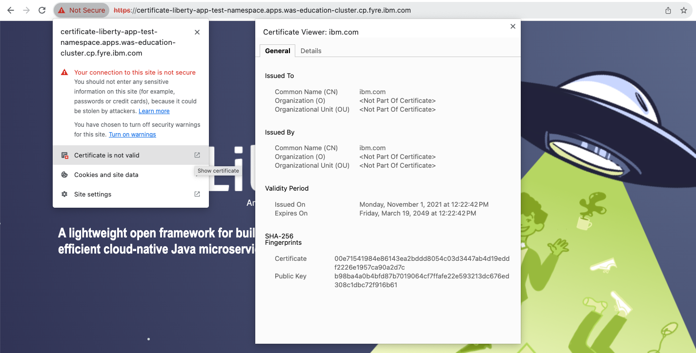

16. Edit OpenLibertyApplication in `liberty-certificate.yaml` to disable automatic generation of certificates. Under `spec` field, set `manageTLS` field to false:
+
[source,yaml]
----
  manageTLS: false
----
+
To apply the changes, run:
+
[source,sh]
----
oc apply -f liberty-certificate.yaml
----
+
The operator will no longer manage the certificates. Manual configuration is required for TLS certificates, probes, monitoring, routes and other parameters.

17. Check the status of the OpenLibertyApplication instance again by running:
+
[source,sh]
----
oc get OpenLibertyApplication certificate-liberty-app -ojson | jq '.status.conditions, .status.references'
----
+
[source,log]
----
[
  {
    "lastTransitionTime": "2023-11-03T02:34:53Z",
    "status": "True",
    "type": "Reconciled"
  },
  {
    "lastTransitionTime": "2023-11-03T02:38:23Z",
    "message": "Application is reconciled and resources are ready.",
    "status": "True",
    "type": "Ready"
  },
  {
    "lastTransitionTime": "2023-11-03T02:38:23Z",
    "message": "Deployment replicas ready: 1/1",
    "reason": "MinimumReplicasAvailable",
    "status": "True",
    "type": "ResourcesReady"
  }
]
{
  "saResourceVersion": "27557235",
  "semeruGeneration": "1"
}
----
+
As in the example output, the application should be ready even without TLS configuration. Without TLS management, `svcCertSecretName` field should now be gone.

18. Please delete the OpenLibertyApplication instance clean up the resources.
+
[source,sh]
----
oc delete OpenLibertyApplication/certificate-liberty-app
----

====

.*Method B: Deployment through OpenShift Web Console*
[%collapsible]
====

1. Access your OpenShift web console. Web console's URL starts with https://console-openshift-console.apps. If you do not have access to a cluster, please contact Lab Administrators to have credentials assigned to you.

2. Switch to the Developer perspective, if it is set to the Administrator perspective. Ensure you are on a project/namespace that you were assgined with for the lab.
+
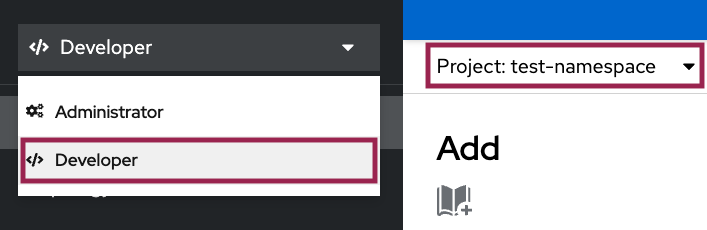

3. Click `+Add`. Under `Developer Catalog`, click `Operator Backed`. This page shows the operator catalog on the cluster and enables you to deploy operator managed services.
+
image:images/operator-backed.png[,500]

4. Click *OpenLibertyApplication* and create an instance.
+
image:images/create-instance.png[,800]
+
Select YAML view and replace the default configurations with the following content:
+
[source,yaml]
----
apiVersion: apps.openliberty.io/v1
kind: OpenLibertyApplication
metadata:
  name: certificate-liberty-app
spec:
  applicationImage: icr.io/appcafe/open-liberty:full-java8-openj9-ubi
  replicas: 1
  expose: true
  manageTLS: true
----
+
This will create a Deployment named `certificate-liberty-app` with 1 replica. By setting `.spec.manageTLS` field to true, the operator attempts to generate certificates and mount them to the pod at `/etc/x509/certs`. Port `9443` is used as the default service port. Since `.spec.expose` field is set to true, the Route is also configured automatically to enable TLS by using `reencrypt` termination.

5. You will see that an instance is created in `Topology` tab. You can select a resource that you would like to investigate.
+
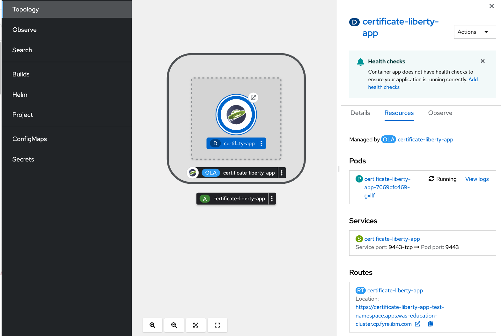

6. If you would like to see the instance's status at once, click 3 dots beside `*OLA* certificate-liberty-app`, then `Edit OpenLibertyApplication`.
+
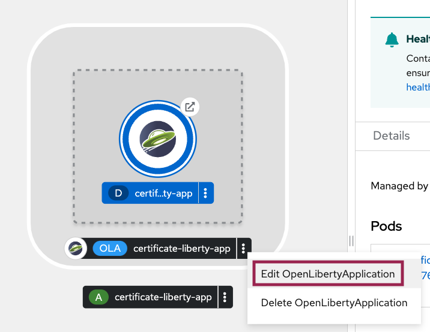

7. Scroll to the botton of the YAML file. As in the example, `ResourcesReady` 's message field shows the number of running replicas out of configured number of replicas. `svcCertSecretName` field shows the generated certificate secret name that the application uses.
+
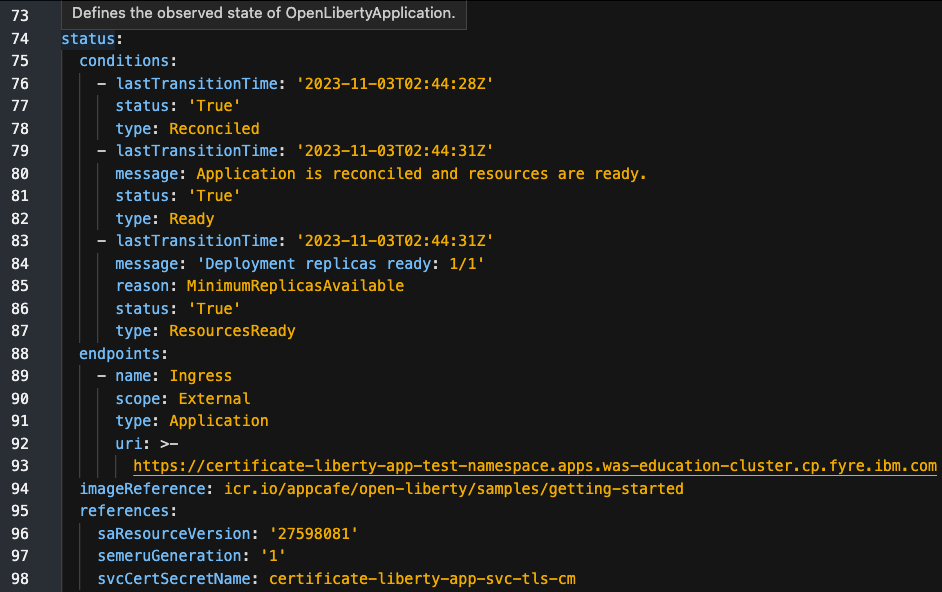
+
If any type under status conditions section reports that the Application is not ready even after a considerate amount of time, check the application's log through Topology page.

8. Go back to the Topology page. Check application pod's log to make sure Liberty server successfully started.
+
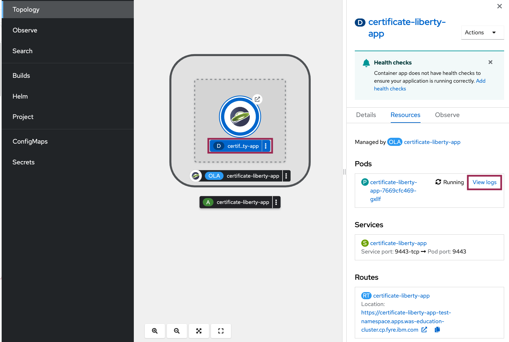
+
Wait for the `CWWKF0011I` log to make sure the Liberty server started successfully:
+
[source,log]
----
{"type":"liberty_message","host":"certificate-liberty-app-78f8796974-4qjr8","ibm_userDir":"\/opt\/ol\/wlp\/usr\/","ibm_serverName":"defaultServer","message":"CWWKF0011I: The defaultServer server is ready to run a smarter planet. The defaultServer server started in 85.906 seconds.","ibm_threadId":"00000028","ibm_datetime":"2023-11-03T01:48:35.446+0000","ibm_messageId":"CWWKF0011I","module":"com.ibm.ws.kernel.feature.internal.FeatureManager","loglevel":"AUDIT","ibm_sequence":"1698976115446_0000000000021","ext_thread":"Default Executor-thread-3"}
----

9. Go back to Topology page. Get the URL allocated by `Routes` resource. You can locate it under `Routes` section on the right. For example: `https://certificate-liberty-app-user0-namespace.apps.was-education-cluster.cp.fyre.ibm.com`. Access the route.
+
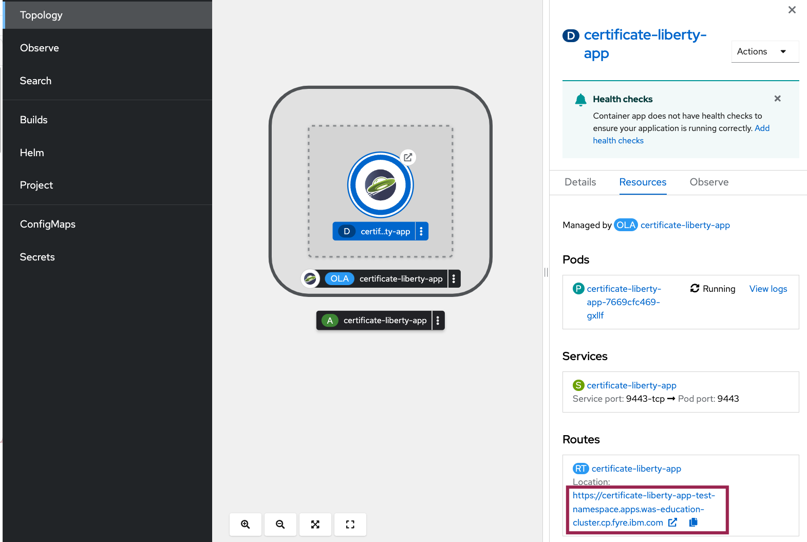

10. Check the certificate of the page. It will say `Not Secure` because the certificate is self-signed. You should see that the certificate is issued to *.apps.<OCP-cluster-name>.cp.fyre.ibm.com and issued by ingress-operator. These are the default values when a certificate is not specified.
+

11. Verify that a Certificate Authority (CA) `Issuer` instance and its corresponding secret are successfully created in your namespace. Click `Search` tab on the left and search for resources `Secret` and `Issuer`. For `Secret`, filter type to TLS. Then you should see the following secrets and issuers included in your result:
+
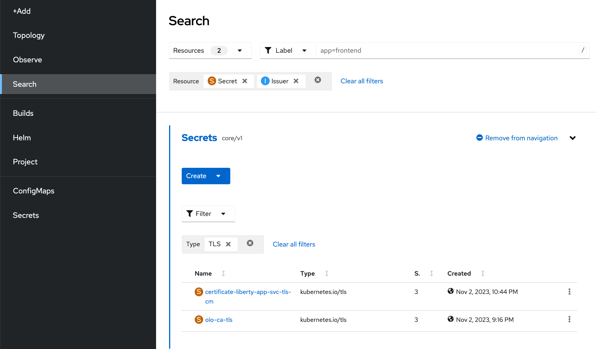 
+
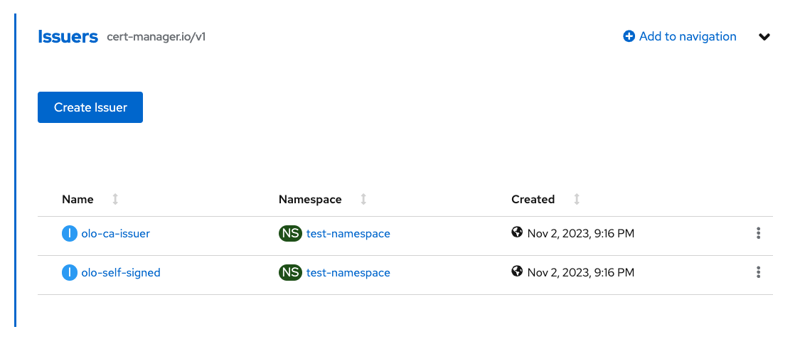 
+
This shows the default secret generated by the Cert Manager, with `svc-tls-cm` suffix appended to the OpenLibertyApplication instance's name.

12. Go back to Topology page. Edit OpenLibertyApplication to add the certificate secret reference to the route. Under `spec` field, add `route` field as the following:
+
[source,yaml]
----
  route:
    certificateSecretRef: certificate-liberty-app-svc-tls-cm
----

13. Revisit the application page on your browser. Check the certificate again. Now the certificate is issued to `certificate-liberty-app.<namespace>.svc` and issued by `Open Liberty Operator`. This is the default self-signed certificate that the Open Liberty Operator provides with Cert Manager.
+

14. Since the operator is running on OpenShift Container Platform for the lab, we can also explore Red Hat OpenShift service CA as well. This method is the default for the operator and is the simplest way to generate certificates without the help of Certificate Manager. Edit OpenLibertyApplication instance to force use of the Red Hat OpenShift service CA. Under `spec` field, edit `route` field and `service` field as the following: 
+
[source,yaml]
----
  route:
    certificateSecretRef: certificate-liberty-app-svc-tls-ocp
----
+
[source,yaml]
----
  service:
    annotations:
      service.beta.openshift.io/serving-cert-secret-name: certificate-liberty-app-svc-tls-ocp
    port: 9443
    type: ClusterIP
----
+
This configuration adds annotation to use Red Hat OpenShift CA. It will ensure `tls.crt` and `tls.key` files are mounted to the pod and Red Hat OpenShift CA certificate is in the /var/run/secrets/kubernetes.io/serviceaccount/service-ca.crt file. By updating the `certificateSecretRef` field, the application route will load the new certificate.

15. Try searching for the TLS secrets again. Click `Secrets` tab. Filter results by `TLS` type and `Name` containing `certificate`. Compared to the last TLS secrets output, there is another TLS secret with `svc-tls-ocp` suffix appended to the OpenLibertyApplication instance's name.
+
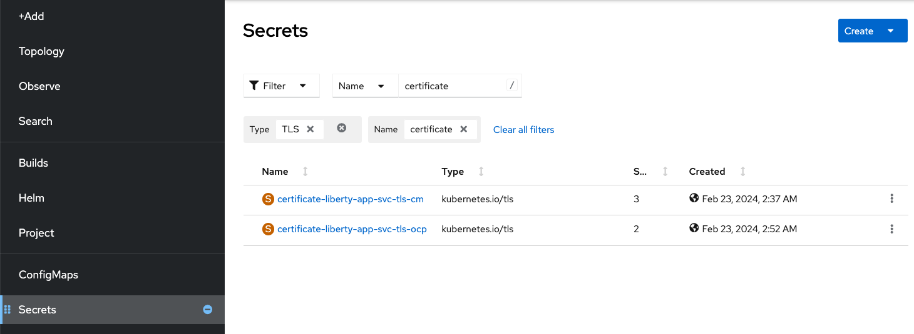

16. Revisit the application page on your browser. Check the certificate again. The certificate is still issued to `certificate-liberty-app.<namespace>.svc` but is now issued by `openshift-service-serving-signer`.
+

17. Let us consider a scenario where you already have a CA certificate ready. Instead of having the operator create its own CA for issuing service certificates, you can bring your own CA certificate. Create a secret by clicking `Secrets` tab, `Create` and `From YAML`. Create a secret with the following content:
+
[source,yaml]
----
apiVersion: v1
kind: Secret
metadata:
  name: olo-custom-ca-tls
type: kubernetes.io/tls
data:
  # This is a self signed certificate that was generated with:
  # openssl genrsa -out ca.key 2048
  # openssl req -x509 -new -nodes -days 10000 -key ca.key -out ca.crt -subj "/CN=ibm.com"
  tls.crt: LS0tLS1CRUdJTiBDRVJUSUZJQ0FURS0tLS0tCk1JSURCVENDQWUyZ0F3SUJBZ0lVYkNkaFZLcGoxTnZlaE15N1BLS0RZaU5nRTQ4d0RRWUpLb1pJaHZjTkFRRUwKQlFBd0VqRVFNQTRHQTFVRUF3d0hhV0p0TG1OdmJUQWVGdzB5TVRFeE1ERXhOakl5TkRKYUZ3MDBPVEF6TVRreApOakl5TkRKYU1CSXhFREFPQmdOVkJBTU1CMmxpYlM1amIyMHdnZ0VpTUEwR0NTcUdTSWIzRFFFQkFRVUFBNElCCkR3QXdnZ0VLQW9JQkFRRE1saFJiM2JRNXliNzRKT25yTCtnVzJOMGZTOGY4MlFCd0cxVXB4Nkx0b20rcDVWc3gKeVJvVE96aklETFA3ODBlOWxFUjBmUk5DVUphMUk2aE1OWmR3T0gyaHYzaSt4NDBneUQyYUEwbHorZXcxRHhGRwpFeHpSOVNNd2duc3p0c3YvcWN1OU9qeGhlTnVEZk1iSTB5S1RKYXpMNjhtNUJLc0oraDV5VWFyT3lwRENBS2o2CkxxWkNkUzZwb0haM3BtQjZCa29ZNFFoaE1ZVmFsbXQyMjM2MGJkV01MY1JGN1dhbkhyNWw5UWZaWEhibkVsbW0KSnBYTVlGWEFRRzBHZXpRYzVTZFNNa1hGOHBFejhLOVBheW5sTlVCUHJPNTFMdXVuSlJaT3M2OEFDY0RjNjlNcQorK2hRbDJhZVlLSjFhdnN5MkNCTEJWK3JRYlhlaEpOVVNsbFJBZ01CQUFHalV6QlJNQjBHQTFVZERnUVdCQlF5CkszcWJUYnRkOUoyd2RvQ3dZMmdhVDlibUNUQWZCZ05WSFNNRUdEQVdnQlF5SzNxYlRidGQ5SjJ3ZG9Dd1kyZ2EKVDlibUNUQVBCZ05WSFJNQkFmOEVCVEFEQVFIL01BMEdDU3FHU0liM0RRRUJDd1VBQTRJQkFRQklNSEExcWpTbgpDMHBUK3lHUS9pTFZqWjBMYVhTK1M5MVFqKzNTS3QxeWRkajdmOE0ySFZvSjZPMGNiNDFkSmdWaU52dHN6dUpoCkc2bENPUGtOcm1lOGhXSk91eGhSTXArenJlQm44UzFuZUhoaG4vZWJYb0JxdGt6WWJkcnFPZzlRdk81LytqYUsKQ1U3L0k0ZEIwMXdoR1lmSEUwS24xZlA1N0ZsWTNDR2M2UDJQYzRycnJBSzZZcGg3STNrUHY4cHdMdHBlOGFIdApvVUFPVmtwNmgzU3dJTW8yTXJVL3NwQVpLS0FRNWhGK2tWaDg2NExrdEN1Nk44dzZoWlpDcjYxdmdrNStZQzd2CmdpRnN4QzFWTDNMWHNDUFdSVWs0RjJFQW53dTd5cXFvN0FwQVhseVNYMExNSC90Y3BaMWQ3MzAwOW9jYkRYS3MKc0QxTERmMFNYNHZMCi0tLS0tRU5EIENFUlRJRklDQVRFLS0tLS0K
  tls.key: LS0tLS1CRUdJTiBSU0EgUFJJVkFURSBLRVktLS0tLQpNSUlFb3dJQkFBS0NBUUVBekpZVVc5MjBPY20rK0NUcDZ5L29GdGpkSDB2SC9Oa0FjQnRWS2NlaTdhSnZxZVZiCk1ja2FFenM0eUF5eisvTkh2WlJFZEgwVFFsQ1d0U09vVERXWGNEaDlvYjk0dnNlTklNZzltZ05KYy9uc05ROFIKUmhNYzBmVWpNSUo3TTdiTC82bkx2VG84WVhqYmczekd5Tk1pa3lXc3krdkp1UVNyQ2ZvZWNsR3F6c3FRd2dDbworaTZtUW5VdXFhQjJkNlpnZWdaS0dPRUlZVEdGV3BacmR0dCt0RzNWakMzRVJlMW1weDYrWmZVSDJWeDI1eEpaCnBpYVZ6R0JWd0VCdEJuczBIT1VuVWpKRnhmS1JNL0N2VDJzcDVUVkFUNnp1ZFM3cnB5VVdUck92QUFuQTNPdlQKS3Z2b1VKZG1ubUNpZFdyN010Z2dTd1ZmcTBHMTNvU1RWRXBaVVFJREFRQUJBb0lCQUYyRjBlSzQ4N1ZqRTJpTwpQMXlpOXI3Uy9pcGJVeDJ6K1c1R0lHVkwvS0FUSEdhWEVWd3Q2VHlYV3ZxZ1MvckdHS3FDUjlUVWhHUlJRTU9uCmZEenlWcnNYSjk4MER6ZHZNNFdqNC8wdXVYcEo2bi9LMW9PcEl3aWJ2aTFqeUh3NGVRTHpsTTU0KzdjM0wybnAKTlZvQ29wQ1ByWEUrNVdVdHpCNXdkMUNkSXE4S3UxTHJsbGczbXJEUEQ3RXg4Q0hoeG5KQTlLOGRJUGpzQ2tJSApUK0M1QTJWWGpzYjNSK3IxQ0p5UHg0bitQbDhqNnNWVkgyQzFSMzRwb0I0R1hvdURIemxWZUM1WXV2eTU3OEVLCnRuUHg4TXhqc0d6aFJaSkhKbHZmOStGbVpiSThMcHBQdFBzRkVPMnkyczZtWCtUQ1hmMXl3aWVUODdjSWtMdnUKQ2F3WG1uMENnWUVBNitkdVNkOWJoUG1LYTZma1d0MjVqc1JEdStWcW5aSHpySTRRQUtnV3MzVzVEYmpEQUF3aApFS25jYm1WSmRCZEJXSHJUVWI1NEJ6bWN1enAwcGMvRWZkZXVybFp0NVBVMnV1aHZFY24zVjhHOFc0cXM2NXJWCjg4cWQ5K0NEb25VdllpcTVEOGIyZ3RzVnZDRXltU1dKMjNod2dsTFNZNjY4cHBzWlZvZWlUYjhDZ1lFQTNnT3MKalJpQVBGT0dCVFBxRFRJbnZpWjA2b0R1Nk9IWURxSEUvajQydE5xZWJRRkhFekpkVEJKdUk1WnNaR3Bqa0cvUgpwZzY2R1hvcnAyQ1liU1JMSkI4Q3VtZllYTE9KUE91MFJrTTNlRG1pUXZreUVGLytiOW1yeFVCa2dZa0lzWnpYCmQwSEtFOG10UGIvWXNWVFpzU0d5OGRwZ1M4ZWtEZXJrLzY4MVBPOENnWUIvWW5nMm9jcnNza2Rodk1aZG5zODkKWFpQcDJZZEowTzlSSldGVXlXK0F0cmdYeGNaZXR5My9yb21lZjBrN3kvYjRUVkxoR0VYK09NaitmU0ZTRERCaApkOThXdXdzYWtLTmVLSGNabHdMZU8zcDN3Qm1DSEJrZVRUSWlFUFZqKzMxN3QvQTRxY3FoZktadThVbytVbnZ2CnJFaXN4d1plMTVOOUw5RnQzVTN5UndLQmdEN0lZVEpoWEZveThISm1OT2pZWng3QnQweGRlN0pGczVpbnJKS04KTzJFM2RaZXp4Y3FxOG5GQndQMjFXeCttYWxOOUc1ZFBFTmVGa2ZTNlAwQ1dBOTNLR3pabGlXemxwSWlpeXc4WAprUWNoblQ0OVJDZ1hUVmVLQWFZOVNHN05OclVyZWs4U1ByZ0x6ejdvRXJwTEdXaWE5QVNxMFpKOGVXc3FJdW9mClBQbm5Bb0dCQUxjVlRUZnkrTHBxbFlPbzdXSHIzNDBrTXlteWYvMmxTZGtmK0FDTm5lck04Z2RaZzB1Mm43NHIKTmI2ZkdiNXF5eHhOVkI3c3NVMFg2QVVONzdoQ3JWVUlVNmxWaURNRFNzbWNQdzBPU1hneUFPVnJZTTVIUU5BMApvMEVYZDBlV3JrU1V3cDFBRGR2b252eEh1czFlRG12OEk1b2RHRklOaFBtODgzcmdodFVKCi0tLS0tRU5EIFJTQSBQUklWQVRFIEtFWS0tLS0tCg==
----
+
It is important to note that the secret's name is `olo-custom-ca-tls`. This way, the operator knows that a custom CA certificate exists and reissues a certificate for the service by using the provided CA.

18. Edit OpenLibertyApplication to update certificate reference for the route. Under `spec` field, edit `route` field the following:
+
[source,yaml]
----
  route:
    certificateSecretRef: olo-custom-ca-tls
----

19. Revisit the application page on your browser. Check the certificate again. The certificate is now issued to `ibm.com` and issued by `ibm.com`.
+

20. Edit the OpenLibertyApplication instance to disable automatic generation of certificates. Under `spec` field, set `manageTLS` field to false:
+
[source,yaml]
----
  manageTLS: false
----
+
The operator will no longer manage the certificates. Manual configuration is required for TLS certificates, probes, monitoring, routes and other parameters.

21. Check the status of the OpenLibertyApplication instance again.
+
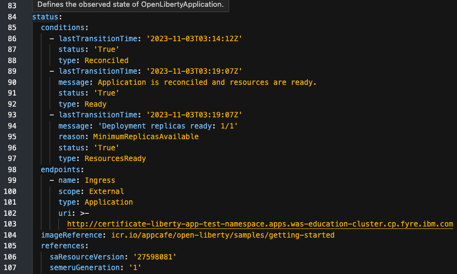
+
As in the example, the application should be ready even without TLS configuration. Without TLS management, `svcCertSecretName` field should now be gone.

22. Please delete the OpenLibertyApplication instance to clean up the resources.
+
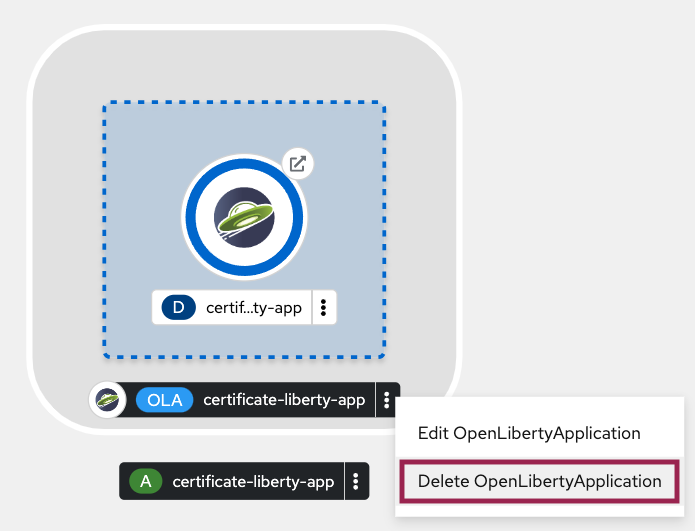

====
