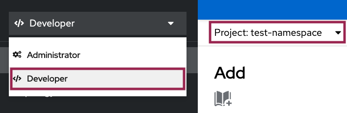
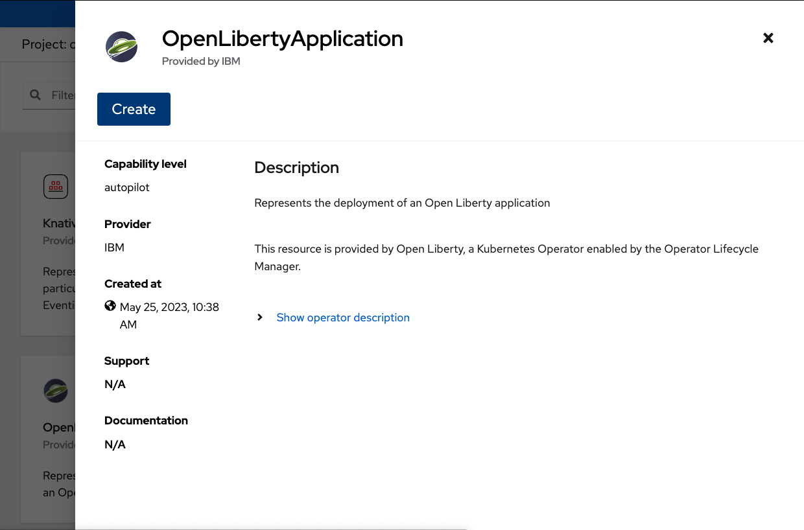

ifdef::env-github[]
:tip-caption: :bulb:
:note-caption: :information_source:
endif::[]

= Semeru Cloud Compiler Integration

This lab focuses on the configuration of Semeru Cloud Compiler for OpenLibertyApplication instances.

== Semeru Cloud Compiler (JIT Server Integration)
The `Semeru Cloud Compiler` efficiently manages Just-In-Time (JIT) compilation requests from applications, operating independently from the application's virtual machine. This decoupling approach leads to optimized resource utilization, including enhanced CPU and memory efficiency within the application VM. When the feature is enabled, Open Liberty Operator takes care of creating deployments, services, and certificates for the Semeru Cloud Comiler, seamlessly connecting them to the relevant applications.

== Getting Started
* Using educational cluster? If you need access to the cluster, please contact Lab Administrators to have credentials assigned to you.
* Using your own cluster? Please follow link:++../Prerequisites.adoc++[Prerequisites guide] before proceeding.

== Deployment Options
Choose one of two methods to deploy OpenLibertyApplication instance on your cluster.

.*Method A: Deployment through `oc` client*
[%collapsible]
====

._Environment setup: If already setup, you can close this section_
[%collapsible%open]
=====
1. Make sure you have `oc` client and `jq` installed in your system. `oc` client is used to communicate with RedHat OpenShift cluster and `jq` is a JSON processing tool, which helps formatting and extracting data.

2. Log into a RedHat OpenShift cluster.
+
[source,sh]
----
oc login --server=https://<cluster-api-ip-address>:6443 --username=<username> --password=<password>
----
+
For example:
+
[source,sh]
----
oc login --server=https://9.123.456.789:6443 --username=testuser --password=PasswordExample123
----
+
If you do not have access to a cluster, please contact Lab Administrators to have credentials assigned to you.

3. To set your current namespace to be the namespace you will be working in, run the following commands:
+
NOTE: _Replace `<your-namespace>` with the namespace provided to you for the lab._
+
[source,sh]
----
export NAMESPACE=<your-namespace>
oc project $NAMESPACE
----
=====

*_Start here after Environment Setup_*

1. Create a YAML file called `liberty-semeru.yaml` with the following content:
+
[source,yaml]
----
apiVersion: apps.openliberty.io/v1
kind: OpenLibertyApplication
metadata:
  name: semeru-enabled-sample
spec:
  applicationImage: >-
    icr.io/appcafe/open-liberty/samples/getting-started@sha256:e22dd56a05e44618a10d275d3ff07a38eb364c0f04f86ffe9618d83dd5467860
  replicas: 1
  semeruCloudCompiler:
    enable: true
    replicas: 1
    resources:
      limits:
        cpu: 200m
        memory: 256Mi
      requests:
        cpu: 100m
        memory: 128Mi
  service:
    port: 9443
    type: ClusterIP
  deployment:
    updateStrategy:
      type: Recreate
----
+
* `semeruCloudCompiler` handles semeru related properties. 
* `deployment.updateStrategy` handles update strategy behaviour. In this example, when there is change observed, instead of updating the replicas one by one, all old replicas will be deleted and recreated. 

2. Create the OpenLibertyApplication instance using the command:
+
[source,sh]
----
oc apply -f liberty-semeru.yaml
----
This will create a Deployment and Service named `semeru-enabled-sample-semeru-compiler-1` for semeru compiler first. After the service is fully ready, the operator will create a Deployment and Service named `semeru-enabled-sample` for the application.

3. Check the status of the OpenLibertyApplication instance by running:
+
[source,sh]
----
oc get OpenLibertyApplication semeru-enabled-sample -ojson | jq '.status.conditions'
----
It will print output similar to the following:
+
[source,log]
----
[
  {
    "lastTransitionTime": "2023-11-03T12:20:22Z",
    "status": "True",
    "type": "Reconciled"
  },
  {
    "lastTransitionTime": "2023-11-03T12:20:24Z",
    "message": "Application is reconciled and resources are ready.",
    "status": "True",
    "type": "Ready"
  },
  {
    "lastTransitionTime": "2023-11-03T12:20:24Z",
    "message": "Deployment replicas ready: 1/1",
    "reason": "MinimumReplicasAvailable",
    "status": "True",
    "type": "ResourcesReady"
  }
]
----
As in the example output, `message` field shows the number of running replicas out of configured number of replicas. When the status reports both `ResourcesReady` and `Ready`, the application is ready. If any type under status conditions section reports that the Application is not ready even after a considerate amount of time, check the application's log, by running `oc logs deployment/semeru-enabled-sample`.

4. Check semeru related properties in the status section as well.
+
[source,sh]
----
oc get OpenLibertyApplication semeru-enabled-sample -ojson | jq '.status.semeruCompiler, .status.references'
----
It will print output similar to the following:
+
[source,log]
----
{
  "serviceHostname": "semeru-enabled-sample-semeru-compiler-1.test-namespace.svc",
  "tlsSecretName": "semeru-enabled-sample-semeru-compiler-1-tls-cm"
}
{
  "saResourceVersion": "27958518",
  "semeruGeneration": "1",
  "semeruInstancesCompleted": "1",
  "svcCertSecretName": "semeru-enabled-sample-svc-tls-cm"
}
----
* `svcCertSecretName` and `tlsSecretName` show certificates in the status section. These certificates are created and managed by the Cert Manager, which is covered in the Cert Manager Lab. They are injected into the application as well as the JIT server via operator's secrets.
* See semeru related properties in the output as well. It lists the service host name and associated TLS secret name under `.status.semeruCompiler` section. It also shows Semeru's generation and completed number under `.status.references`.

5. You can check what resources are managed by the operator through a command.
+
[source,sh]
----
oc get all -l app.kubernetes.io/part-of=semeru-enabled-sample
----
It will print output similar to the following:
+
[source,log]
----
NAME                                                           READY   STATUS    RESTARTS   AGE
pod/semeru-enabled-sample-7bfddd57f4-dplgj                     1/1     Running   0          21m
pod/semeru-enabled-sample-semeru-compiler-1-5dbc66f787-dncpw   1/1     Running   0          21m

NAME                                              TYPE        CLUSTER-IP       EXTERNAL-IP   PORT(S)     AGE
service/semeru-enabled-sample                     ClusterIP   172.30.20.141    <none>        9443/TCP    21m
service/semeru-enabled-sample-semeru-compiler-1   ClusterIP   172.30.239.125   <none>        38400/TCP   21m

NAME                                                      READY   UP-TO-DATE   AVAILABLE   AGE
deployment.apps/semeru-enabled-sample                     1/1     1            1           21m
deployment.apps/semeru-enabled-sample-semeru-compiler-1   1/1     1            1           21m

NAME                                                                 DESIRED   CURRENT   READY   AGE
replicaset.apps/semeru-enabled-sample-7bfddd57f4                     1         1         1       21m
replicaset.apps/semeru-enabled-sample-semeru-compiler-1-5dbc66f787   1         1         1       21m
----
+
The certificates are not reflected here, but you can check the certificates using `svcCertSecretName` and `tlsSecretName` in the status output in Step 4.

6. Check the logs of JIT server pods. Run the following command:
+
[source,sh]
----
oc logs deployment/semeru-enabled-sample-semeru-compiler-1
----
+
It will print output similar to the following:
+
[source,log]
----
#INFO:  StartTime: Nov 03 12:20:08 2023
#INFO:  TimeZone: UTC (UTC)

JITServer is ready to accept incoming requests
#JITServer: t= 55690 A new client (clientUID=17669114005711668316) connected. Server allocated a new client session.
----
+
You can see that there are clients connected to the JITServer with unique client ID for each application pod.

7. Check the Liberty application log to ensure the connection with JIT Server. Run the following to get the logs:
+
[source,sh]
----
oc logs deployment/semeru-enabled-sample
----
+
For Mac/Linux users, to print out only the first 8 lines:
+
[source,sh]
----
oc logs deployment/semeru-enabled-sample | head -8
----
+
It will print output similar to the following at the top:
+
[source,log]
---- 
Found mounted TLS certificates, generating keystore
Found mounted TLS CA certificate, adding to truststore

#INFO:  StartTime: Feb 23 08:27:06 2024
#INFO:  Free Physical Memory: 384 MB 
#INFO:  CPU entitlement = 100.00
#JITServer: t=  1048 Connected to a server (serverUID=4411328907690025758)
{"type":"liberty_message","host":"semeru-enabled-sample-65d799b8d-glfnw","ibm_userDir":"\/opt\/ol\/wlp\/usr\/","ibm_serverName":"defaultServer","message":"Launching defaultServer (Open Liberty 23.0.0.3\/wlp-1.0.75.cl230320230319-1900) on Eclipse OpenJ9 VM, version 11.0.18+10 (en_US)","ibm_datetime":"2024-02-23T08:27:08.185+0000","ibm_sequence":"1708676828186_0000000000001"}
----
+
You can see that the Liberty application is successfully connected to JIT Server pod.

8. The operator will instantly detect when the application image is modified or updated. Then the operator will create a new set of JIT Server pods for the new application pods. Edit OpenLibertyApplication in `liberty-semeru.yaml`. Under `spec` field, modify `replicas` to 2 and `applicationImage` field to the new image, with new digest value. Please note `semeruCloudCompiler.replicas` field stays as 1.
+
[source,yaml]
----
  applicationImage: >-
    icr.io/appcafe/open-liberty/samples/getting-started@sha256:f7c7da21059eef8734cf0d43a417609aecf68bfe89d0be8e61012fade5877a01
  replicas: 2
  semeruCloudCompiler:
    enable: true
    replicas: 1
----
+
To apply the changes, run:
+
[source,sh]
----
oc apply -f liberty-semeru.yaml
----

9. Check the status of managed resources. When the application is not fully updated with the new image, there will be 2 Semeru deployments. This is to ensure deployments with older image is still connected to the first version of Semeru while updating. Wait until the Liberty app deployment’s pods are all updated to the new image and there is only 1 Semeru deployment.
+
[source,sh]
----
oc get all -l app.kubernetes.io/part-of=semeru-enabled-sample
----
+
[source,log]
----
NAME                                                           READY   STATUS    RESTARTS   AGE
pod/semeru-enabled-sample-7cb5b9648-78ksr                      1/1     Running   0          55s
pod/semeru-enabled-sample-7cb5b9648-p84wf                      1/1     Running   0          55s
pod/semeru-enabled-sample-semeru-compiler-2-5bf6678d64-7hj28   1/1     Running   0          102s

NAME                                              TYPE        CLUSTER-IP       EXTERNAL-IP   PORT(S)     AGE
service/semeru-enabled-sample                     ClusterIP   172.30.20.141    <none>        9443/TCP    27m
service/semeru-enabled-sample-semeru-compiler-2   ClusterIP   172.30.107.104   <none>        38400/TCP   2m15s

NAME                                                      READY   UP-TO-DATE   AVAILABLE   AGE
deployment.apps/semeru-enabled-sample                     2/2     2            2           27m
deployment.apps/semeru-enabled-sample-semeru-compiler-2   1/1     1            1           2m15s

NAME                                                                 DESIRED   CURRENT   READY   AGE
replicaset.apps/semeru-enabled-sample-7bfddd57f4                     0         0         0       27m
replicaset.apps/semeru-enabled-sample-7cb5b9648                      2         2         2       55s
replicaset.apps/semeru-enabled-sample-semeru-compiler-2-5bf6678d64   1         1         1       102s
----
+
You can see that the JIT Server's deployment and service name has been changed from `semeru-enabled-sample-semeru-compiler-1` to `semeru-enabled-sample-semeru-compiler-2`. This is a new set of JIT Server sessions with the Liberty app. New `semeru-enabled-sample` deployment now has 2 pods associated with replicas update.

10. Check the logs of JIT server pod to ensure a connection is established on the new semeru pod. 
+
[source,sh]
----
oc logs deployment/semeru-enabled-sample-semeru-compiler-2
----
+
[source,log]
----
#INFO:  StartTime: Nov 03 12:45:58 2023
#INFO:  TimeZone: UTC (UTC)

JITServer is ready to accept incoming requests
#JITServer: t= 57233 A new client (clientUID=17323591195897896455) connected. Server allocated a new client session.
#JITServer: t= 57485 A new client (clientUID=64487259094609072) connected. Server allocated a new client session.
----
+
Now there are 2 new client sessions, one for each `semeru-enabled-sample` pod.

11. You can also detect the changes in OpenLibertyApplication instance's status report as well.
+
[source,sh]
----
oc get OpenLibertyApplication semeru-enabled-sample -ojson | jq '.status.semeruCompiler, .status.references'
----
It will print output similar to the following:
+
[source,log]
----
{
  "serviceHostname": "semeru-enabled-sample-semeru-compiler-2.test-namespace.svc",
  "tlsSecretName": "semeru-enabled-sample-semeru-compiler-2-tls-cm"
}
{
  "saResourceVersion": "27958518",
  "semeruGeneration": "2",
  "semeruInstancesCompleted": "2",
  "svcCertSecretName": "semeru-enabled-sample-svc-tls-cm"
}
----
+
The version check enables easy cleanup of the old version of JIT Server with the numbering naming convention.

12. To disable JIT Server integration, edit OpenLibertyApplication instance in `liberty-semeru.yaml`. Under `spec` field, change `semeruCloudCompiler.enable` to false:
+
[source,yaml]
----
  semeruCloudCompiler:
    enable: false
----
+
To apply the changes, run:
+
[source,sh]
----
oc apply -f liberty-semeru.yaml
----

13. Check the instance's status sections.
+
[source,sh]
----
oc get OpenLibertyApplication semeru-enabled-sample -ojson | jq '.status.conditions, .status.semeruCompiler'
----
It will print output similar to the following:
+
[source,log]
----
[
  {
    "lastTransitionTime": "2023-11-03T12:46:09Z",
    "status": "True",
    "type": "Reconciled"
  },
  {
    "lastTransitionTime": "2023-11-03T12:53:49Z",
    "message": "Application is reconciled and resources are ready.",
    "status": "True",
    "type": "Ready"
  },
  {
    "lastTransitionTime": "2023-11-03T12:53:49Z",
    "message": "Deployment replicas ready: 2/2",
    "reason": "MinimumReplicasAvailable",
    "status": "True",
    "type": "ResourcesReady"
  }
]
null
----
Note that the output of `.status.semeruCompiler` returns null. You will be able to see that the pods of JIT Server are now removed as well.
+
[source,sh]
----
oc get all -l app.kubernetes.io/part-of=semeru-enabled-sample
----
+
[source,log]
----
NAME                                         READY   STATUS    RESTARTS   AGE
pod/semeru-enabled-sample-569564f774-999bh   1/1     Running   0          62s
pod/semeru-enabled-sample-569564f774-sb4bn   1/1     Running   0          62s

NAME                            TYPE        CLUSTER-IP      EXTERNAL-IP   PORT(S)    AGE
service/semeru-enabled-sample   ClusterIP   172.30.20.141   <none>        9443/TCP   34m

NAME                                    READY   UP-TO-DATE   AVAILABLE   AGE
deployment.apps/semeru-enabled-sample   2/2     2            2           34m

NAME                                               DESIRED   CURRENT   READY   AGE
replicaset.apps/semeru-enabled-sample-569564f774   2         2         2       62s
replicaset.apps/semeru-enabled-sample-7bfddd57f4   0         0         0       34m
replicaset.apps/semeru-enabled-sample-7cb5b9648    0         0         0       8m7s
----

14. Please delete the OpenLibertyApplication instance to clean up the resources.
+
[source,sh]
----
oc delete OpenLibertyApplication/semeru-enabled-sample
----

====

.*Method B: Deployment through OpenShift Web Console*
[%collapsible]
====

1. Access your OpenShift web console. Web console's URL starts with https://console-openshift-console.apps. If you do not have access to a cluster, please contact Lab Administrators to have credentials assigned to you.

2. Switch to the Developer perspective, if it is set to the Administrator perspective. Ensure you are on a project/namespace that you were assgined with for the lab.
+

3. Click `+Add`. Under `Developer Catalog`, click `Operator Backed`. This page shows the operator catalog on the cluster and enables you to deploy operator managed services.
+
image:images/operator-backed.png[,500]

4. Click *OpenLibertyApplication* and create an instance.
+

+
Select YAML view and replace the default configurations with the following content:
+
[source,yaml]
----
apiVersion: apps.openliberty.io/v1
kind: OpenLibertyApplication
metadata:
  name: semeru-enabled-sample
spec:
  applicationImage: >-
    icr.io/appcafe/open-liberty/samples/getting-started@sha256:e22dd56a05e44618a10d275d3ff07a38eb364c0f04f86ffe9618d83dd5467860
  replicas: 1
  semeruCloudCompiler:
    enable: true
    replicas: 1
    resources:
      limits:
        cpu: 200m
        memory: 256Mi
      requests:
        cpu: 100m
        memory: 128Mi
  service:
    port: 9443
    type: ClusterIP
  deployment:
    updateStrategy:
      type: Recreate
----
+
* `semeruCloudCompiler` handles semeru related properties. 
* `deployment.updateStrategy` handles update strategy behaviour. In this example, when there is change observed, instead of updating the replicas one by one, all old replicas will be deleted and recreated. 

+
This will create a Deployment and Service named `semeru-enabled-sample-semeru-compiler-1` for semeru compiler first. After the service is fully ready, the operator will create a Deployment and Service named `semeru-enabled-sample` for the application.

5. You will see that an instance is created in `Topology` page. Click `OLA semeru-enabled-sample`. You can select a resource on the right that you wish to investigate.
+
image:images/topology.png[,900]

6. Check the OpenLibertyApplication instance's status. Click 3 dots beside `OLA semeru-enabled-sample`, then `Edit OpenLibertyApplication`.
+
image:images/ola.png[,500]
+
Scroll to the botton of the YAML file. As in the example, `message` field shows the number of running replicas out of configured number of replicas. If the `status` reports that the Application is not ready, check the pod's log.
+

+
* As in the example image above, `ResourcesReady` 's message field shows the number of running replicas out of configured number of replicas. When the status reports both `ResourcesReady` and `Ready`, the application is ready.
* The certificates were not reflected in the Topology page, but you can check the certificates using `svcCertSecretName` and `tlsSecretName` in the status section. These certificates are created and managed by the Cert Manager, which is covered in the Cert Manager Lab. They are injected into the application as well as the JIT server via operator's secrets.
* See semeru related properties in the status section as well. It lists the service host name and associated TLS secret name under `.status.semeruCompiler` section. It also shows Semeru's generation and completed number under `.status.references`.

+
If any type under status conditions section reports that the Application is not ready even after a considerate amount of time, check the application's log through Topology page.
+

7. Check the logs of JIT server pods. Go back to `Topology` page to see managed resources of OpenLibertyApplication instance. Click on Deployment resource with name `semeru-enabled-sample-semeru-compiler-1`. Then click `View logs`
+
image:images/semeru-deployment.png[,900]
+
You should be able to see JITServer logs reporting that the server allocated a new client session.
+
image:images/semeru-logs.png[,900]
+
You can see that there are clients connected to the JITServer with unique client ID for each application pod.

8. Check the logs of Liberty application pods. Go back to `Topology` page to see managed resources of OpenLibertyApplication instance. Click on Deployment resource with name `semeru-enabled-sample`. Then click `View logs`
+

+
image:images/app-logs.png[,900]
+
You can see that the Liberty application is successfully connected to JIT Server pod.

9. The operator will instantly detect when the application image is modified or updated. Then the operator will create a new set of JIT Server pods for the new application pods. Click 3 dots beside `OLA semeru-enabled-sample`, then `Edit OpenLibertyApplication`.
+
image:images/ola.png[,500]
+
Under `spec` field, modify `replicas` to 2 and `applicationImage` field to the new image, with new digest value. Please note `semeruCloudCompiler.replicas` field stays as 1.
+
[source,yaml]
----
spec:
  applicationImage: >-
    icr.io/appcafe/open-liberty/samples/getting-started@sha256:f7c7da21059eef8734cf0d43a417609aecf68bfe89d0be8e61012fade5877a01
  replicas: 2
  semeruCloudCompiler:
    enable: true
    replicas: 1
----

10. Go back to `Topology` page to see managed resources of OpenLibertyApplication instance.
+
image:images/deployment-loading.png[,900]
+
When the application is not fully updated with the new image, there will be 2 Semeru deployments. This is to ensure deployments with older image is still connected to the first version of Semeru while updating. Wait until the Liberty app deployment’s pods are all updated to the new image and there is only 1 Semeru deployment.
+

+
You can see that the JIT Server's deployment and service name has been changed from `semeru-enabled-sample-semeru-compiler-1` to `semeru-enabled-sample-semeru-compiler-2`. This is a new set of JIT Server sessions with the Liberty app. New `semeru-enabled-sample` deployment now has 2 pods associated with replicas update.

11. Check the logs of JIT server pod to ensure a connection is established on the new semeru pod. Click on Deployment resource with name `semeru-enabled-sample-semeru-compiler-2`. Then click `View Logs`.
+
image:images/semeru-logs-new.png[,900]
+
Now there are 2 new client sessions, one for each `semeru-enabled-sample` pod.

12. You can also detect the changes in OpenLibertyApplication instance's status report as well. Click 3 dots beside `OLA semeru-enabled-sample`, then `Edit OpenLibertyApplication`. Scroll to the botton of the YAML file.
+
image:images/status-conditions-new.png[,900]
+
The version check enables easy cleanup of the old version of JIT Server with the numbering naming convention.

13. To disable JIT Server integration, make changes to the OpenLibertyApplication instance. 
+
Under `spec` field, change `semeruCloudCompiler.enable` to false:
+
[source,yaml]
----
  semeruCloudCompiler:
    enable: false
----

14. Go back to `Topology` page to see managed resources of OpenLibertyApplication instance.
+
image:images/topology-no-semeru.png[,900]
+
You will be able to see that the pods of JIT Server are now removed.

15. Please delete the OpenLibertyApplication instance to clean up the resources.
+

====
