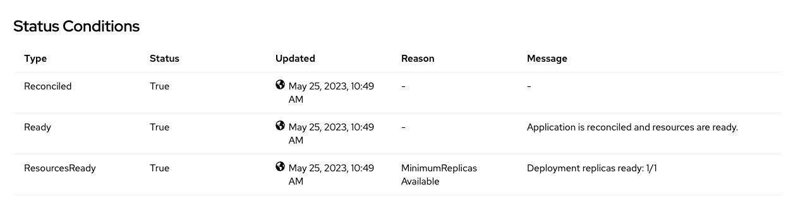

ifdef::env-github[]
:tip-caption: :bulb:
:note-caption: :information_source:
endif::[]

= Horizontal Pod Autoscaler Configuration

This lab focuses on the configuration of Horizontal Pod Autoscaler for OpenLibertyApplication instances.

== Horizontal Pod Autoscaler (HPA)
`Horizontal Pod Autoscaler (HPA)` is a feature that automates the scaling of workloads such as Deployments or StatefulSets, based on the configured demand for their resources, typically measured by CPU and memory consumption. It dynamically adjusts the number of Pods to efficiently handle the workload's resource requirements. When the workload is under-utilized and the number of running Pods is above the minimum configured value, HPA reduces the number of Pods. Conversely, when the workload is over-utilized and the number of running Pods is below the maximum configured value, HPA increases the number of Pods. By automatically scaling the number of Pods based on demand, HPA enables efficient resource utilization and eliminates the need for manual intervention in scaling decision.

== Configuration Options
Choose one of two methods to deploy OpenLibertyApplication instance on your cluster.

.*Method A: Deployment through `oc` client*
[%collapsible]
====
1. Make sure you have `oc` client installed in your system and are logged into a RedHat OpenShift cluster before you begin the lab.
+
[source,sh]
----
oc login --server=https://<cluster-api-ip-address>:6443 --username=<username> --password=<password>
----
+
For example:
+
[source,sh]
----
oc login --server=https://9.123.456.789:6443 --username=user1 --password=PasswordExample123
----
+
If you do not have access to a cluster, please contact Lab Administrators to have credentials assigned to you.

2. To set your current namespace to be the namespace you will be working in, run the following commands:
+
NOTE: _Replace `<your-namespace>` with the namespace provided to you for the lab._
+
[source,sh]
----
export NAMESPACE=<your-namespace>
oc project $NAMESPACE
----

3. Create a YAML file called `liberty-autoscaling.yaml` with the following content:
+
[source,yaml]
----
apiVersion: apps.openliberty.io/v1
kind: OpenLibertyApplication
metadata:
  name: autoscaling-liberty-app
spec:
  applicationImage: icr.io/appcafe/open-liberty/samples/getting-started
  replicas: 1
  expose: false
  probes:
    readiness:
      httpGet:
        path: /
        port: 9080
      initialDelaySeconds: 1
      timeoutSeconds: 1
      periodSeconds: 5
      successThreshold: 1
      failureThreshold: 24
    liveness:
      httpGet:
        path: /
        port: 9080
      initialDelaySeconds: 8
      timeoutSeconds: 1
      periodSeconds: 5
      successThreshold: 1
      failureThreshold: 12
----

4. Create the OpenLibertyApplication instance using the command:
+
[source,sh]
----
oc apply -f liberty-autoscaling.yaml
----
This will create a Deployment named `autoscaling-liberty-app` with 1 replica.

5. Check the status of the OpenLibertyApplication instance by running:
+
[source,sh]
----
oc get OpenLibertyApplication autoscaling-liberty-app -ojson | jq '.status.conditions'
----
+
It should print output that the application is `Reconciled`, `Ready` and `ResourcesReady` similar to the following:
+
[source,log]
----
[
  {
    "lastTransitionTime": "2023-05-11T18:21:19Z",
    "status": "True",
    "type": "Reconciled"
  },
  {
    "lastTransitionTime": "2023-05-11T18:21:30Z",
    "message": "Application is reconciled and resources are ready.",
    "status": "True",
    "type": "Ready"
  },
  {
    "lastTransitionTime": "2023-05-11T18:21:30Z",
    "message": "Deployment replicas ready: 1/1",
    "reason": "MinimumReplicasAvailable",
    "status": "True",
    "type": "ResourcesReady"
  }
]
----
+
As in the example output, `status` field shows the number of running replicas out of configured number of replicas. If the `status` reports that the Application is not ready, check the pod's log.

6. Edit the OpenLibertyApplication instance to use `autoscaling` field as opposed to `replicas` field. Run the command: 
+
[source,sh]
----
oc edit OpenLibertyApplication autoscaling-liberty-app
----
Then remove `replicas: 1` and `resources: {}` under `spec` field and replace them with the following:
+
[source,yaml]
----
  resources:
    requests:
      cpu: "0.4"
  autoscaling:
    maxReplicas: 5
    minReplicas: 3
    targetCPUUtilizationPercentage: 50
----
+
The `resources` field defines a metric source for targeted container resources. In this example, it  `autoscaling` field configures the range of number of Pods for a workload using `maxReplicas` and `minReplicas`. These fields ensure that the number of Pods falls within the specified range. Replica scaling will be determined using `targetCPUUtilizationPercentage` and the metric specified under `resources` field.

7. Check the status of the OpenLibertyApplication instance again by running:
+
[source,sh]
----
oc get OpenLibertyApplication autoscaling-liberty-app -ojson | jq '.status.conditions'
----
It will print output similar to the following:
+
[source,log]
----
[
  {
    "lastTransitionTime": "2023-05-11T18:21:19Z",
    "status": "True",
    "type": "Reconciled"
  },
  {
    "lastTransitionTime": "2023-05-11T18:45:16Z",
    "message": "Application is reconciled and resources are ready.",
    "status": "True",
    "type": "Ready"
  },
  {
    "lastTransitionTime": "2023-05-11T18:45:16Z",
    "message": "Deployment replicas ready: 3",
    "reason": "MinimumReplicasAvailable",
    "status": "True",
    "type": "ResourcesReady"
  }
]
----
+
Compared to the last status output, `status` field now outputs the number of running replicas only without the desired number of replicas. It will report the instance as `Ready` when the currently running number of pods is within the range of `maxReplicas` and `minReplicas`. If the `status` reports that the Application is not ready, check the pod's log.

8. When you check the managed resources, you will see that HorizontalPodAutoscaler resource has been created.
+
[source,sh]
----
oc get all -l app.kubernetes.io/part-of=autoscaling-liberty-app
----
It will print output similar to the following:
+
[source,log]
----
NAME                                           READY   STATUS    RESTARTS   AGE
pod/autoscaling-liberty-app-54946849f8-jl9lk   1/1     Running   0          10m
pod/autoscaling-liberty-app-54946849f8-trnjk   1/1     Running   0          10m
pod/autoscaling-liberty-app-54946849f8-xrkj6   1/1     Running   0          10m

NAME                              TYPE        CLUSTER-IP     EXTERNAL-IP   PORT(S)    AGE
service/autoscaling-liberty-app   ClusterIP   172.30.110.7   <none>        9443/TCP   21m

NAME                                      READY   UP-TO-DATE   AVAILABLE   AGE
deployment.apps/autoscaling-liberty-app   3/3     3            3           21m

NAME                                                 DESIRED   CURRENT   READY   AGE
replicaset.apps/autoscaling-liberty-app-54946849f8   3         3         3       11m
replicaset.apps/autoscaling-liberty-app-54c9d846bc   0         0         0       21m

NAME                                                          REFERENCE                            TARGETS   MINPODS   MAXPODS   REPLICAS   AGE
horizontalpodautoscaler.autoscaling/autoscaling-liberty-app   Deployment/autoscaling-liberty-app   2%/50%    3         5         3          11m
----

9. Check the status of HorizontalPodAutoscaler resource to see if scaling is working as expected.
+
[source,sh]
----
oc get hpa autoscaling-liberty-app -ojson | jq '.status.conditions'
----
+
It will print output similar to the following:
+
[source,log]
----
[
  {
    "lastTransitionTime": "2023-07-20T05:38:32Z",
    "message": "recommended size matches current size",
    "reason": "ReadyForNewScale",
    "status": "True",
    "type": "AbleToScale"
  },
  {
    "lastTransitionTime": "2023-07-20T05:43:17Z",
    "message": "the HPA was able to successfully calculate a replica count from cpu resource utilization (percentage of request)",
    "reason": "ValidMetricFound",
    "status": "True",
    "type": "ScalingActive"
  },
  {
    "lastTransitionTime": "2023-07-20T05:43:17Z",
    "message": "the desired replica count is less than the minimum replica count",
    "reason": "TooFewReplicas",
    "status": "True",
    "type": "ScalingLimited"
  }
]
----
+
You should see `AbleToScale` condition type reporting `True` and `ScalingActive` condition type reporting `True` as well. Status reporting `TooFewReplicas` is not to be concerned for this lab. The sample Liberty application is using very little CPU resource and HPA is complaining that `minReplica` as 3 is too many.

====

.*Method B: Deployment through OpenShift Web Console*
[%collapsible]
====
1. Access your OpenShift web console. Web console's URL starts with https://console-openshift-console.

2. Switch to the Developer perspective, if it is set to the Administrator perspective. Ensure you are on a project/namespace that you were assgined with for the lab.
+
image:images/perspective.png[,300]

3. Click `+Add`. Under `Developer Catalog`, click `Operator Backed`. This page shows the operator catalog on the cluster and enables you to deploy operator managed services.
+
image:images/operator-backed.png[,500]

4. Click OpenLibertyApplication and create an instance.
+
image:images/create-instance.png[,800]

5. Change the OpenLibertyApplication instance to `autoscaling-liberty-app` under *Name* field. Set replicas to 1.
+
image:images/replicas.png[,500]

6. You will see that an instance is created in `Topology` tab. You can select a resource that you would like to investigate.
+
image:images/topology.png[,900]

7. If you would like to see the instance’s status at once, click Search tab on the left and search for OpenLibertyApplications resource. Select `autoscaling-liberty-app`.
+
image:images/ola.png[,900]
+
At the bottom, you will see *Status Conditions* section, which gives you detail on status conditions of the managed resources and the application instance.
+

8. To edit, click `Search` tab on the left and search for `OpenLibertyApplications` resource, and select `autoscaling-liberty-app` instance again. Edit the OpenLibertyApplication instance to use autoscaling feature by configuring `autoscaling` and `resources` field under `spec` field as the following:
+
[source,yaml]
----
  resources:
    requests:
      cpu: "0.4"
  autoscaling:
    maxReplicas: 5
    minReplicas: 3
    targetCPUUtilizationPercentage: 50
----
+
The `resources` field defines a metric source for targeted container resources. In this example, it  `autoscaling` field configures the range of number of Pods for a workload using `maxReplicas` and `minReplicas`. These fields ensure that the number of Pods falls within the specified range. Replica scaling will be determined using `targetCPUUtilizationPercentage` and the metric specified under `resources` field.

9. To see the changes in effect, check the managed resources in `Topology` section, you will now see a new resource under `HorizontalPodAutoscalers` section.
+
image:images/topology-new.png[,900]
+
When you click on the HPA resource and scroll down to see the status condition, you should see `AbleToScale` condition type reporting `True` and `ScalingActive` condition type reporting `True` as well. Status reporting `TooFewReplicas` is not to be concerned for this lab. The sample Liberty application is using very little CPU resource and HPA is complaining that `minReplica` as 3 is too many.
+
image:images/hpa-status-conditions.png[,900]

====

