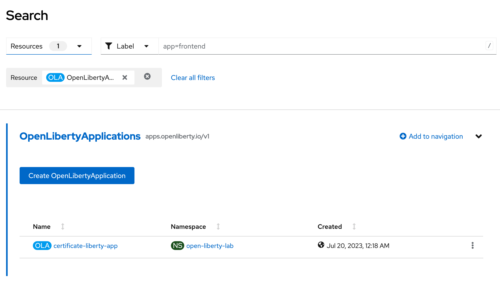
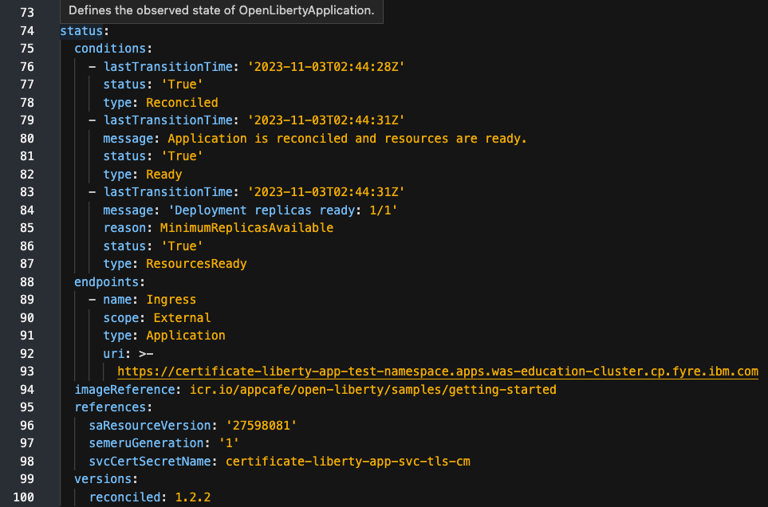
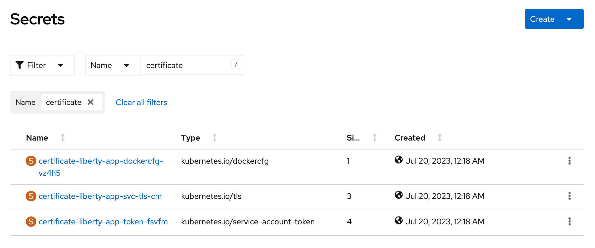

ifdef::env-github[]
:tip-caption: :bulb:
:note-caption: :information_source:
endif::[]

= TLS Certificate Generation

This lab focuses on the TLS certification generate and configuration, as well as an integration of Certificate Manager for OpenLibertyApplication instances.

== TLS Certificates Configuration
In Kubernetes-based clusters, administartors have the ability to configure TLS certificates to secure applications. By default, the operator takes care of generating certificates. However, the administrators also have the option to specify certificates for the Route and Service manually. To automate the provisioning of TLS certificates for Pods and Routes, the cert-manager tool comes into play. This tool enables the operator to handle the certificate provisioning process automatically. Moreover, certificates are securely mounted into containers from a Kubernetes secret, ensuring that they are regularly refreshed whenever updates occur. For more in-depth information about the cert-manager tool, you can refer to https://cert-manager.io/.

There are three methods to generate and configure certificates with Open Liberty Operator. The lab will provide a step-by-step walk-through of each approach. However, before starting the lab, ensure that the certificate manager is already installed on the OpenShift cluster. In case it is not installed, please reach out to the Lab Administrators for assistance with the installation process.

== Configuration Options
Choose one of two methods to deploy OpenLibertyApplication instance on your cluster.

.*Method A: Deployment through `oc` client*
[%collapsible]
====
1. To set your current namespace to be the namespace you will be working in, run the following commands:
+
NOTE: _Replace `<your-namespace>` with the namespace provided to you for the lab._
+
[source,sh]
----
export NAMESPACE=<your-namespace>
oc project $NAMESPACE
----

2. Create a YAML file called `liberty-certificate.yaml` with the following content:
+
[source,yaml]
----
apiVersion: apps.openliberty.io/v1
kind: OpenLibertyApplication
metadata:
  name: certificate-liberty-app
spec:
  applicationImage: icr.io/appcafe/open-liberty/samples/getting-started
  replicas: 1
  expose: true
  manageTLS: true
  probes:
    readiness:
      httpGet:
        path: /
        port: 9080
      initialDelaySeconds: 1
      timeoutSeconds: 1
      periodSeconds: 5
      successThreshold: 1
      failureThreshold: 24
    liveness:
      httpGet:
        path: /
        port: 9080
      initialDelaySeconds: 8
      timeoutSeconds: 1
      periodSeconds: 5
      successThreshold: 1
      failureThreshold: 12
----

3. Create the OpenLibertyApplication instance using the command:
+
[source,sh]
----
oc apply -f liberty-certificate.yaml
----
This will create a Deployment named `certificate-liberty-app` with 1 replica. By setting `.spec.manageTLS` field to true, the operator attempts to generate certificates and mount them to the pod at `/etc/x509/certs`. Port `9443` is used as the default service port. Since `.spec.expose` field is set to true, the Route is also configured automatically to enable TLS by using `reencrypt` termination.

4. Check the status of the OpenLibertyApplication instance by running:
+
[source,sh]
----
oc get OpenLibertyApplication certificate-liberty-app -ojson | jq '.status.conditions'
----
It will print output similar to the following:
+
[source,log]
----
[
  {
    "lastTransitionTime": "2023-05-11T18:21:19Z",
    "status": "True",
    "type": "Reconciled"
  },
  {
    "lastTransitionTime": "2023-05-11T18:21:30Z",
    "message": "Application is reconciled and resources are ready.",
    "status": "True",
    "type": "Ready"
  },
  {
    "lastTransitionTime": "2023-05-11T18:21:30Z",
    "message": "Deployment replicas ready: 1/1",
    "reason": "MinimumReplicasAvailable",
    "status": "True",
    "type": "ResourcesReady"
  }
]
----
As in the example output, `status` field shows the number of running replicas out of configured number of replicas. If the `status` reports that the Application is not ready, check the pod's log.

5. Verify that a Certificate Authority (CA) `Issuer` instance and a corresponding secret are successfully created in your namespace.
+
[source,sh]
----
oc get secrets -n $NAMESPACE
oc get issuers -n $NAMESPACE -o wide
----

6. Since the operator is running on OpenShift Container Platform for the lab, we can also explore Red Hat OpenShift service CA as well. This method is the default for the operator and is the simplest way to generate certificates without the help of Certificate Manager. Edit the OpenLibertyApplication instance to force use of the Red Hat OpenShift service CA by configuring `.spec.service` field: 
+
[source,sh]
----
oc edit OpenLibertyApplication certificate-liberty-app
----
Then add `service` field under `spec` field as the following:
+
[source,yaml]
----
  service:
    annotations:
      service.beta.openshift.io/serving-cert-secret-name: my-app-svc-tls-ocp
    port: 9443
----
This configuration will ensure `tls.crt` and `tls.key` files are mounted to the pod and Red Hat OpenShift CA certificate is in the /var/run/secrets/kubernetes.io/serviceaccount/service-ca.crt file.

7. Let us consider a scenario where you already have a CA certificate ready. Instead of having the operator create its own CA for issuing service certificates, you can bring your own CA certificate. Create a YAML file called `cert-secret.yaml` with the following content:
+
[source,yaml]
----
apiVersion: v1
kind: Secret
metadata:
  name: olo-custom-ca-tls
data:
  tls.crt: >-
    LS0tLS.....
  tls.key: >-
    LS0tL.....
type: kubernetes.io/tls
----
Note that the secret's name is `olo-custom-ca-tls`. This way, the operator knows that a custom CA certificate exists and reissues certifiactes for the service by using the provided CA.

8. Additionally, you can also provide a custom Issuer, such as Certificate Authority (CA) or vault, for the service certificates. Create a YAML file called `cert-issuer.yaml` with the following content:
+
[source,yaml]
----
apiVersion: cert-manager.io/v1
kind: Issuer
metadata:
  name: olo-custom-issuer
spec:
  vault:
    auth:
      tokenSecretRef:
        key: token
        name: vault-token
    path: pki/sign/cert-manager
    server: >-
      https://vault-internal.vault.svc:8201
----
Note that the issuer's name is `olo-custom-issuer`. This way, the operator knows that a custom issuer exists.

9. Edit the OpenLibertyApplication instance to disable automatic generation of certificates by setting `.spec.manageTLS` field to false. Run the command: 
+
[source,sh]
----
oc edit OpenLibertyApplication certificate-liberty-app
----
Then change `manageTLS: true` under `spec` field to `manageTLS: false`:
+
[source,yaml]
----
  manageTLS: false
----
The operator will no longer manage the certificates. Manual configuration is required for TLS certificates, probes, monitoring, routes and other parameters.

10. Check the status of the OpenLibertyApplication instance again by running:
+
[source,sh]
----
oc get OpenLibertyApplication certificate-liberty-app -ojson | jq '.status.conditions'
----

====

.*Method B: Deployment through OpenShift Web Console*
[%collapsible]
====

1. Access your OpenShift web console. Web console's URL starts with https://console-openshift-console.

2. Switch to the Developer perspective, if it is set to the Administrator perspective. Ensure you are on a project/namespace that you were assgined with for the lab.
+
image:images/perspective.png[,300]

3. Click `+Add`. Under `Developer Catalog`, click `Operator Backed`. This page shows the operator catalog on the cluster and enables you to deploy operator managed services.
+
image:images/operator-backed.png[,500]

4. Click OpenLibertyApplication and create an instance.
+
image:images/create-instance.png[,800]
+
Select YAML view and copy the following content:
+
[source,yaml]
----
apiVersion: apps.openliberty.io/v1
kind: OpenLibertyApplication
metadata:
  name: certificate-liberty-app
spec:
  applicationImage: icr.io/appcafe/open-liberty/samples/getting-started
  replicas: 1
  expose: true
  manageTLS: true
  probes:
    readiness:
      httpGet:
        path: /
        port: 9080
      initialDelaySeconds: 1
      timeoutSeconds: 1
      periodSeconds: 5
      successThreshold: 1
      failureThreshold: 24
    liveness:
      httpGet:
        path: /
        port: 9080
      initialDelaySeconds: 8
      timeoutSeconds: 1
      periodSeconds: 5
      successThreshold: 1
      failureThreshold: 12
----
+
This will create a Deployment named `certificate-liberty-app` with 1 replica. By setting `.spec.manageTLS` field to true, the operator attempts to generate certificates and mount them to the pod at `/etc/x509/certs`. Port `9443` is used as the default service port. Since `.spec.expose` field is set to true, the Route is also configured automatically to enable TLS by using `reencrypt` termination.

5. You will see that an instance is created in `Topology` tab. You can select a resource that you would like to investigate.
+
image:images/topology.png[,900]

6. If you would like to see the instance's status at once, click `Search` tab on the left and search for `OpenLibertyApplications` resource.
+

7. Select `certificate-liberty-app` instance.
+
image:images/operator-details.png[,900]
+
At the bottom, you will see *Status Conditions* section, which gives you detail on status conditions of the managed resources and the application instance.
+

8. Verify that a Certificate Authority (CA) `Issuer` instance and a corresponding secret are successfully created in your namespace. Click `Secrets` tab on the left and search for `Secret` with name containing "certificate".
+

9. Since the operator is running on OpenShift Container Platform for the lab, we can also explore Red Hat OpenShift service CA as well. This method is the default for the operator and is the simplest way to generate certificates without the help of Certificate Manager. To edit, click `Search` tab on the left and search for `OpenLibertyApplications` resource, and select `certificate-liberty-app` instance again. Edit the OpenLibertyApplication instance to force use of the Red Hat OpenShift service CA by configuring `service` field under `spec` field as the following:
+
[source,yaml]
----
  service:
    annotations:
      service.beta.openshift.io/serving-cert-secret-name: my-app-svc-tls-ocp
    port: 9443
    type: ClusterIP
----
+
image:images/ocp-ca-configure.png[,900]
+
This configuration will ensure `tls.crt` and `tls.key` files are mounted to the pod and Red Hat OpenShift CA certificate is in the /var/run/secrets/kubernetes.io/serviceaccount/service-ca.crt file.

10. Let us consider a scenario where you already have a CA certificate ready. Instead of having the operator create its own CA for issuing service certificates, you can bring your own CA certificate. Create a secret by clicking `Secrets`, `Create` and `From YAML`. Create a secret with the following content:
+
[source,yaml]
----
apiVersion: v1
kind: Secret
metadata:
  name: olo-custom-ca-tls
type: kubernetes.io/tls
data:
  # This is a self signed certificate that was generated with:
  # openssl genrsa -out ca.key 2048
  # openssl req -x509 -new -nodes -days 10000 -key ca.key -out ca.crt -subj "/CN=ibm.com"
  tls.crt: LS0tLS1CRUdJTiBDRVJUSUZJQ0FURS0tLS0tCk1JSURCVENDQWUyZ0F3SUJBZ0lVYkNkaFZLcGoxTnZlaE15N1BLS0RZaU5nRTQ4d0RRWUpLb1pJaHZjTkFRRUwKQlFBd0VqRVFNQTRHQTFVRUF3d0hhV0p0TG1OdmJUQWVGdzB5TVRFeE1ERXhOakl5TkRKYUZ3MDBPVEF6TVRreApOakl5TkRKYU1CSXhFREFPQmdOVkJBTU1CMmxpYlM1amIyMHdnZ0VpTUEwR0NTcUdTSWIzRFFFQkFRVUFBNElCCkR3QXdnZ0VLQW9JQkFRRE1saFJiM2JRNXliNzRKT25yTCtnVzJOMGZTOGY4MlFCd0cxVXB4Nkx0b20rcDVWc3gKeVJvVE96aklETFA3ODBlOWxFUjBmUk5DVUphMUk2aE1OWmR3T0gyaHYzaSt4NDBneUQyYUEwbHorZXcxRHhGRwpFeHpSOVNNd2duc3p0c3YvcWN1OU9qeGhlTnVEZk1iSTB5S1RKYXpMNjhtNUJLc0oraDV5VWFyT3lwRENBS2o2CkxxWkNkUzZwb0haM3BtQjZCa29ZNFFoaE1ZVmFsbXQyMjM2MGJkV01MY1JGN1dhbkhyNWw5UWZaWEhibkVsbW0KSnBYTVlGWEFRRzBHZXpRYzVTZFNNa1hGOHBFejhLOVBheW5sTlVCUHJPNTFMdXVuSlJaT3M2OEFDY0RjNjlNcQorK2hRbDJhZVlLSjFhdnN5MkNCTEJWK3JRYlhlaEpOVVNsbFJBZ01CQUFHalV6QlJNQjBHQTFVZERnUVdCQlF5CkszcWJUYnRkOUoyd2RvQ3dZMmdhVDlibUNUQWZCZ05WSFNNRUdEQVdnQlF5SzNxYlRidGQ5SjJ3ZG9Dd1kyZ2EKVDlibUNUQVBCZ05WSFJNQkFmOEVCVEFEQVFIL01BMEdDU3FHU0liM0RRRUJDd1VBQTRJQkFRQklNSEExcWpTbgpDMHBUK3lHUS9pTFZqWjBMYVhTK1M5MVFqKzNTS3QxeWRkajdmOE0ySFZvSjZPMGNiNDFkSmdWaU52dHN6dUpoCkc2bENPUGtOcm1lOGhXSk91eGhSTXArenJlQm44UzFuZUhoaG4vZWJYb0JxdGt6WWJkcnFPZzlRdk81LytqYUsKQ1U3L0k0ZEIwMXdoR1lmSEUwS24xZlA1N0ZsWTNDR2M2UDJQYzRycnJBSzZZcGg3STNrUHY4cHdMdHBlOGFIdApvVUFPVmtwNmgzU3dJTW8yTXJVL3NwQVpLS0FRNWhGK2tWaDg2NExrdEN1Nk44dzZoWlpDcjYxdmdrNStZQzd2CmdpRnN4QzFWTDNMWHNDUFdSVWs0RjJFQW53dTd5cXFvN0FwQVhseVNYMExNSC90Y3BaMWQ3MzAwOW9jYkRYS3MKc0QxTERmMFNYNHZMCi0tLS0tRU5EIENFUlRJRklDQVRFLS0tLS0K
  tls.key: LS0tLS1CRUdJTiBSU0EgUFJJVkFURSBLRVktLS0tLQpNSUlFb3dJQkFBS0NBUUVBekpZVVc5MjBPY20rK0NUcDZ5L29GdGpkSDB2SC9Oa0FjQnRWS2NlaTdhSnZxZVZiCk1ja2FFenM0eUF5eisvTkh2WlJFZEgwVFFsQ1d0U09vVERXWGNEaDlvYjk0dnNlTklNZzltZ05KYy9uc05ROFIKUmhNYzBmVWpNSUo3TTdiTC82bkx2VG84WVhqYmczekd5Tk1pa3lXc3krdkp1UVNyQ2ZvZWNsR3F6c3FRd2dDbworaTZtUW5VdXFhQjJkNlpnZWdaS0dPRUlZVEdGV3BacmR0dCt0RzNWakMzRVJlMW1weDYrWmZVSDJWeDI1eEpaCnBpYVZ6R0JWd0VCdEJuczBIT1VuVWpKRnhmS1JNL0N2VDJzcDVUVkFUNnp1ZFM3cnB5VVdUck92QUFuQTNPdlQKS3Z2b1VKZG1ubUNpZFdyN010Z2dTd1ZmcTBHMTNvU1RWRXBaVVFJREFRQUJBb0lCQUYyRjBlSzQ4N1ZqRTJpTwpQMXlpOXI3Uy9pcGJVeDJ6K1c1R0lHVkwvS0FUSEdhWEVWd3Q2VHlYV3ZxZ1MvckdHS3FDUjlUVWhHUlJRTU9uCmZEenlWcnNYSjk4MER6ZHZNNFdqNC8wdXVYcEo2bi9LMW9PcEl3aWJ2aTFqeUh3NGVRTHpsTTU0KzdjM0wybnAKTlZvQ29wQ1ByWEUrNVdVdHpCNXdkMUNkSXE4S3UxTHJsbGczbXJEUEQ3RXg4Q0hoeG5KQTlLOGRJUGpzQ2tJSApUK0M1QTJWWGpzYjNSK3IxQ0p5UHg0bitQbDhqNnNWVkgyQzFSMzRwb0I0R1hvdURIemxWZUM1WXV2eTU3OEVLCnRuUHg4TXhqc0d6aFJaSkhKbHZmOStGbVpiSThMcHBQdFBzRkVPMnkyczZtWCtUQ1hmMXl3aWVUODdjSWtMdnUKQ2F3WG1uMENnWUVBNitkdVNkOWJoUG1LYTZma1d0MjVqc1JEdStWcW5aSHpySTRRQUtnV3MzVzVEYmpEQUF3aApFS25jYm1WSmRCZEJXSHJUVWI1NEJ6bWN1enAwcGMvRWZkZXVybFp0NVBVMnV1aHZFY24zVjhHOFc0cXM2NXJWCjg4cWQ5K0NEb25VdllpcTVEOGIyZ3RzVnZDRXltU1dKMjNod2dsTFNZNjY4cHBzWlZvZWlUYjhDZ1lFQTNnT3MKalJpQVBGT0dCVFBxRFRJbnZpWjA2b0R1Nk9IWURxSEUvajQydE5xZWJRRkhFekpkVEJKdUk1WnNaR3Bqa0cvUgpwZzY2R1hvcnAyQ1liU1JMSkI4Q3VtZllYTE9KUE91MFJrTTNlRG1pUXZreUVGLytiOW1yeFVCa2dZa0lzWnpYCmQwSEtFOG10UGIvWXNWVFpzU0d5OGRwZ1M4ZWtEZXJrLzY4MVBPOENnWUIvWW5nMm9jcnNza2Rodk1aZG5zODkKWFpQcDJZZEowTzlSSldGVXlXK0F0cmdYeGNaZXR5My9yb21lZjBrN3kvYjRUVkxoR0VYK09NaitmU0ZTRERCaApkOThXdXdzYWtLTmVLSGNabHdMZU8zcDN3Qm1DSEJrZVRUSWlFUFZqKzMxN3QvQTRxY3FoZktadThVbytVbnZ2CnJFaXN4d1plMTVOOUw5RnQzVTN5UndLQmdEN0lZVEpoWEZveThISm1OT2pZWng3QnQweGRlN0pGczVpbnJKS04KTzJFM2RaZXp4Y3FxOG5GQndQMjFXeCttYWxOOUc1ZFBFTmVGa2ZTNlAwQ1dBOTNLR3pabGlXemxwSWlpeXc4WAprUWNoblQ0OVJDZ1hUVmVLQWFZOVNHN05OclVyZWs4U1ByZ0x6ejdvRXJwTEdXaWE5QVNxMFpKOGVXc3FJdW9mClBQbm5Bb0dCQUxjVlRUZnkrTHBxbFlPbzdXSHIzNDBrTXlteWYvMmxTZGtmK0FDTm5lck04Z2RaZzB1Mm43NHIKTmI2ZkdiNXF5eHhOVkI3c3NVMFg2QVVONzdoQ3JWVUlVNmxWaURNRFNzbWNQdzBPU1hneUFPVnJZTTVIUU5BMApvMEVYZDBlV3JrU1V3cDFBRGR2b252eEh1czFlRG12OEk1b2RHRklOaFBtODgzcmdodFVKCi0tLS0tRU5EIFJTQSBQUklWQVRFIEtFWS0tLS0tCg==
----
Note that the secret's name is `olo-custom-ca-tls`. This way, the operator knows that a custom CA certificate exists and reissues certifiactes for the service by using the provided CA.

11. Additionally, you can also provide a custom Issuer, such as Certificate Authority (CA) or vault, for the service certificates. Create an Issuer instance with the following content:
+
[source,yaml]
----
apiVersion: cert-manager.io/v1
kind: Issuer
metadata:
  name: olo-custom-issuer
spec:
  vault:
    auth:
      tokenSecretRef:
        key: token
        name: vault-token
    path: pki/sign/cert-manager
    server: >-
      https://vault-internal.vault.svc:8201
----
Note that the issuer's name is `olo-custom-issuer`. This way, the operator knows that a custom issuer exists.

12. Edit the OpenLibertyApplication instance to disable automatic generation of certificates by setting `.spec.manageTLS` field to false. To edit, click `Search` tab on the left and search for `OpenLibertyApplications` resource, and select `certificate-liberty-app` instance again. Edit the OpenLibertyApplication instance as the following: 
+
Change `manageTLS: true` under `spec` field to `manageTLS: false`:
+
[source,yaml]
----
  manageTLS: false
----
The operator will no longer manage the certificates. Manual configuration is required for TLS certificates, probes, monitoring, routes and other parameters.

13. Check the status of the OpenLibertyApplication instance again.

