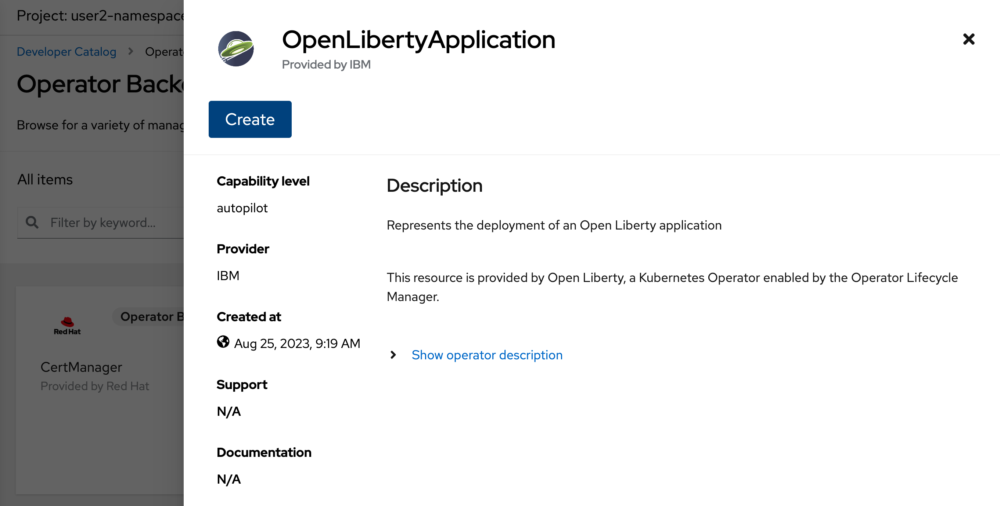

ifdef::env-github[]
:tip-caption: :bulb:
:note-caption: :information_source:
endif::[]

= Knative Serving Configuration

This lab focuses on the configuration of Knative Serving for OpenLibertyApplication instances.

== Knative Serving
`Knative Serving` enables users to deploy and serve applications as serverless containers. Serverless computing allows users to deploy application without the hassle of worrying about the underlying infrastructure. This is possible because the service provider allocates machine resources on demand, taking care of the servers on behalf of their customers. Servers are still used, but the naming comes from absence of concerns for server management. For example, capacity planning, configuration, maintenance or scaling of containers. Knative Serving especially provides support for automatic scaling, routing and network programming, and point-in-time snapshots of deployed code and configurations.

== Configuration Options
Choose one of two methods to deploy OpenLibertyApplication instance on your cluster.

.*Method A: Deployment through `oc` client*
[%collapsible]
====
1. To set your current namespace to be the namespace you will be working in, run the following commands:
+
NOTE: _Replace `<your-namespace>` with the namespace provided to you for the lab._
+
[source,sh]
----
export NAMESPACE=<your-namespace>
oc project $NAMESPACE
----

2. Ensure `Red Hat OpenShift Serverless` operator is installed on the cluster and Knative Serving instance is Ready.
+
[source,sh]
----
oc get subscription serverless-operator -n openshift-serverless
oc get KnativeServing knative-serving -n knative-serving
----
+
You will get similar to the following if the operator is installed and the instance is Ready:
+
[source,log]
----
NAME                  PACKAGE               SOURCE             CHANNEL
serverless-operator   serverless-operator   redhat-operators   stable
NAME              VERSION   READY   REASON
knative-serving   1.8       True 
----

3. Create a YAML file called `knative-enabled-sample.yaml` with the following content:
+
[source,yaml]
----
apiVersion: apps.openliberty.io/v1
kind: OpenLibertyApplication
metadata:
  name: knative-enabled-sample
spec:
  applicationImage: icr.io/appcafe/open-liberty/samples/getting-started
  replicas: 1
  createKnativeService: true
  expose: true
----

4. Create the OpenLibertyApplication instance using the command:
+
[source,sh]
----
oc apply -f knative-enabled-sample.yaml
----
The operator will create a Knative Service resource which manages the entire life cycle of a workload.

5. Check the status of the OpenLibertyApplication instance by running:
+
[source,sh]
----
oc get OpenLibertyApplication knative-enabled-sample -ojson | jq '.status.conditions'
----
It will print output similar to the following:
+
[source,log]
----
[
  {
    "lastTransitionTime": "2023-07-06T15:24:28Z",
    "status": "True",
    "type": "Reconciled"
  },
  {
    "lastTransitionTime": "2023-07-06T15:24:28Z",
    "message": "Application is reconciled and resources are ready.",
    "status": "True",
    "type": "Ready"
  },
  {
    "lastTransitionTime": "2023-07-06T15:24:28Z",
    "message": "Knative service is ready.",
    "status": "True",
    "type": "ResourcesReady"
  }
]
----
As in the example output, `status` field shows the number of running replicas out of configured number of replicas. If the `status` reports that the Application is not ready, check the pod's log.

6. Check the managed resources and their statuses. Run the command: 
+
[source,sh]
----
oc get all -l app.kubernetes.io/part-of=knative-enabled-sample 
----
Then the output will be similar to the following:
+
[source,log]
----
NAME                                                          READY   STATUS    RESTARTS   AGE
pod/knative-enabled-sample-00001-deployment-d8676b4c4-dl8m8   2/2     Running   0          20s

NAME                                           TYPE           CLUSTER-IP      EXTERNAL-IP                                                  PORT(S)                                              AGE
service/knative-enabled-sample                 ExternalName   <none>          kourier-internal.knative-serving-ingress.svc.cluster.local   80/TCP                                               4s
service/knative-enabled-sample-00001           ClusterIP      172.30.138.3    <none>                                                       80/TCP,443/TCP                                       20s
service/knative-enabled-sample-00001-private   ClusterIP      172.30.43.116   <none>                                                       80/TCP,443/TCP,9090/TCP,9091/TCP,8022/TCP,8012/TCP   20s

NAME                                                      READY   UP-TO-DATE   AVAILABLE   AGE
deployment.apps/knative-enabled-sample-00001-deployment   1/1     1            1           20s

NAME                                                                DESIRED   CURRENT   READY   AGE
replicaset.apps/knative-enabled-sample-00001-deployment-d8676b4c4   1         1         1       20s

NAME                                                        CONFIG NAME              K8S SERVICE NAME   GENERATION   READY   REASON   ACTUAL REPLICAS   DESIRED REPLICAS
revision.serving.knative.dev/knative-enabled-sample-00001   knative-enabled-sample                      1            True             1                 1

NAME                                               URL                                                                         READY   REASON
route.serving.knative.dev/knative-enabled-sample   https://knative-enabled-sample-liberty-lab.apps.operators.cp.fyre.ibm.com   True    

NAME                                                 URL                                                                         LATESTCREATED                  LATESTREADY                    READY   REASON
service.serving.knative.dev/knative-enabled-sample   https://knative-enabled-sample-liberty-lab.apps.operators.cp.fyre.ibm.com   knative-enabled-sample-00001   knative-enabled-sample-00001   True    

NAME                                                       LATESTCREATED                  LATESTREADY                    READY   REASON
configuration.serving.knative.dev/knative-enabled-sample   knative-enabled-sample-00001   knative-enabled-sample-00001   True    
----
+
It shows Deployment and its associated Pods, Services, Route and Knative resources created by the operator. The number of running pods may change over time. This is an expected behaviour because Knative serving handles autoscaling of the deployment.

7. Check the status of the OpenLibertyApplication instance again by running:
+
[source,sh]
----
oc get OpenLibertyApplication knative-enabled-sample -ojson | jq '.status.conditions'
----
It will print output similar to the following:
+
[source,log]
----
[
  {
    "lastTransitionTime": "2023-05-11T18:21:19Z",
    "status": "True",
    "type": "Reconciled"
  },
  {
    "lastTransitionTime": "2023-05-11T18:45:16Z",
    "message": "Application is reconciled and resources are ready.",
    "status": "True",
    "type": "Ready"
  },
  {
    "lastTransitionTime": "2023-05-11T18:45:16Z",
    "message": "Deployment replicas ready: 3",
    "reason": "MinimumReplicasAvailable",
    "status": "True",
    "type": "ResourcesReady"
  }
]
----
Compared to the last status output, `status` field now outputs the number of running replicas only without the desired number of replicas. It will report the instance as `Ready` when the currently running number of pods is within the range of `maxReplicas` and `minReplicas`. If the `status` reports that the Application is not ready, check the pod's log.

====

.*Method B: Deployment through OpenShift Web Console*
[%collapsible]
====
1. Access your OpenShift web console. Web console's URL starts with https://console-openshift-console.

2. Switch to the Developer perspective, if it is set to the Administrator perspective. Ensure you are on a project/namespace that you were assgined with for the lab.
+
image:images/perspective.png[,300]

3. Click `+Add`. Under `Developer Catalog`, click `Operator Backed`. This page shows the operator catalog on the cluster and enables you to deploy operator managed services.
+
image:images/operator-backed.png[,500]

4. Click OpenLibertyApplication and create an instance.
+

5. Change the OpenLibertyApplication instance to `knative-enabled-sample` under *Name* field. Set replicas to 1.
+
image:images/replicas.png[,500]

6. You will see that an instance is created in `Topology` tab. You can select a resource that you would like to investigate.
+
image:images/topology.png[,900]

7. If you would like to see the instance's status at once, click link at `Managed by CSV`. This will direct you to Open Liberty Operator's details.
+
image:images/csv.png[,400]

8. Click `OpenLibertyApplication` tab and select `knative-enabled-sample` instance.
+
image:images/operator-details.png[,900]
+
At the bottom, you will see *Status Conditions* section, which gives you detail on status conditions of the managed resources and the application instance.
+
image:images/status-conditions.png[,900]

====
