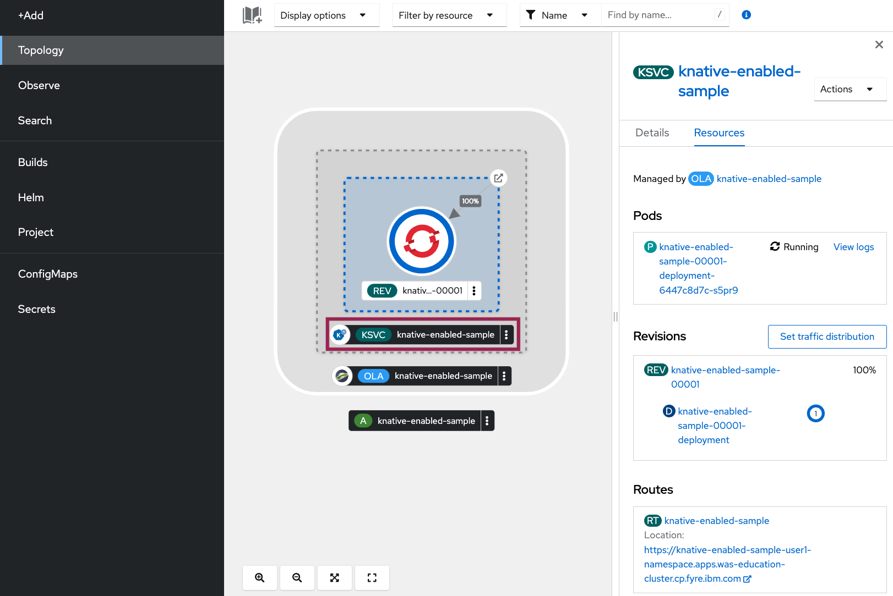
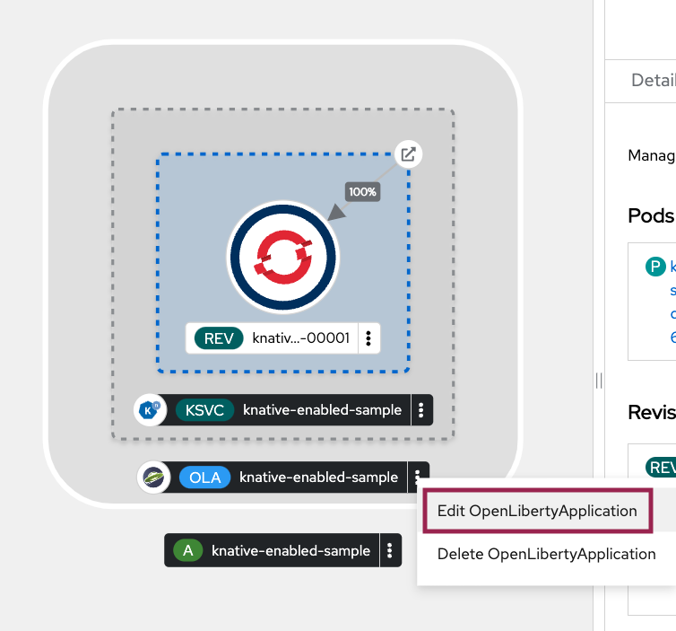

ifdef::env-github[]
:tip-caption: :bulb:
:note-caption: :information_source:
endif::[]

= Knative Serving Configuration

This lab focuses on the configuration of Knative Serving for OpenLibertyApplication instances. Before proceeding with this lab, it is advisable to complete the AutoscalingLab.

== Knative Serving
`Knative Serving` simplifies the deployment of serverless applications by abstracting away infrastructure complexities. With serverless computing, users can deploy their applications without the burden of managing the underlying servers. The platform dynamically allocates machine resources as per demand, alleviating users from the worries of capacity planning, configuration, maintenance, and container scaling are abstracted away.

One of the key benefits of Knative Serving is its automatic scaling feature, which efficiently adjusts resource allocation based on workload demands. It also provides robust routing and network programming capabilities, enabling intelligent traffic distribution. Additionally, it provides support for point-in-time snapshots, allowing users to capture and manage previous versions of deployed code and configurations. This provides a safety net for seamless rollbacks and helps testing and version control for better application stability.

== Configuration Options
Choose one of two methods to deploy OpenLibertyApplication instance on your cluster.

.*Method A: Deployment through `oc` client*
[%collapsible]
====
1. To set your current namespace to be the namespace you will be working in, run the following commands:
+
NOTE: _Replace `<your-namespace>` with the namespace provided to you for the lab._
+
[source,sh]
----
export NAMESPACE=<your-namespace>
oc project $NAMESPACE
----

2. Ensure `Red Hat OpenShift Serverless` operator is installed on the cluster and Knative Serving instance is Ready.
+
[source,sh]
----
oc get subscription serverless-operator -n openshift-serverless
oc get KnativeServing knative-serving -n knative-serving
----
+
You will get similar to the following if the operator is installed and the instance is Ready:
+
[source,log]
----
NAME                  PACKAGE               SOURCE             CHANNEL
serverless-operator   serverless-operator   redhat-operators   stable
NAME              VERSION   READY   REASON
knative-serving   1.8       True 
----

3. Create a YAML file called `knative-enabled-sample.yaml` with the following content:
+
[source,yaml]
----
apiVersion: apps.openliberty.io/v1
kind: OpenLibertyApplication
metadata:
  name: knative-enabled-sample
spec:
  applicationImage: icr.io/appcafe/open-liberty/samples/getting-started
  replicas: 1
  createKnativeService: true
  expose: true
  service:
    port: 9080
    type: ClusterIP
----

4. Create the OpenLibertyApplication instance using the command:
+
[source,sh]
----
oc apply -f knative-enabled-sample.yaml
----
+
The operator will create a Knative Service resource which manages the entire life cycle of a workload.

5. Check the status of the OpenLibertyApplication instance by running:
+
[source,sh]
----
oc get OpenLibertyApplication knative-enabled-sample -ojson | jq '.status.conditions'
----
It will print output similar to the following:
+
[source,log]
----
[
  {
    "lastTransitionTime": "2023-07-06T15:24:28Z",
    "status": "True",
    "type": "Reconciled"
  },
  {
    "lastTransitionTime": "2023-07-06T15:24:28Z",
    "message": "Application is reconciled and resources are ready.",
    "status": "True",
    "type": "Ready"
  },
  {
    "lastTransitionTime": "2023-07-06T15:24:28Z",
    "message": "Knative service is ready.",
    "status": "True",
    "type": "ResourcesReady"
  }
]
----
+
As in the example output, `status` field shows that Knative service is ready instead of reporting the number of application replicas. If the `status` reports that the Application is not ready, check the pod's log.

6. Check the managed resources and their statuses. Run the command: 
+
[source,sh]
----
oc get all -l app.kubernetes.io/part-of=knative-enabled-sample 
----
Then the output will be similar to the following:
+
[source,log]
----
NAME                                                          READY   STATUS    RESTARTS   AGE
pod/knative-enabled-sample-00001-deployment-d8676b4c4-dl8m8   2/2     Running   0          20s

NAME                                           TYPE           CLUSTER-IP      EXTERNAL-IP                                                  PORT(S)                                              AGE
service/knative-enabled-sample                 ExternalName   <none>          kourier-internal.knative-serving-ingress.svc.cluster.local   80/TCP                                               4s
service/knative-enabled-sample-00001           ClusterIP      172.30.138.3    <none>                                                       80/TCP,443/TCP                                       20s
service/knative-enabled-sample-00001-private   ClusterIP      172.30.43.116   <none>                                                       80/TCP,443/TCP,9090/TCP,9091/TCP,8022/TCP,8012/TCP   20s

NAME                                                      READY   UP-TO-DATE   AVAILABLE   AGE
deployment.apps/knative-enabled-sample-00001-deployment   1/1     1            1           20s

NAME                                                                DESIRED   CURRENT   READY   AGE
replicaset.apps/knative-enabled-sample-00001-deployment-d8676b4c4   1         1         1       20s

NAME                                                        CONFIG NAME              K8S SERVICE NAME   GENERATION   READY   REASON   ACTUAL REPLICAS   DESIRED REPLICAS
revision.serving.knative.dev/knative-enabled-sample-00001   knative-enabled-sample                      1            True             1                 1

NAME                                               URL                                                                         READY   REASON
route.serving.knative.dev/knative-enabled-sample   https://knative-enabled-sample-liberty-lab.apps.operators.cp.fyre.ibm.com   True    

NAME                                                 URL                                                                         LATESTCREATED                  LATESTREADY                    READY   REASON
service.serving.knative.dev/knative-enabled-sample   https://knative-enabled-sample-liberty-lab.apps.operators.cp.fyre.ibm.com   knative-enabled-sample-00001   knative-enabled-sample-00001   True    

NAME                                                       LATESTCREATED                  LATESTREADY                    READY   REASON
configuration.serving.knative.dev/knative-enabled-sample   knative-enabled-sample-00001   knative-enabled-sample-00001   True    
----
+
It shows Deployment and its associated Pods, Services, Route and Knative resources created by the operator. Two containers are running for the Pod: one for Liberty application and one for Queue proxy, which is a sidecar container serving as a reverse proxy in front of the Liberty application. Knative service autoscales the workload and when the workload is idle, it may scale the pod to zero.

7. Get the URL allocated by `route.serving.knative.dev/knative-enabled-sample`. For example: `https://knative-enabled-sample-liberty-lab.apps.operators.cp.fyre.ibm.com`.
+
[source,sh]
----
oc get route.serving.knative.dev/knative-enabled-sample 
----
+
[source,log]
----
NAME                     URL                                                                         READY   REASON
knative-enabled-sample   https://knative-enabled-sample-liberty-lab.apps.operators.cp.fyre.ibm.com   True    
----
+
Access the page, and you will be able to see the sample Liberty app page.
+
image:images/sample-app-page.png[,700]

8. Edit OpenLibertyApplication to disable Knative configuration. Change `createKnativeService` field to false.
+
[source,sh]
----
oc edit OpenLibertyApplication knative-enabled-sample
----
+
[source,yaml]
----
apiVersion: apps.openliberty.io/v1
kind: OpenLibertyApplication
metadata:
  name: knative-enabled-sample
spec:
  applicationImage: icr.io/appcafe/open-liberty/samples/getting-started
  replicas: 1
  createKnativeService: false
  expose: true
  service:
    port: 9080
    type: ClusterIP
----

9. When you check the managed resources, you will see that Knative managed resources are deleted and new Deployment, Service and Route resources are created.
+
[source,sh]
----
oc get all -l app.kubernetes.io/part-of=knative-enabled-sample 
----
+
Then the output will be similar to the following:
+
[source,log]
----
NAME                                          READY   STATUS    RESTARTS   AGE
pod/knative-enabled-sample-7b4cc69d49-6nwc4   1/1     Running   0          36s

NAME                             TYPE        CLUSTER-IP      EXTERNAL-IP   PORT(S)    AGE
service/knative-enabled-sample   ClusterIP   172.30.85.152   <none>        9080/TCP   36s

NAME                                     READY   UP-TO-DATE   AVAILABLE   AGE
deployment.apps/knative-enabled-sample   1/1     1            1           36s

NAME                                                DESIRED   CURRENT   READY   AGE
replicaset.apps/knative-enabled-sample-7b4cc69d49   1         1         1       36s

NAME                                              HOST/PORT                                                              PATH   SERVICES                 PORT       TERMINATION   WILDCARD
route.route.openshift.io/knative-enabled-sample   knative-enabled-sample-open-liberty-lab.apps.wsatest.cp.fyre.ibm.com          knative-enabled-sample   9080-tcp   reencrypt     None
----

10. Check the status of the OpenLibertyApplication instance by running:
+
[source,sh]
----
oc get OpenLibertyApplication knative-enabled-sample -ojson | jq '.status.conditions'
----
+
Then the output will be similar to the following:
+
[source,log]
----
[
  {
    "lastTransitionTime": "2023-07-20T05:16:03Z",
    "status": "True",
    "type": "Reconciled"
  },
  {
    "lastTransitionTime": "2023-07-20T05:16:05Z",
    "message": "Application is reconciled and resources are ready.",
    "status": "True",
    "type": "Ready"
  },
  {
    "lastTransitionTime": "2023-07-20T05:16:05Z",
    "message": "Deployment replicas ready: 1/1",
    "reason": "MinimumReplicasAvailable",
    "status": "True",
    "type": "ResourcesReady"
  }
]
----
+
Now the OpenLibertyApplication instance is reporting that the application is hosted as a Deployment with static replica of 1.

====

.*Method B: Deployment through OpenShift Web Console*
[%collapsible]
====

1. Access your OpenShift web console. Web console's URL starts with https://console-openshift-console.

2. Switch to the Developer perspective, if it is set to the Administrator perspective. Ensure you are on a project/namespace that you were assgined with for the lab.
+
image:images/perspective.png[,300]

3. Click `+Add`. Under `Developer Catalog`, click `Operator Backed`. This page shows the operator catalog on the cluster and enables you to deploy operator managed services.
+
image:images/operator-backed.png[,500]

4. Click OpenLibertyApplication and create an instance.
+
image:images/create-instance.png[,800]
+
Select YAML view and copy the following content:
+
[source,yaml]
----
apiVersion: apps.openliberty.io/v1
kind: OpenLibertyApplication
metadata:
  name: knative-enabled-sample
spec:
  applicationImage: icr.io/appcafe/open-liberty/samples/getting-started
  replicas: 1
  createKnativeService: true
  expose: true
  service:
    port: 9080
    type: ClusterIP
----
+
The operator will create a Knative Service resource which manages the entire life cycle of a workload.

5. You will see that an instance is created in `Topology` tab. You can select a resource that you would like to investigate.
+

+
It shows Deployment and its associated Pods, Services, Route and Knative resources created by the operator. Two containers are running for the Pod: one for Liberty application and one for Queue proxy, which is a sidecar container serving as a reverse proxy in front of the Liberty application. Knative service autoscales the workload and when the workload is idle, it may scale the pod to zero.

6. If you would like to see the instance's status at once, click `Search` tab on the left and search for `OpenLibertyApplications` resource.
+

7. Select `knative-enabled-sample` instance. At the bottom, you will see *Status Conditions* section, which gives you detail on status conditions of the managed resources and the application instance.
+

+
As in the example output, `status` field shows that Knative service is ready instead of reporting the number of application replicas. If the `status` reports that the Application is not ready, check the pod's log.

8. Get the URL allocated by `Routes` resource. You can locate it in `Topology` section when you click on the application, with the name "knative-enabled-sample". For example: `https://knative-enabled-sample-liberty-lab.apps.operators.cp.fyre.ibm.com`.
+
image:images/route.png[,900]
+
Access the page, and you will be able to see the sample Liberty app page.
+
image:images/sample-app-page.png[,700]

9. Edit the OpenLibertyApplication instance to disable Knative configuration. Change `createKnativeService` field to false. To edit, click `Search` tab on the left and search for `OpenLibertyApplications` resource, and select `knative-enabled-sample` instance again. Edit the OpenLibertyApplication instance as the following: 
+
Change `createKnativeService: true` under `spec` field to `createKnativeService: false`:
+
[source,yaml]
----
  createKnativeService: false
----
+
The operator will delete Knative related resources and create new resources for the application.

10. When you check the managed resources, you will see that Knative managed resources are deleted and new Deployment, Service and Route resources are created. Check the managed resources and the status of the OpenLibertyApplication instance again.
+
image:images/status-conditions-new.png[,900]
+
Now the OpenLibertyApplication instance is reporting that the application is hosted as a Deployment with static replica of 1. When you check the managed resources in `Topology` section, you will no longer see Knative related resources.
+
image:images/topology-new.png[,900]

====
