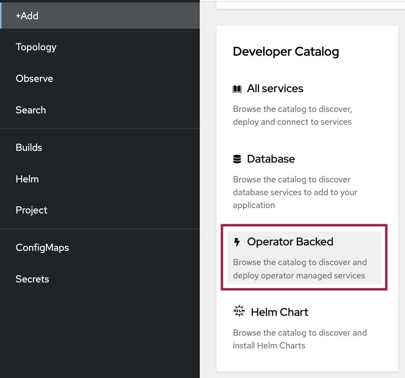
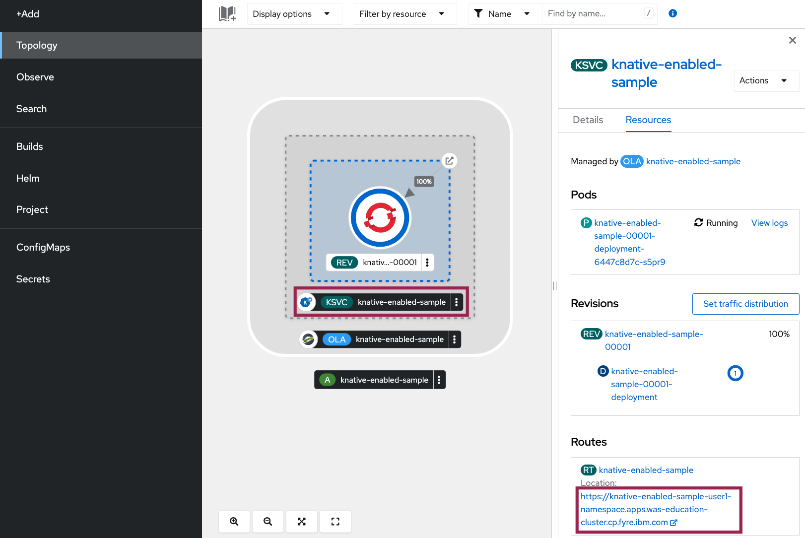
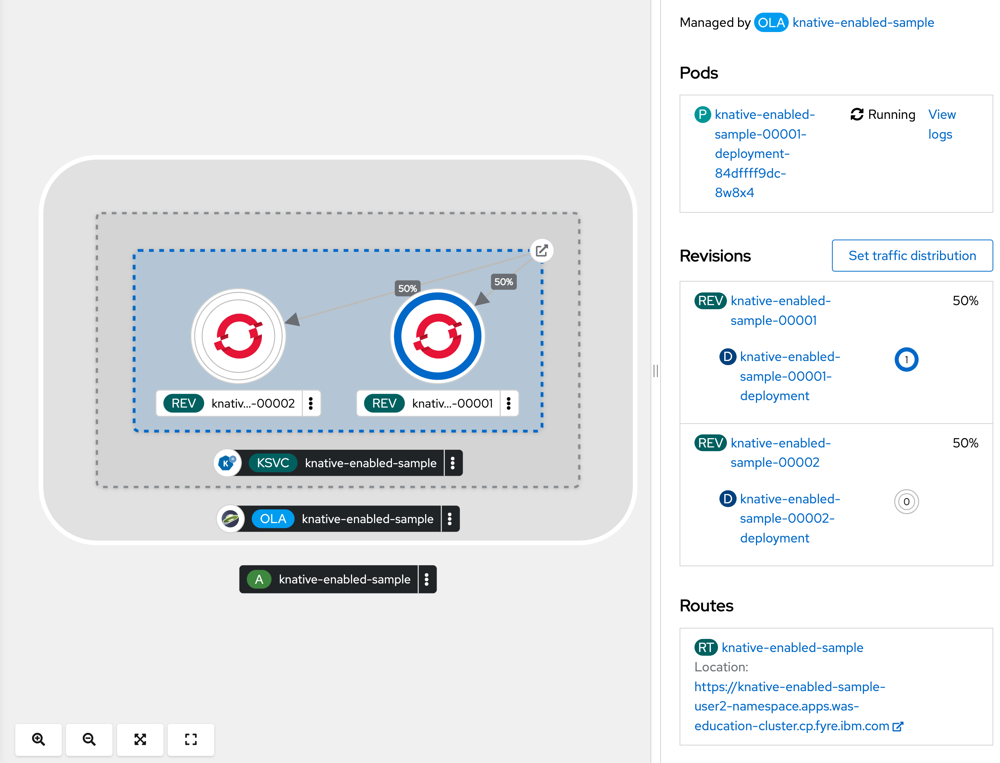

ifdef::env-github[]
:tip-caption: :bulb:
:note-caption: :information_source:
endif::[]

= Knative Serving Configuration

This lab focuses on the configuration of Knative Serving for OpenLibertyApplication instances. Before proceeding with this lab, it is advisable to complete the AutoscalingLab.

== Knative Serving
`Knative Serving` simplifies the deployment of serverless applications by abstracting away infrastructure complexities. With serverless computing, users can deploy their applications without the burden of managing the underlying servers. The platform dynamically allocates machine resources as per demand, alleviating users from the worries of capacity planning, configuration, maintenance, and container scaling are abstracted away.

One of the key benefits of Knative Serving is its automatic scaling feature, which efficiently adjusts resource allocation based on workload demands. It also provides robust routing and network programming capabilities, enabling intelligent traffic distribution. Additionally, it provides support for point-in-time snapshots, allowing users to capture and manage previous versions of deployed code and configurations. This provides a safety net for seamless rollbacks and helps testing and version control for better application stability.

== Configuration Options
Choose one of two methods to deploy OpenLibertyApplication instance on your cluster.

.*Method A: Deployment through `oc` client*
[%collapsible]
====
1. Make sure you have `oc` client and `jq` installed in your system, and are logged into a RedHat OpenShift cluster before you begin the lab.
+
[source,sh]
----
oc login --server=https://<cluster-api-ip-address>:6443 --username=<username> --password=<password>
----
+
For example:
+
[source,sh]
----
oc login --server=https://9.123.456.789:6443 --username=user1 --password=PasswordExample123
----
+
If you do not have access to a cluster, please contact Lab Administrators to have credentials assigned to you.

2. To set your current namespace to be the namespace you will be working in, run the following commands:
+
NOTE: _Replace `<your-namespace>` with the namespace provided to you for the lab._
+
[source,sh]
----
export NAMESPACE=<your-namespace>
oc project $NAMESPACE
----

3. Ensure `Red Hat OpenShift Serverless` operator is installed on the cluster and Knative Serving instance is Ready.
+
[source,sh]
----
oc get subscription serverless-operator -n openshift-serverless
oc get KnativeServing knative-serving -n knative-serving
----
+
You will get similar to the following if the operator is installed and the instance is Ready:
+
[source,log]
----
NAME                  PACKAGE               SOURCE             CHANNEL
serverless-operator   serverless-operator   redhat-operators   stable
NAME              VERSION   READY   REASON
knative-serving   1.8       True 
----
+
If you do not see any of the two outputs correctly, contact Lab Administrators.

4. Create a YAML file called `knative-enabled-sample.yaml` with the following content:
+
[source,yaml]
----
apiVersion: apps.openliberty.io/v1
kind: OpenLibertyApplication
metadata:
  name: knative-enabled-sample
spec:
  applicationImage: icr.io/appcafe/open-liberty/samples/getting-started@sha256:e32f0eb0feff73c6bc8416fe2f7aa0cb74cbaa325cae5fad636325ee0ac4a105
  replicas: 1
  createKnativeService: true
  expose: true
  service:
    port: 9080
    type: ClusterIP
----

5. Create the OpenLibertyApplication instance using the command:
+
[source,sh]
----
oc apply -f knative-enabled-sample.yaml
----
+
The operator will create a Knative Service resource which manages the entire life cycle of a workload.

6. Check the status of the OpenLibertyApplication instance by running:
+
[source,sh]
----
oc get OpenLibertyApplication knative-enabled-sample -ojson | jq '.status.conditions'
----
It will print output similar to the following:
+
[source,log]
----
[
  {
    "lastTransitionTime": "2023-08-25T16:49:02Z",
    "status": "True",
    "type": "Reconciled"
  },
  {
    "lastTransitionTime": "2023-08-25T16:49:01Z",
    "message": "Knative service is ready.",
    "status": "True",
    "type": "ResourcesReady"
  },
  {
    "lastTransitionTime": "2023-08-25T16:49:02Z",
    "message": "Application is reconciled and resources are ready.",
    "status": "True",
    "type": "Ready"
  }
]
----
+
As in the example output, `status` field shows that Knative service is ready instead of reporting the number of application replicas. If the `status` reports that the Application is not ready, check the pod's log.

7. Check the managed resources and their statuses. Run the command: 
+
[source,sh]
----
oc get all -l app.kubernetes.io/part-of=knative-enabled-sample 
----
Then the output will be similar to the following:
+
[source,log]
----
NAME                                                           READY   STATUS    RESTARTS   AGE
pod/knative-enabled-sample-00001-deployment-7bff476879-4fdkh   2/2     Running   0          2m21s

NAME                                           TYPE           CLUSTER-IP       EXTERNAL-IP                                                  PORT(S)                                              AGE
service/knative-enabled-sample                 ExternalName   <none>           kourier-internal.knative-serving-ingress.svc.cluster.local   80/TCP                                               5s
service/knative-enabled-sample-00001           ClusterIP      172.30.169.174   <none>                                                       80/TCP,443/TCP                                       2m21s
service/knative-enabled-sample-00001-private   ClusterIP      172.30.105.77    <none>                                                       80/TCP,443/TCP,9090/TCP,9091/TCP,8022/TCP,8012/TCP   2m21s

NAME                                                      READY   UP-TO-DATE   AVAILABLE   AGE
deployment.apps/knative-enabled-sample-00001-deployment   1/1     1            1           2m22s

NAME                                                                 DESIRED   CURRENT   READY   AGE
replicaset.apps/knative-enabled-sample-00001-deployment-7bff476879   1         1         1       2m22s

NAME                                                 URL                                                                                         LATESTCREATED                  LATESTREADY                    READY   REASON
service.serving.knative.dev/knative-enabled-sample   https://knative-enabled-sample-user2-namespace.apps.was-education-cluster.cp.fyre.ibm.com   knative-enabled-sample-00001   knative-enabled-sample-00001   True    

NAME                                                       LATESTCREATED                  LATESTREADY                    READY   REASON
configuration.serving.knative.dev/knative-enabled-sample   knative-enabled-sample-00001   knative-enabled-sample-00001   True    

NAME                                                        CONFIG NAME              K8S SERVICE NAME   GENERATION   READY   REASON   ACTUAL REPLICAS   DESIRED REPLICAS
revision.serving.knative.dev/knative-enabled-sample-00001   knative-enabled-sample                      1            True             1                 1

NAME                                               URL                                                                                         READY   REASON
route.serving.knative.dev/knative-enabled-sample   https://knative-enabled-sample-user2-namespace.apps.was-education-cluster.cp.fyre.ibm.com   True 
----
+
It shows Deployment and its associated Pods, Services, Route and Knative resources created by the operator. Two containers are running for the Pod: one for Liberty application and one for Queue proxy, which is a sidecar container serving as a reverse proxy in front of the Liberty application.
Knative service autoscales the workload and when the workload is idle, it may scale the pod to zero. Then the pod will not be included in the output. When traffic is observed, the pod will be scaled back up.

8. Let's take a closer look at the Knative service instance. Run below to get the revision details:
+
[source,sh]
----
oc get rev -n $NAMESPACE
----
+
[source,log]
----
NAME                           CONFIG NAME              K8S SERVICE NAME   GENERATION   READY   REASON   ACTUAL REPLICAS   DESIRED REPLICAS
knative-enabled-sample-00001   knative-enabled-sample                      1            True             0                 0
----
+
You will see that the revision's generation is 1. This captures point-in-time snapshot of the Knative service. Notice that the actual and desired replicas in the output may be 0's. This is an example of Knative service's scale-to-zero feature when the pod is idle.

9. Get the URL allocated by `route.serving.knative.dev/knative-enabled-sample`. For example: `https://knative-enabled-sample-liberty-lab.apps.operators.cp.fyre.ibm.com`.
+
[source,sh]
----
oc get route.serving.knative.dev/knative-enabled-sample -n $NAMESPACE
----
+
[source,log]
----
NAME                     URL                                                                         READY   REASON
knative-enabled-sample   https://knative-enabled-sample-liberty-lab.apps.operators.cp.fyre.ibm.com   True    
----
+
Access the page, and you will be able to see the sample Liberty app page.
+

+
When the page is accessed, pod will be scaled up from 0.
+
[source,sh]
----
oc get rev -n $NAMESPACE
----
+
[source,log]
----
NAME                           CONFIG NAME              K8S SERVICE NAME   GENERATION   READY   REASON   ACTUAL REPLICAS   DESIRED REPLICAS
knative-enabled-sample-00001   knative-enabled-sample                      1            True             1                 1
----
+
The actual replicas and desired replicas are scaled up to 1 from 0.

10. Edit OpenLibertyApplication to update application image. Edit `applicationImage` field under `spec` field:
+
[source,sh]
----
oc edit OpenLibertyApplication knative-enabled-sample
----
+
[source,yaml]
----
spec:
  applicationImage: icr.io/appcafe/open-liberty/samples/getting-started:latest
----

11. Access the sample app on brower again to update the pod. Then run the command:
+
[source,sh]
----
oc get rev -n $NAMESPACE
----
+
[source,log]
----
NAME                           CONFIG NAME              K8S SERVICE NAME   GENERATION   READY   REASON   ACTUAL REPLICAS   DESIRED REPLICAS
knative-enabled-sample-00001   knative-enabled-sample                      1            True             0                 0
knative-enabled-sample-00002   knative-enabled-sample                      2            True             1                 1
----
+
You can now see 2 revision outputs. Notice `knative-enabled-sample-00002` instance's generation value is 2 and the replicas are running under that revision.

12. You can rollback to the previous revision, separate traffic to both revisions and also rollout to the latest revision. Edit Knative service to use both revisions.
+
[source,sh]
----
oc edit ksvc knative-enabled-sample -n $NAMESPACE
----
+
Edit `traffic` field under `spec` field:
+
[source,log]
----
  traffic:
    - latestRevision: false
      percent: 50
      revisionName: knative-enabled-sample-00001
    - latestRevision: false
      percent: 50
      revisionName: knative-enabled-sample-00002
----
+
This will route 50% of traffic to the first revision and the other half to the latest revision.

13. Check the revision status.
+
[source,sh]
----
oc get rev -n $NAMESPACE
----
+
[source,log]
----
NAME                           CONFIG NAME              K8S SERVICE NAME   GENERATION   READY   REASON   ACTUAL REPLICAS   DESIRED REPLICAS
knative-enabled-sample-00001   knative-enabled-sample                      1            True             1                 1
knative-enabled-sample-00002   knative-enabled-sample                      2            True             0                 1
----
+
You can see that the running pod is assigned to the first revision. The running pod may change to the latest revision from time to time because there is only 1 running pod and 50% will occupy the single pod.

14. Edit OpenLibertyApplication to disable Knative configuration. Change `createKnativeService` field under `spec` field to false:
+
[source,sh]
----
oc edit OpenLibertyApplication knative-enabled-sample
----
+
[source,yaml]
----
  createKnativeService: false
----

14. When you check the managed resources, you will see that Knative managed resources are deleted and new Deployment, Service and Route resources are created.
+
[source,sh]
----
oc get all -l app.kubernetes.io/part-of=knative-enabled-sample 
----
+
Then the output will be similar to the following:
+
[source,log]
----
NAME                                          READY   STATUS    RESTARTS   AGE
pod/knative-enabled-sample-555fbf4c99-fmh6r   1/1     Running   0          27s

NAME                             TYPE        CLUSTER-IP       EXTERNAL-IP   PORT(S)    AGE
service/knative-enabled-sample   ClusterIP   172.30.141.167   <none>        9080/TCP   33s

NAME                                     READY   UP-TO-DATE   AVAILABLE   AGE
deployment.apps/knative-enabled-sample   1/1     1            1           28s

NAME                                                DESIRED   CURRENT   READY   AGE
replicaset.apps/knative-enabled-sample-555fbf4c99   1         1         1       28s

NAME                                              HOST/PORT                                                                           PATH   SERVICES                 PORT       TERMINATION   WILDCARD
route.route.openshift.io/knative-enabled-sample   knative-enabled-sample-user2-namespace.apps.was-education-cluster.cp.fyre.ibm.com          knative-enabled-sample   9080-tcp   reencrypt     None
----

15. Check the status of the OpenLibertyApplication instance by running:
+
[source,sh]
----
oc get OpenLibertyApplication knative-enabled-sample -ojson | jq '.status.conditions'
----
+
Then the output will be similar to the following:
+
[source,log]
----
[
  {
    "lastTransitionTime": "2023-08-25T17:29:19Z",
    "status": "True",
    "type": "Reconciled"
  },
  {
    "lastTransitionTime": "2023-08-25T17:29:22Z",
    "message": "Deployment replicas ready: 1/1",
    "reason": "MinimumReplicasAvailable",
    "status": "True",
    "type": "ResourcesReady"
  },
  {
    "lastTransitionTime": "2023-08-25T17:29:22Z",
    "message": "Application is reconciled and resources are ready.",
    "status": "True",
    "type": "Ready"
  }
]
----
+
Now the OpenLibertyApplication instance is reporting that the application is hosted as a Deployment with static replica of 1.

====

.*Method B: Deployment through OpenShift Web Console*
[%collapsible]
====

1. Access your OpenShift web console. Web console's URL starts with https://console-openshift-console.

2. Switch to the Developer perspective, if it is set to the Administrator perspective. Ensure you are on a project/namespace that you were assgined with for the lab.
+
image:images/perspective.png[,300]

3. Click `+Add`. Under `Developer Catalog`, click `Operator Backed`. This page shows the operator catalog on the cluster and enables you to deploy operator managed services.
+

+
Make sure you see *Knative Serving* in the list. If not, please contact Lab Administrator to have it installed.
+

4. Click OpenLibertyApplication and create an instance.
+
image:images/create-instance.png[,800]
+
Select YAML view and copy the following content:
+
[source,yaml]
----
apiVersion: apps.openliberty.io/v1
kind: OpenLibertyApplication
metadata:
  name: knative-enabled-sample
spec:
  applicationImage: icr.io/appcafe/open-liberty/samples/getting-started@sha256:e32f0eb0feff73c6bc8416fe2f7aa0cb74cbaa325cae5fad636325ee0ac4a105
  replicas: 1
  createKnativeService: true
  expose: true
  service:
    port: 9080
    type: ClusterIP
----
+
The operator will create a Knative Service resource which manages the entire life cycle of a workload.

5. You will see that an instance is created in `Topology` tab. Select `KSVC knative-enabled-sample` below the icon. You can select a resource that you would like to investigate.
+
image:images/topology.png[,900]
+
It shows Deployment and its associated Pods, Services, Route and Knative resources created by the operator. Two containers are running for the Pod: one for Liberty application and one for Queue proxy, which is a sidecar container serving as a reverse proxy in front of the Liberty application. Knative service autoscales the workload and when the workload is idle, it may scale the pod to zero.

6. Check the OpenLibertyApplication instance's status. Click 3 dots beside `OLA knative-enabled-sample`, then `Edit OpenLibertyApplication`.
+
image:images/ola.png[,900]
+
Select `Details` tab and scroll to the bottom of the page to see the status conditions. 
+
image:images/status-conditions.png[,900]
+
As in the example output, `status` field shows that Knative service is ready instead of reporting the number of application replicas. If the `status` reports that the Application is not ready, check the pod's log.

8. Get the URL allocated by `Routes` resource. You can locate it in `Topology` section when you click on the application, with the name "knative-enabled-sample". For example: `https://knative-enabled-sample-liberty-lab.apps.operators.cp.fyre.ibm.com`.
+

+
Access the page, and you will be able to see the sample Liberty app page.
+

9. Edit the OpenLibertyApplication instance to disable Knative configuration. Change `createKnativeService` field to false. To edit, click `Search` tab on the left and search for `OpenLibertyApplications` resource, and select `knative-enabled-sample` instance again. Edit the OpenLibertyApplication instance as the following: 
+
Change `createKnativeService: true` under `spec` field to `createKnativeService: false`:
+
[source,yaml]
----
  createKnativeService: false
----
+
The operator will delete Knative related resources and create new resources for the application.

10. When you check the managed resources, you will see that Knative managed resources are deleted and new Deployment, Service and Route resources are created. Check the managed resources and the status of the OpenLibertyApplication instance again.
+

+
Now the OpenLibertyApplication instance is reporting that the application is hosted as a Deployment with static replica of 1. When you check the managed resources in `Topology` section, you will no longer see Knative related resources.
+

====
