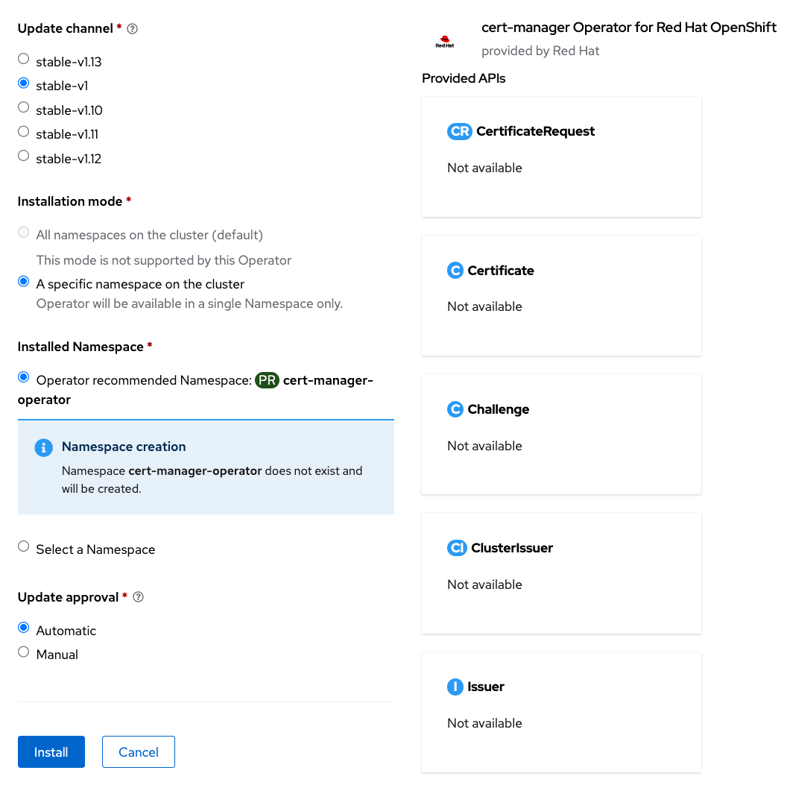
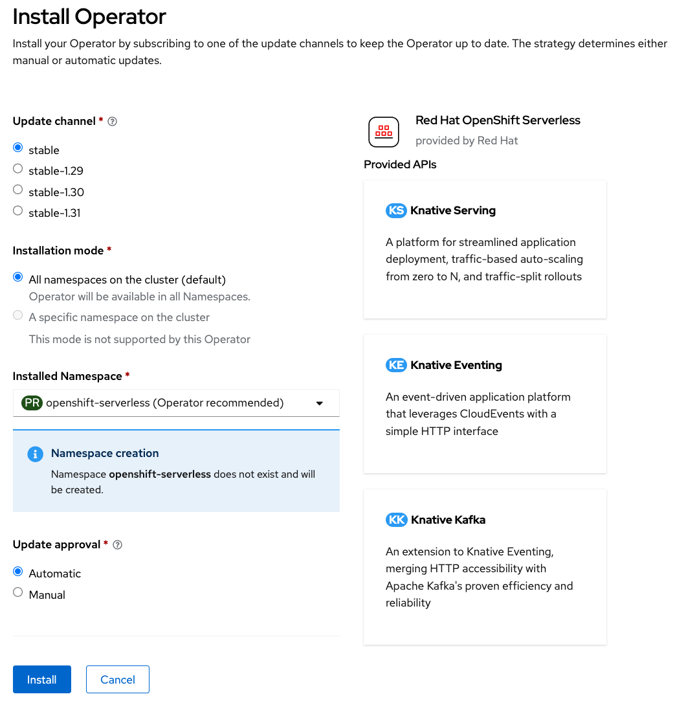
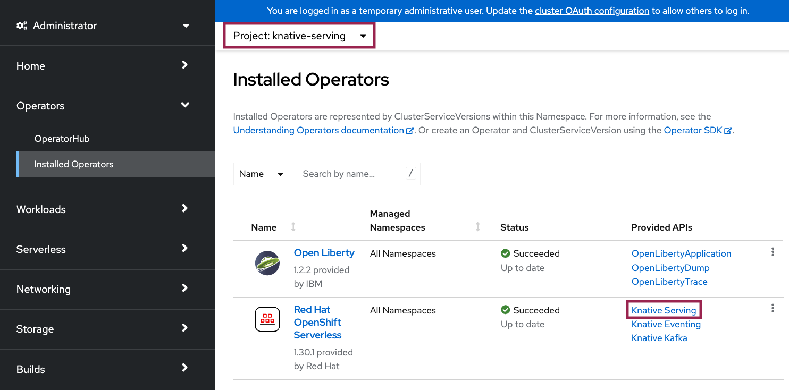
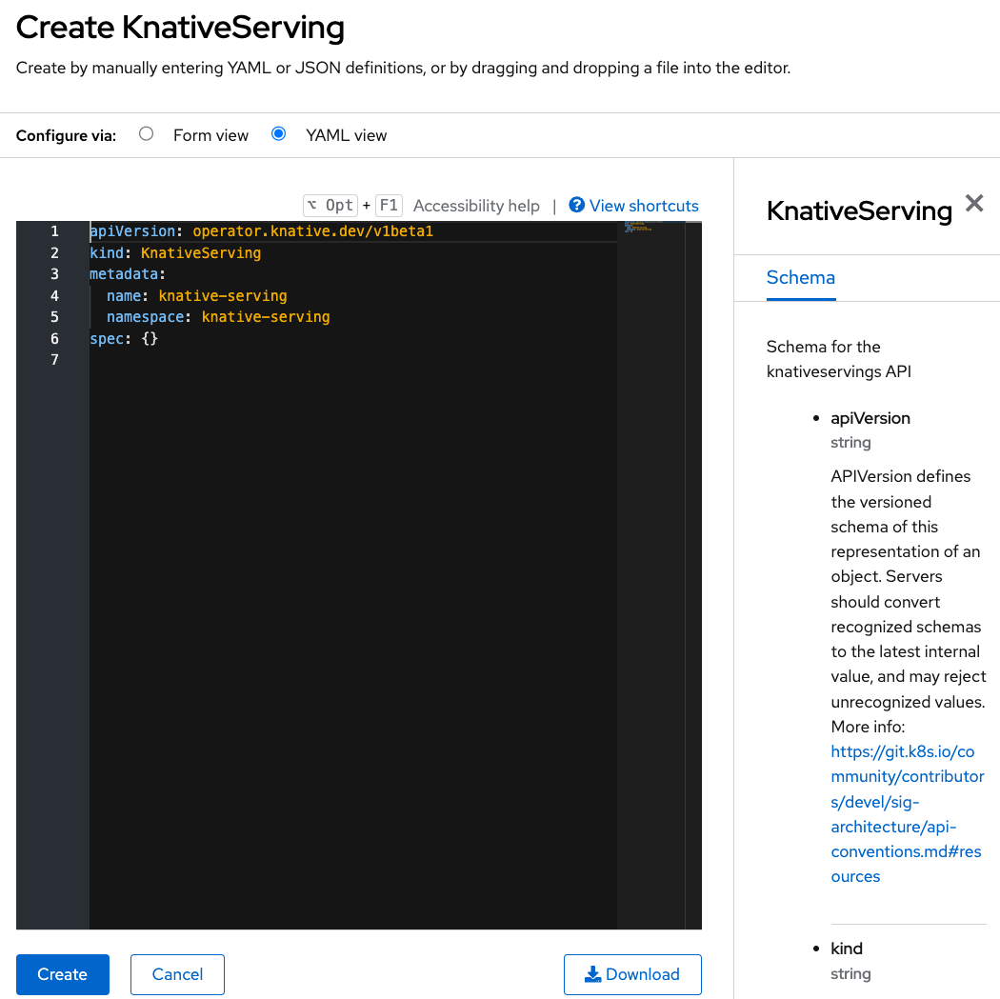
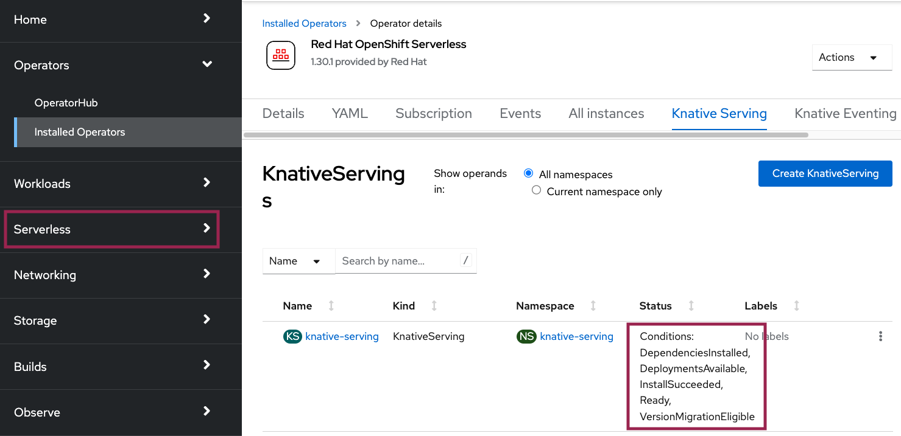
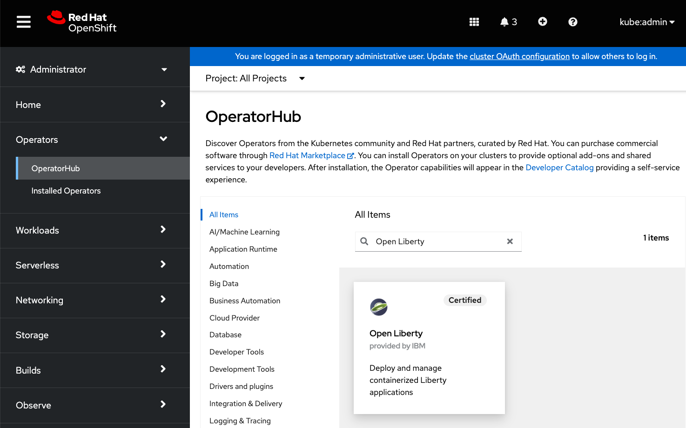
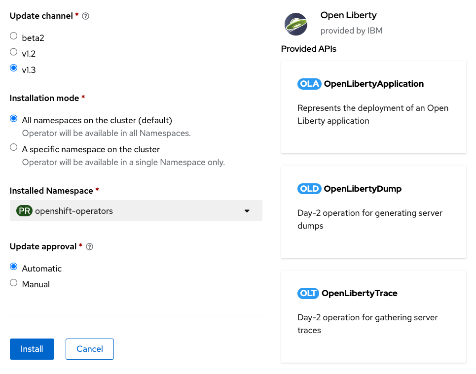

= Red Hat OpenShift Container Platform Setup Guide

This guide is for the users who are using their own cluster.

== Cluster Requirement
Red Hat OpenShift Container Platform 4.12 or newer

== Prerequisites Installation

Log into a RedHat OpenShift cluster through console. Click `OperatorHub` tab to install operators.

== Cert-Manager Operator
Search `cert-manager Operator for Red Hat OpenShift`.

Click the result and `install` button. Install the operator with the default settings.

== Knative Serving
Search `Red Hat OpenShift Serverless`.

Click the result and `install` button. Install the operator with the default settings.

Click `Installed Operators` tab to see installed operators. Select `knative-serving` project to install `Knative Serving` instance. Click `Knative Serving` under Provided APIs.

Click `Create KnativeServing`. Create with default settings.

When `Knative Serving` is successfully created, you should see Serverless tab created on the left and `Ready` status.

== Open Liberty Operator
Search `Open Liberty`.

Click the result and `install` button. If you would like to install the operator in all namespaces, install with the default settings. If you would like to install it only on one namespace, choose `A specific namespace on the cluster` under *Installation mode* and select a project to install.

