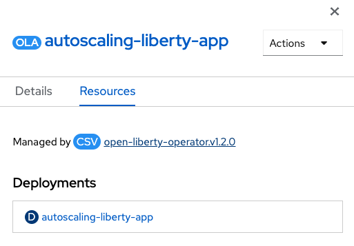

ifdef::env-github[]
:tip-caption: :bulb:
:note-caption: :information_source:
endif::[]

= Semeru Cloud Compiler Integration

This lab focuses on the configuration of Semeru Cloud Compiler for OpenLibertyApplication instances.

== Semeru Cloud Compiler (JIT Server Ingeration)
`Semeru Cloud Compiler` handles Just-In-Time (JIT) compilation requests from the applications and provides the process independently from the application virtual machine. This decoupling method optimizes the resources utilization, including CPU and memory utilization optimization in the application VM.

== Configuration Options
Choose one of two methods to deploy OpenLibertyApplication instance on your cluster.

.*Method A: Deployment through `oc` client*
[%collapsible]
====
1. To set your current namespace to be the namespace you will be working in, run the following commands:
+
NOTE: _Replace `<your-namespace>` with the namespace provided to you for the lab._
+
[source,sh]
----
export NAMESPACE=<your-namespace>
oc project $NAMESPACE
----

2. Create a YAML file called `liberty-semeru.yaml` with the following content:
+
[source,yaml]
----
apiVersion: apps.openliberty.io/v1
kind: OpenLibertyApplication
metadata:
  name: liberty-app
spec:
  applicationImage: icr.io/appcafe/websphere-liberty:kernel-java17-openj9-ubi
  replicas: 1
  semeruCloudCompiler:
    enable: true
    replicas: 1
----

3. Create the OpenLibertyApplication instance using the command:
+
[source,sh]
----
oc apply -f liberty-semeru.yaml
----
This will create a Deployment and Service named `liberty-app-semeru-compiler-1` for semeru compiler first. After the service is fully ready, the operator will create a Deployment and Service named `liberty-app` for the application.

4. Check the status of the OpenLibertyApplication instance by running:
+
[source,sh]
----
oc get OpenLibertyApplication liberty-app -ojson | jq '.status.conditions'
----
It will print output similar to the following:
+
[source,log]
----
[
  {
    "lastTransitionTime": "2023-05-11T18:21:19Z",
    "status": "True",
    "type": "Reconciled"
  },
  {
    "lastTransitionTime": "2023-05-11T18:21:30Z",
    "message": "Application is reconciled and resources are ready.",
    "status": "True",
    "type": "Ready"
  },
  {
    "lastTransitionTime": "2023-05-11T18:21:30Z",
    "message": "Deployment replicas ready: 1/1",
    "reason": "MinimumReplicasAvailable",
    "status": "True",
    "type": "ResourcesReady"
  }
]
----
As in the example output, `status` field shows the number of running replicas out of configured number of replicas. If the `status` reports that the Application is not ready, check the pod's log.

6. Check semeru related properties in the status section as well.
+
[source,sh]
----
oc get OpenLibertyApplication liberty-app -ojson | jq '.status.semeruCompiler, .status.references'
----
It will print output similar to the following:
+
[source,log]
----
{
  "serviceHostname": "liberty-app-semeru-compiler-1.open-liberty-lab.svc",
  "tlsSecretName": "liberty-app-semeru-compiler-1-tls-cm"
}
{
  "saResourceVersion": "33776407",
  "semeruGeneration": "1",
  "semeruInstancesCompleted": "1",
  "svcCertSecretName": "liberty-app-svc-tls-cm"
}
----
It lists the service host name and associated TLS secret name under `.status.semeruCompiler` section. Then shows Semeru's generation and completed number under `.status.references`.

7. You can check what resources are managed by the operator through a command.
+
[source,sh]
----
kubectl get all -l app.kubernetes.io/part-of=liberty-app
----
It will print output similar to the following:
+
[source,log]
----
NAME                                                 READY   STATUS    RESTARTS   AGE
pod/liberty-app-756fd76b8f-rwrw5                     1/1     Running   0          59m
pod/liberty-app-semeru-compiler-1-77c8d48749-7r9rx   1/1     Running   0          59m

NAME                                    TYPE        CLUSTER-IP       EXTERNAL-IP   PORT(S)     AGE
service/liberty-app                     ClusterIP   172.30.91.109    <none>        9443/TCP    59m
service/liberty-app-semeru-compiler-1   ClusterIP   172.30.128.242   <none>        38400/TCP   59m

NAME                                            READY   UP-TO-DATE   AVAILABLE   AGE
deployment.apps/liberty-app                     1/1     1            1           59m
deployment.apps/liberty-app-semeru-compiler-1   1/1     1            1           59m

NAME                                                       DESIRED   CURRENT   READY   AGE
replicaset.apps/liberty-app-756fd76b8f                     1         1         1       59m
replicaset.apps/liberty-app-semeru-compiler-1-77c8d48749   1         1         1       59m
====

.*Method B: Deployment through OpenShift Web Console*
[%collapsible]
====
1. Access your OpenShift web console. Web console's URL starts with https://console-openshift-console.

2. Switch to the Developer perspective, if it is set to the Administrator perspective. Ensure you are on a project/namespace that you were assgined with for the lab.
+
image:images/perspective.png[,300]

3. Click `+Add`. Under `Developer Catalog`, click `Operator Backed`. This page shows the operator catalog on the cluster and enables you to deploy operator managed services.
+
image:images/operator-backed.png[,500]

4. Click OpenLibertyApplication and create an instance.
+
image:images/create-instance.png[,800]

5. Change the OpenLibertyApplication instance to `autoscaling-liberty-app` under *Name* field. Set replicas to 1.
+
image:images/replicas.png[,500]

6. You will see that an instance is created in `Topology` tab. You can select a resource that you would like to investigate.
+
image:images/topology.png[,900]

7. If you would like to see the instance's status at once, click link at `Managed by CSV`. This will direct you to Open Liberty Operator's details.
+

8. Click `OpenLibertyApplication` tab and select `autoscaling-liberty-app` instance.
+
image:images/operator-details.png[,900]
+
At the bottom, you will see *Status Conditions* section, which gives you detail on status conditions of the managed resources and the application instance.
+
image:images/status-conditions.png[,900]

====
