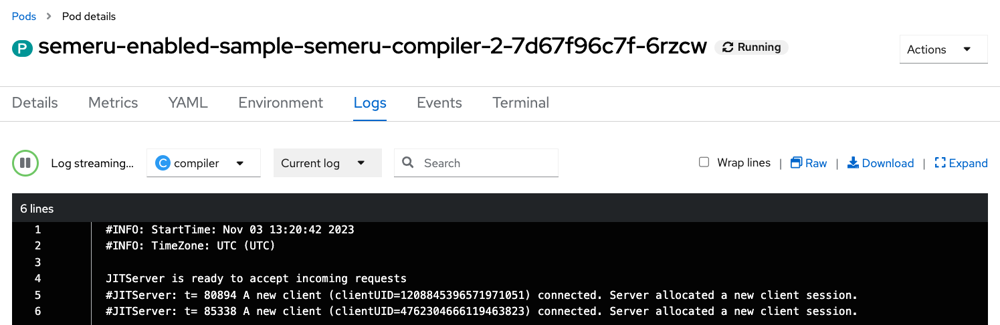

ifdef::env-github[]
:tip-caption: :bulb:
:note-caption: :information_source:
endif::[]

= Semeru Cloud Compiler Integration

This lab focuses on the configuration of Semeru Cloud Compiler for OpenLibertyApplication instances.

== Semeru Cloud Compiler (JIT Server Integration)
The `Semeru Cloud Compiler` efficiently manages Just-In-Time (JIT) compilation requests from applications, operating independently from the application's virtual machine. This decoupling approach leads to optimized resource utilization, including enhanced CPU and memory efficiency within the application VM. When the feature is enabled, Open Liberty Operator takes care of creating deployments, services, and certificates for the Semeru Cloud Comiler, seamlessly connecting them to the relevant applications.

== Configuration Options
Choose one of two methods to deploy OpenLibertyApplication instance on your cluster.

.*Method A: Deployment through `oc` client*
[%collapsible]
====
1. To set your current namespace to be the namespace you will be working in, run the following commands:
+
NOTE: _Replace `<your-namespace>` with the namespace provided to you for the lab._
+
[source,sh]
----
export NAMESPACE=<your-namespace>
oc project $NAMESPACE
----

2. Create a YAML file called `liberty-semeru.yaml` with the following content:
+
[source,yaml]
----
apiVersion: apps.openliberty.io/v1
kind: OpenLibertyApplication
metadata:
  name: semeru-enabled-sample
spec:
  applicationImage: icr.io/appcafe/open-liberty/samples/getting-started
  replicas: 2
  semeruCloudCompiler:
    enable: true
    replicas: 1
----

3. Create the OpenLibertyApplication instance using the command:
+
[source,sh]
----
oc apply -f liberty-semeru.yaml
----
This will create a Deployment and Service named `semeru-enabled-sample-semeru-compiler-1` for semeru compiler first. After the service is fully ready, the operator will create a Deployment and Service named `semeru-enabled-sample` for the application.

4. Check the status of the OpenLibertyApplication instance by running:
+
[source,sh]
----
oc get OpenLibertyApplication semeru-enabled-sample -ojson | jq '.status.conditions'
----
It will print output similar to the following:
+
[source,log]
----
[
  {
    "lastTransitionTime": "2023-05-11T18:21:19Z",
    "status": "True",
    "type": "Reconciled"
  },
  {
    "lastTransitionTime": "2023-05-11T18:21:30Z",
    "message": "Application is reconciled and resources are ready.",
    "status": "True",
    "type": "Ready"
  },
  {
    "lastTransitionTime": "2023-05-11T18:21:30Z",
    "message": "Deployment replicas ready: 2/2",
    "reason": "MinimumReplicasAvailable",
    "status": "True",
    "type": "ResourcesReady"
  }
]
----
As in the example output, `status` field shows the number of running replicas out of configured number of replicas. When the status reports both `ResourcesReady` and `Ready`, move to the next step. If the `status` reports that the Application is not ready, check the pod's log.

5. Check semeru related properties in the status section as well.
+
[source,sh]
----
oc get OpenLibertyApplication semeru-enabled-sample -ojson | jq '.status.semeruCompiler, .status.references'
----
It will print output similar to the following:
+
[source,log]
----
{
  "serviceHostname": "semeru-enabled-sample-semeru-compiler-1.open-liberty-lab.svc",
  "tlsSecretName": "semeru-enabled-sample-semeru-compiler-1-tls-cm"
}
{
  "saResourceVersion": "33776407",
  "semeruGeneration": "1",
  "semeruInstancesCompleted": "1",
  "svcCertSecretName": "semeru-enabled-sample-svc-tls-cm"
}
----
It lists the service host name and associated TLS secret name under `.status.semeruCompiler` section. Then shows Semeru's generation and completed number under `.status.references`.

6. You can check what resources are managed by the operator through a command.
+
[source,sh]
----
oc get all -l app.kubernetes.io/part-of=semeru-enabled-sample
----
It will print output similar to the following:
+
[source,log]
----
NAME                                                 READY   STATUS    RESTARTS   AGE
pod/semeru-enabled-sample-756fd76b8f-rwrw5                     1/1     Running   0          59m
pod/semeru-enabled-sample-semeru-compiler-1-77c8d48749-7r9rx   1/1     Running   0          59m

NAME                                    TYPE        CLUSTER-IP       EXTERNAL-IP   PORT(S)     AGE
service/semeru-enabled-sample                  ClusterIP   172.30.91.109    <none>        9443/TCP    59m
service/semeru-enabled-sample-semeru-compiler-1   ClusterIP   172.30.128.242   <none>        38400/TCP   59m

NAME                                            READY   UP-TO-DATE   AVAILABLE   AGE
deployment.apps/semeru-enabled-sample                     1/1     1            1           59m
deployment.apps/semeru-enabled-sample-semeru-compiler-1   1/1     1            1           59m

NAME                                                       DESIRED   CURRENT   READY   AGE
replicaset.apps/semeru-enabled-sample-756fd76b8f                     1         1         1       59m
replicaset.apps/semeru-enabled-sample-semeru-compiler-1-77c8d48749   1         1         1       59m
----
+
The certificates are not reflected here, but you can check the certificates using `svcCertSecretName` and `tlsSecretName` in the status output above. These certificates are created and managed by the Cert Manager, which was covered before this lab. They are injected into the application as well as the JIT server via the secret by the operator.

7. Check the logs of JIT server pods. Use the pod name using the output above. For example, the pod name will start with `semeru-enabled-sample-semeru-compiler-1`...
+
[source,sh]
----
oc logs semeru-enabled-sample-semeru-compiler-1-77c8d48749-7r9rx
----
+
It will print output similar to the following:
+
[source,log]
----
#INFO: StartTime: May 08 14:39:50 2023
#INFO: TimeZone: UTC (UTC)

JITServer is ready to accept incoming requests
#JITServer: t= 21496 A new client (clientUID=123456643212345) connected. Server allocated a new client session.
----
+
You can see that there are clients connected to the JITServer with unique client ID for each application pod.

8. Check the Liberty application log to ensure the connection with JIT Server. Use the pod name using the output above. For example, the pod name will start with `semeru-enabled-sample`...
+
[source,sh]
----
oc logs semeru-enabled-sample-756fd76b8f-rwrw5
----
+
It will print output similar to the following:
+
[source,log]
----
...
#INFO: StartTime: May 08 14:39:50 2023
#INFO: Free Physical Memory: 2403 MB
#INFO: CPU entitlement = 800.00
#JITServer: t= 10 Connected to a server (serverUID=18345234542131213)
...
----
+
You can see that the Liberty application is successfully connected to JIT Server pod.

9. The operator will instantly detect when the application image is modified or updated. Then the operator will create a new set of JIT Server pods for the new application pods. Modify the application image to another image and the number of replicas to see the changes more clearly.
+
[source,sh]
----
oc edit OpenLibertyApplication/semeru-enabled-sample
----
+
[source,yaml]
----
apiVersion: apps.openliberty.io/v1
kind: OpenLibertyApplication
metadata:
  name: semeru-enabled-sample
spec:
  applicationImage: icr.io/appcafe/websphere-liberty:kernel-java11-openj9-ubi
  replicas: 3
  semeruCloudCompiler:
    enable: true
    replicas: 1
----

10. Wait until the Liberty app deployment's pods are all updated to the new image.
+
[source,sh]
----
oc get deployment semeru-enabled-sample
----

11. When all pods are ready and running, check the status of managed resources.
+
[source,sh]
----
oc get all -l app.kubernetes.io/part-of=semeru-enabled-sample
----
+
[source,log]
----
NAME                                                 READY   STATUS    RESTARTS   AGE
pod/semeru-enabled-sample-756fd76b8f-rwrw5                     1/1     Running   0          59m
pod/semeru-enabled-sample-semeru-compiler-2-494jdp493-39dj9   1/1     Running   0          59m

NAME                                    TYPE        CLUSTER-IP       EXTERNAL-IP   PORT(S)     AGE
service/semeru-enabled-sample                  ClusterIP   172.30.91.109    <none>        9443/TCP    59m
service/semeru-enabled-sample-semeru-compiler-2   ClusterIP   172.30.128.242   <none>        38400/TCP   59m

NAME                                            READY   UP-TO-DATE   AVAILABLE   AGE
deployment.apps/semeru-enabled-sample                     1/1     1            1           59m
deployment.apps/semeru-enabled-sample-semeru-compiler-2   1/1     1            1           59m

NAME                                                       DESIRED   CURRENT   READY   AGE
replicaset.apps/semeru-enabled-sample-756fd76b8f                     1         1         1       59m
replicaset.apps/semeru-enabled-sample-semeru-compiler-2-494jdp493   1         1         1       59m
----
+
You can see that the JIT Server's deployment name has been changed from `semeru-enabled-sample-semeru-compiler-1` to `semeru-enabled-sample-semeru-compiler-2`. This is a new set of JIT Server sessions with the Liberty app. You can check the log and ensure 4 connections are established.
+
[source,sh]
----
oc logs semeru-enabled-sample-semeru-compiler-2-494jdp493-39dj9
----

12. You can also detect the changes in OpenLibertyApplication instance's status report as well.
+
[source,sh]
----
oc get OpenLibertyApplication semeru-enabled-sample -ojson | jq '.status.semeruCompiler, .status.references'
----
It will print output similar to the following:
+
[source,log]
----
{
  "serviceHostname": "semeru-enabled-sample-semeru-compiler-1.open-liberty-lab.svc",
  "tlsSecretName": "semeru-enabled-sample-semeru-compiler-1-tls-cm"
}
{
  "saResourceVersion": "33776407",
  "semeruGeneration": "2",
  "semeruInstancesCompleted": "2",
  "svcCertSecretName": "semeru-enabled-sample-svc-tls-cm"
}
----
+
The version check enables easy cleanup of the old version of JIT Server with the numbering naming convention.

13. To disable JIT Server integration, make changes to the OpenLibertyApplication instance.
+
[source,sh]
----
oc edit OpenLibertyApplication/semeru-enabled-sample
----
+
Then change `.spec.semeruCloudCompiler.enable` to false
+
[source,yaml]
----
apiVersion: apps.openliberty.io/v1
kind: OpenLibertyApplication
metadata:
  name: semeru-enabled-sample
spec:
  applicationImage: icr.io/appcafe/open-liberty/samples/getting-started
  replicas: 3
  semeruCloudCompiler:
    enable: false
----
+
You will be able to see that the pods of JIT Server are now removed.
+
[source,log]
----
NAME                                                 READY   STATUS    RESTARTS   AGE
pod/semeru-enabled-sample-756fd76b8f-rwrw5                     1/1     Running   0          59m

NAME                                    TYPE        CLUSTER-IP       EXTERNAL-IP   PORT(S)     AGE
service/semeru-enabled-sample                  ClusterIP   172.30.91.109    <none>        9443/TCP    59m

NAME                                            READY   UP-TO-DATE   AVAILABLE   AGE
deployment.apps/semeru-enabled-sample                     1/1     1            1           59m

NAME                                                       DESIRED   CURRENT   READY   AGE
replicaset.apps/semeru-enabled-sample-756fd76b8f                     1         1         1       59m
----
====

.*Method B: Deployment through OpenShift Web Console*
[%collapsible]
====

1. Access your OpenShift web console. Web console's URL starts with https://console-openshift-console.

2. Switch to the Developer perspective, if it is set to the Administrator perspective. Ensure you are on a project/namespace that you were assgined with for the lab.
+
image:images/perspective.png[,300]

3. Click `+Add`. Under `Developer Catalog`, click `Operator Backed`. This page shows the operator catalog on the cluster and enables you to deploy operator managed services.
+
image:images/operator-backed.png[,500]

4. Click OpenLibertyApplication and create an instance.
+
image:images/create-instance.png[,800]
+
Select YAML view and copy the following content:
+
[source,yaml]
----
apiVersion: apps.openliberty.io/v1
kind: OpenLibertyApplication
metadata:
  name: semeru-enabled-sample
spec:
  applicationImage: icr.io/appcafe/open-liberty/samples/getting-started
  replicas: 2
  semeruCloudCompiler:
    enable: true
    replicas: 1
----
+
This will create a Deployment and Service named `semeru-enabled-sample-semeru-compiler-1` for semeru compiler first. After the service is fully ready, the operator will create a Deployment and Service named `semeru-enabled-sample` for the application.

5. You will see that an instance is created in `Topology` tab. You can select a resource that you would like to investigate.
+
image:images/topology.png[,900]
+
The certificates are not reflected here, but you can check the certificates using `svcCertSecretName` and `tlsSecretName` in the status output above. These certificates are created and managed by the Cert Manager, which was covered before this lab. They are injected into the application as well as the JIT server via the secret by the operator.

6. If you would like to see the instance's status at once, click `Search` tab on the left and search for `OpenLibertyApplications` resource.
+
image:images/ola.png[,900]

7. Select `semeru-enabled-sample` instance. At the bottom, you will see *Status Conditions* section, which gives you detail on status conditions of the managed resources and the application instance.
+
image:images/status-conditions.png[,900]
+
As in the example output, `status` field shows the number of running replicas out of configured number of replicas. When the status reports both `ResourcesReady` and `Ready`, move to the next step. If the `status` reports that the Application is not ready, check the pod's log.

8. Click `YAML` tab to see semeru related properties in the status section as well.
+
image:images/status-conditions-semeru.png[,900]
+
It lists the service host name and associated TLS secret name under `.status.semeruCompiler` section. Then shows Semeru's generation and completed number under `.status.references`.

9. Check the logs of JIT server pods. Go back to `Topology` tab to see managed resources of OpenLibertyApplication instance. Click on Deployment resource with name `semeru-enabled-sample-semeru-compiler-1`.
+
image:images/semeru-deployment.png[,400]
+
Click `Pods` tab and the pod's name.
+
image:images/semeru-pod.png[,900]
+
Click `Logs` tab. You should be able to see JITServer logs reporting that the server allocated a new client session.
+
image:images/semeru-logs.png[,900]
+
You can see that there are clients connected to the JITServer with unique client ID for each application pod.

10. Check the logs of Liberty application pods. Go back to `Topology` tab to see managed resources of OpenLibertyApplication instance. Click on Deployment resource with name `semeru-enabled-sample`.
+
image:images/app-deployment.png[,400]
+
Click `Pods` tab and choose any of the three pods.
+
image:images/app-pods.png[,900]
+
Click `Logs` tab.
+
image:images/app-logs.png[,900]
+
You can see that the Liberty application is successfully connected to JIT Server pod.

11. The operator will instantly detect when the application image is modified or updated. Then the operator will create a new set of JIT Server pods for the new application pods. Modify the application image to another image and the number of replicas to see the changes more clearly. To edit, click `Search` tab on the left and search for `OpenLibertyApplications` resource, and select `semeru-enabled-sample` instance again. Edit the OpenLibertyApplication instance as the following: 
+
Change `applicationImage` to "icr.io/appcafe/websphere-liberty:kernel-java11-openj9-ubi" and `replicas` to 4 under `spec` field:
+
[source,yaml]
----
  applicationImage: icr.io/appcafe/websphere-liberty:kernel-java11-openj9-ubi
  replicas: 4
----

12. Go back to `Topology` tab to see managed resources of OpenLibertyApplication instance.
+
image:images/deployment-loading.png[,700]
+
When the application is not fully updated with the new image, there will be 2 Semeru deployments. This is to ensure deployments with older image is still connected to the first version of Semeru while updating. Wait until the Liberty app deployment’s pods are all updated to the new image and there is only 1 Semeru deployment.
+
image:images/topology-new.png[,700]
+
You can see that the JIT Server’s deployment name has been changed from semeru-enabled-sample-semeru-compiler-1 to semeru-enabled-sample-semeru-compiler-2. This is a new set of JIT Server sessions with the Liberty app.

13. Check the logs of JIT server pods to ensure 4 connections are established. Click on Deployment resource with name `semeru-enabled-sample-semeru-compiler-2`. Click `Pods` tab and the pod's name. Then click `Logs` tab. You should be able to see JITServer logs reporting that the server allocated 4 new client sessions, instead of 3.
+

14. You can also detect the changes in OpenLibertyApplication instance’s status report as well. Click `Search` tab on the left and search for `OpenLibertyApplications` resource, and select `semeru-enabled-sample` instance. Click `YAML` tab to see semeru related properties in the status section.
+

+
The version check enables easy cleanup of the old version of JIT Server with the numbering naming convention.

15. To disable JIT Server integration, make changes to the OpenLibertyApplication instance. 
+
Change `.spec.semeruCloudCompiler.enable` to false:
+
[source,yaml]
----
  semeruCloudCompiler:
    enable: false
----

16. Go back to `Topology` tab to see managed resources of OpenLibertyApplication instance.
+
image:images/topology-no-semeru.png[,900]
+
You will be able to see that the pods of JIT Server are now removed.

====

