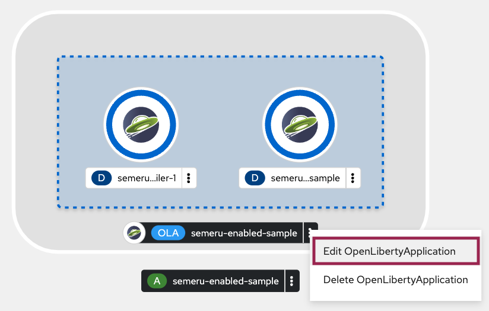
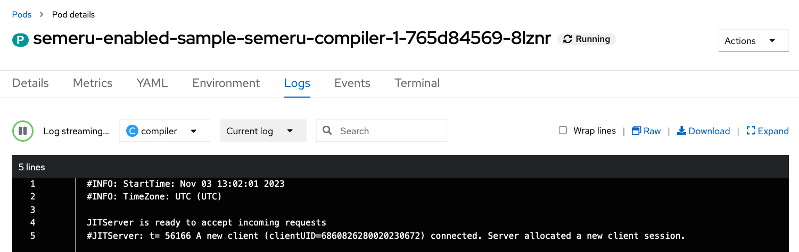
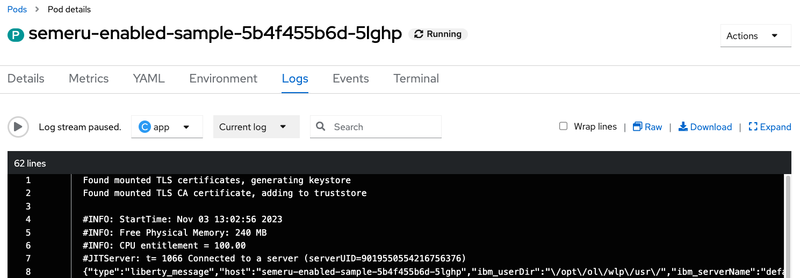
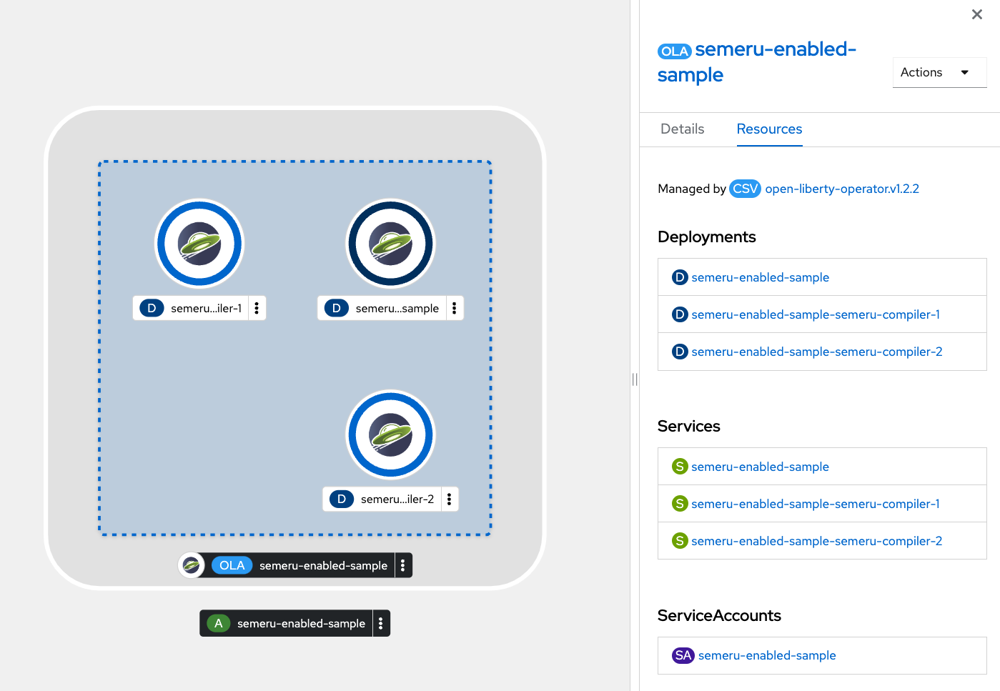
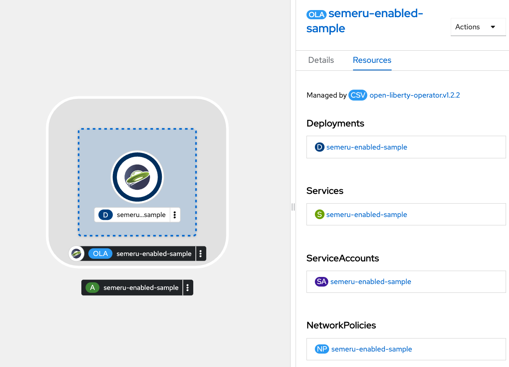

ifdef::env-github[]
:tip-caption: :bulb:
:note-caption: :information_source:
endif::[]

= Semeru Cloud Compiler Integration

This lab focuses on the configuration of Semeru Cloud Compiler for OpenLibertyApplication instances.

== Semeru Cloud Compiler (JIT Server Integration)
The `Semeru Cloud Compiler` efficiently manages Just-In-Time (JIT) compilation requests from applications, operating independently from the application's virtual machine. This decoupling approach leads to optimized resource utilization, including enhanced CPU and memory efficiency within the application VM. When the feature is enabled, Open Liberty Operator takes care of creating deployments, services, and certificates for the Semeru Cloud Comiler, seamlessly connecting them to the relevant applications.

== Configuration Options
Choose one of two methods to deploy OpenLibertyApplication instance on your cluster.

.*Method A: Deployment through `oc` client*
[%collapsible]
====
1. Make sure you have `oc` client and `jq` installed in your system, and are logged into a RedHat OpenShift cluster before you begin the lab.
+
[source,sh]
----
oc login --server=https://<cluster-api-ip-address>:6443 --username=<username> --password=<password>
----
+
For example:
+
[source,sh]
----
oc login --server=https://9.123.456.789:6443 --username=user1 --password=PasswordExample123
----
+
If you do not have access to a cluster, please contact Lab Administrators to have credentials assigned to you.

2. To set your current namespace to be the namespace you will be working in, run the following commands:
+
NOTE: _Replace `<your-namespace>` with the namespace provided to you for the lab._
+
[source,sh]
----
export NAMESPACE=<your-namespace>
oc project $NAMESPACE
----

3. Create a YAML file called `liberty-semeru.yaml` with the following content:
+
[source,yaml]
----
apiVersion: apps.openliberty.io/v1
kind: OpenLibertyApplication
metadata:
  name: semeru-enabled-sample
spec:
  applicationImage: icr.io/appcafe/open-liberty/samples/getting-started
  replicas: 1
  semeruCloudCompiler:
    enable: true
    replicas: 1
    resources:
      limits:
        cpu: 20m
        memory: 64Mi
      requests:
        cpu: 20m
        memory: 64Mi
  service:
    port: 9443
    type: ClusterIP
  deployment:
    updateStrategy:
      type: Recreate
----

4. Create the OpenLibertyApplication instance using the command:
+
[source,sh]
----
oc apply -f liberty-semeru.yaml
----
This will create a Deployment and Service named `semeru-enabled-sample-semeru-compiler-1` for semeru compiler first. After the service is fully ready, the operator will create a Deployment and Service named `semeru-enabled-sample` for the application.

5. Check the status of the OpenLibertyApplication instance by running:
+
[source,sh]
----
oc get OpenLibertyApplication semeru-enabled-sample -ojson | jq '.status.conditions'
----
It will print output similar to the following:
+
[source,log]
----
[
  {
    "lastTransitionTime": "2023-08-25T19:42:39Z",
    "message": "Deployment replicas ready: 1/1",
    "reason": "MinimumReplicasAvailable",
    "status": "True",
    "type": "ResourcesReady"
  },
  {
    "lastTransitionTime": "2023-08-25T19:42:39Z",
    "message": "Application is reconciled and resources are ready.",
    "status": "True",
    "type": "Ready"
  },
  {
    "lastTransitionTime": "2023-08-25T19:42:35Z",
    "status": "True",
    "type": "Reconciled"
  }
]
----
As in the example output, `status` field shows the number of running replicas out of configured number of replicas. When the status reports both `ResourcesReady` and `Ready`, move to the next step. If the `status` reports that the Application is not ready, check the pod's log.

6. Check semeru related properties in the status section as well.
+
[source,sh]
----
oc get OpenLibertyApplication semeru-enabled-sample -ojson | jq '.status.semeruCompiler, .status.references'
----
It will print output similar to the following:
+
[source,log]
----
{
  "serviceHostname": "semeru-enabled-sample-semeru-compiler-1.user2-namespace.svc",
  "tlsSecretName": "semeru-enabled-sample-semeru-compiler-1-tls-cm"
}
{
  "saResourceVersion": "166370768",
  "semeruGeneration": "1",
  "semeruInstancesCompleted": "1",
  "svcCertSecretName": "semeru-enabled-sample-svc-tls-cm"
}
----
It lists the service host name and associated TLS secret name under `.status.semeruCompiler` section. Then shows Semeru's generation and completed number under `.status.references`.

7. You can check what resources are managed by the operator through a command.
+
[source,sh]
----
oc get all -l app.kubernetes.io/part-of=semeru-enabled-sample
----
It will print output similar to the following:
+
[source,log]
----
NAME                                                           READY   STATUS    RESTARTS   AGE
pod/semeru-enabled-sample-787f6fd547-pmjsf                     1/1     Running   0          4m42s
pod/semeru-enabled-sample-semeru-compiler-1-564bb567fd-9wpqr   1/1     Running   0          5m24s

NAME                                              TYPE        CLUSTER-IP       EXTERNAL-IP   PORT(S)     AGE
service/semeru-enabled-sample                     ClusterIP   172.30.246.239   <none>        9443/TCP    4m47s
service/semeru-enabled-sample-semeru-compiler-1   ClusterIP   172.30.76.4      <none>        38400/TCP   6m10s

NAME                                                      READY   UP-TO-DATE   AVAILABLE   AGE
deployment.apps/semeru-enabled-sample                     1/1     1            1           4m43s
deployment.apps/semeru-enabled-sample-semeru-compiler-1   1/1     1            1           6m11s

NAME                                                                 DESIRED   CURRENT   READY   AGE
replicaset.apps/semeru-enabled-sample-787f6fd547                     1         1         1       4m43s
replicaset.apps/semeru-enabled-sample-semeru-compiler-1-564bb567fd   1         1         1       5m25s
----
+
The certificates are not reflected here, but you can check the certificates using `svcCertSecretName` and `tlsSecretName` in the status output in Step 6. These certificates are created and managed by the Cert Manager, which was covered before this lab. They are injected into the application as well as the JIT server via the secret by the operator.

8. Check the logs of JIT server pods. Use the pod name using the output above. For example, the pod name will start with `semeru-enabled-sample-semeru-compiler-1`...
+
[source,sh]
----
oc logs semeru-enabled-sample-semeru-compiler-1-564bb567fd-9wpqr
----
+
It will print output similar to the following:
+
[source,log]
----
#INFO:  StartTime: Aug 25 19:42:24 2023
#INFO:  TimeZone: UTC (UTC)

JITServer is ready to accept incoming requests
#JITServer: t= 36700 A new client (clientUID=8010230079672077624) connected. Server allocated a new client session.
----
+
You can see that there are clients connected to the JITServer with unique client ID for each application pod.

9. Check the Liberty application log to ensure the connection with JIT Server. Use the pod name using the output above. For example, the pod name will start with `semeru-enabled-sample`...
+
[source,sh]
----
oc logs semeru-enabled-sample-787f6fd547-pmjsf    
----
+
It will print output similar to the following at the top:
+
[source,log]
---- 
Found mounted TLS certificates, generating keystore
Found mounted TLS CA certificate, adding to truststore

#INFO:  StartTime: Aug 25 19:43:01 2023
#INFO:  Free Physical Memory: 1008 MB 
#INFO:  CPU entitlement = 100.00
#JITServer: t=   247 Connected to a server (serverUID=12278687460026451856)
...
----
+
You can see that the Liberty application is successfully connected to JIT Server pod.

10. The operator will instantly detect when the application image is modified or updated. Then the operator will create a new set of JIT Server pods for the new application pods. Modify `applicationImage` field under `spec` field to another image.
+
[source,sh]
----
oc edit OpenLibertyApplication/semeru-enabled-sample
----
+
[source,yaml]
----
  applicationImage: icr.io/appcafe/open-liberty/samples/getting-started@sha256:e22dd56a05e44618a10d275d3ff07a38eb364c0f04f86ffe9618d83dd5467860
----

11. Wait until the Liberty app deployment's pods are all updated to the new image.
+
[source,sh]
----
oc get deployment semeru-enabled-sample
----

12. When all pods are ready and running, check the status of managed resources.
+
[source,sh]
----
oc get all -l app.kubernetes.io/part-of=semeru-enabled-sample
----
+
[source,log]
----
NAME                                                           READY   STATUS    RESTARTS   AGE
pod/semeru-enabled-sample-57fb6c58fb-8cfjb                     1/1     Running   0          2m33s
pod/semeru-enabled-sample-semeru-compiler-2-5f6f6fd555-lpz8d   1/1     Running   0          7m30s

NAME                                              TYPE        CLUSTER-IP      EXTERNAL-IP   PORT(S)     AGE
service/semeru-enabled-sample                     ClusterIP   172.30.165.56   <none>        9443/TCP    8m50s
service/semeru-enabled-sample-semeru-compiler-2   ClusterIP   172.30.57.208   <none>        38400/TCP   7m36s

NAME                                                      READY   UP-TO-DATE   AVAILABLE   AGE
deployment.apps/semeru-enabled-sample                     1/1     1            1           8m45s
deployment.apps/semeru-enabled-sample-semeru-compiler-2   1/1     1            1           7m31s

NAME                                                                 DESIRED   CURRENT   READY   AGE
replicaset.apps/semeru-enabled-sample-57fb6c58fb                     1         1         1       5m18s
replicaset.apps/semeru-enabled-sample-semeru-compiler-2-5f6f6fd555   1         1         1       7m31s
----
+
You can see that the JIT Server's deployment name has been changed from `semeru-enabled-sample-semeru-compiler-1` to `semeru-enabled-sample-semeru-compiler-2`. This is a new set of JIT Server sessions with the Liberty app.
+
[source,sh]
----
oc logs semeru-enabled-sample-semeru-compiler-2-494jdp493-39dj9
----

13. You can also detect the changes in OpenLibertyApplication instance's status report as well.
+
[source,sh]
----
oc get OpenLibertyApplication semeru-enabled-sample -ojson | jq '.status.semeruCompiler, .status.references'
----
It will print output similar to the following:
+
[source,log]
----
{
  "serviceHostname": "semeru-enabled-sample-semeru-compiler-2.user2-namespace.svc",
  "tlsSecretName": "semeru-enabled-sample-semeru-compiler-2-tls-cm"
}
{
  "saResourceVersion": "166384339",
  "semeruGeneration": "2",
  "semeruInstancesCompleted": "2",
  "svcCertSecretName": "semeru-enabled-sample-svc-tls-cm"
}
----
+
The version check enables easy cleanup of the old version of JIT Server with the numbering naming convention.

14. To disable JIT Server integration, make changes to the OpenLibertyApplication instance.
+
[source,sh]
----
oc edit OpenLibertyApplication/semeru-enabled-sample
----
+
Then change `semeruCloudCompiler.enable` to false under `spec` field.
+
[source,yaml]
----
  semeruCloudCompiler:
    enable: false
----

15. Check the instance's status sections.
+
[source,sh]
----
oc get OpenLibertyApplication semeru-enabled-sample -ojson | jq '.status.semeruCompiler'
----
It will print output similar to the following:
+
[source,log]
----
null
----
Note that the output of `.status.semeruCompiler` returns null. You will be able to see that the pods of JIT Server are now removed as well.
+
[source,sh]
----
oc get all -l app.kubernetes.io/part-of=semeru-enabled-sample
----
+
[source,log]
----
NAME                                         READY   STATUS    RESTARTS   AGE
pod/semeru-enabled-sample-7cc885d77f-lnpgr   1/1     Running   0          63s

NAME                            TYPE        CLUSTER-IP      EXTERNAL-IP   PORT(S)    AGE
service/semeru-enabled-sample   ClusterIP   172.30.165.56   <none>        9443/TCP   11m

NAME                                    READY   UP-TO-DATE   AVAILABLE   AGE
deployment.apps/semeru-enabled-sample   1/1     1            1           11m

NAME                                               DESIRED   CURRENT   READY   AGE
replicaset.apps/semeru-enabled-sample-7cc885d77f   1         1         1       64s
----
====

.*Method B: Deployment through OpenShift Web Console*
[%collapsible]
====

1. Access your OpenShift web console. Web console's URL starts with https://console-openshift-console.

2. Switch to the Developer perspective, if it is set to the Administrator perspective. Ensure you are on a project/namespace that you were assgined with for the lab.
+
image:images/perspective.png[,300]

3. Click `+Add`. Under `Developer Catalog`, click `Operator Backed`. This page shows the operator catalog on the cluster and enables you to deploy operator managed services.
+
image:images/operator-backed.png[,500]

4. Click OpenLibertyApplication and create an instance.
+
image:images/create-instance.png[,800]
+
Select YAML view and copy the following content:
+
[source,yaml]
----
apiVersion: apps.openliberty.io/v1
kind: OpenLibertyApplication
metadata:
  name: semeru-enabled-sample
spec:
  applicationImage: icr.io/appcafe/open-liberty/samples/getting-started
  replicas: 1
  semeruCloudCompiler:
    enable: true
    replicas: 1
    resources:
      limits:
        cpu: 20m
        memory: 64Mi
      requests:
        cpu: 20m
        memory: 64Mi
  service:
    port: 9443
    type: ClusterIP
  deployment:
    updateStrategy:
      type: Recreate
----
+
This will create a Deployment and Service named `semeru-enabled-sample-semeru-compiler-1` for semeru compiler first. After the service is fully ready, the operator will create a Deployment and Service named `semeru-enabled-sample` for the application.

5. You will see that an instance is created in `Topology` tab. Click `OLA semeru-enabled-sample`. You can select a resource on the right that you wish to investigate.
+
image:images/topology.png[,900]
+
The certificates are not reflected here, but you can check the certificates using `svcCertSecretName` and `tlsSecretName` in the status output above. These certificates are created and managed by the Cert Manager, which was covered before this lab. They are injected into the application as well as the JIT server via the secret by the operator.

6. Check the OpenLibertyApplication instance's status. Click 3 dots beside `OLA semeru-enabled-sample`, then `Edit OpenLibertyApplication`.
+

+
Select `Details` tab and scroll to the bottom of the page to see the status conditions. 
+
image:images/status.png[,700]
+
As in the example image, `ResourcesReady` type shows the number of running replicas out of configured number of replicas. When the status reports both `ResourcesReady` and `Ready`, move to the next step. If the `status` reports that the Application is not ready, check the pod's log.

8. Click `YAML` tab and scroll to the bottom to see semeru related properties in the status section as well.
+
image:images/status-conditions-semeru.png[,900]
+
It lists the service host name and associated TLS secret name under `.status.semeruCompiler` section. It also shows Semeru's generation and completed number under `.status.references`.

9. Check the logs of JIT server pods. Go back to `Topology` tab to see managed resources of OpenLibertyApplication instance. Click on Deployment resource with name `semeru-enabled-sample-semeru-compiler-1`.
+
image:images/semeru-deployment.png[,900]
+
Click `Pods` tab and the pod's name.
+
image:images/semeru-pod.png[,900]
+
Click `Logs` tab. You should be able to see JITServer logs reporting that the server allocated a new client session.
+

+
You can see that there are clients connected to the JITServer with unique client ID for each application pod.

10. Check the logs of Liberty application pods. Go back to `Topology` tab to see managed resources of OpenLibertyApplication instance. Click on Deployment resource with name `semeru-enabled-sample`.
+
image:images/app-deployment.png[,900]
+
Click `Pods` tab and choose any of the three pods.
+
image:images/app-pods.png[,900]
+
Click `Logs` tab.
+

+
You can see that the Liberty application is successfully connected to JIT Server pod.

11. The operator will instantly detect when the application image is modified or updated. Then the operator will create a new set of JIT Server pods for the new application pods. Click 3 dots beside `OLA semeru-enabled-sample`, then `Edit OpenLibertyApplication`.
+

+
Modify `applicationImage` field under `spec` field to another image.
+
[source,yaml]
----
  applicationImage: icr.io/appcafe/open-liberty/samples/getting-started@sha256:e22dd56a05e44618a10d275d3ff07a38eb364c0f04f86ffe9618d83dd5467860
----

12. Go back to `Topology` tab to see managed resources of OpenLibertyApplication instance.
+

+
When the application is not fully updated with the new image, there will be 2 Semeru deployments. This is to ensure deployments with older image is still connected to the first version of Semeru while updating. Wait until the Liberty app deployment’s pods are all updated to the new image and there is only 1 Semeru deployment.
+
image:images/topology-new.png[,700]
+
You can see that the JIT Server’s deployment name has been changed from semeru-enabled-sample-semeru-compiler-1 to semeru-enabled-sample-semeru-compiler-2. This is a new set of JIT Server sessions with the Liberty app.

13. Check the logs of JIT server pods to ensure 4 connections are established. Click on Deployment resource with name `semeru-enabled-sample-semeru-compiler-2`. Click `Pods` tab and the pod's name. Then click `Logs` tab. You should be able to see JITServer logs reporting that the server allocated 4 new client sessions, instead of 3.
+
image:images/semeru-logs-new.png[,900]

14. You can also detect the changes in OpenLibertyApplication instance’s status report as well. Click `Search` tab on the left and search for `OpenLibertyApplications` resource, and select `semeru-enabled-sample` instance. Click `YAML` tab to see semeru related properties in the status section.
+
image:images/status-conditions-new.png[,700]
+
The version check enables easy cleanup of the old version of JIT Server with the numbering naming convention.

15. To disable JIT Server integration, make changes to the OpenLibertyApplication instance. 
+
Change `.spec.semeruCloudCompiler.enable` to false:
+
[source,yaml]
----
  semeruCloudCompiler:
    enable: false
----

16. Go back to `Topology` tab to see managed resources of OpenLibertyApplication instance.
+

+
You will be able to see that the pods of JIT Server are now removed.

====

